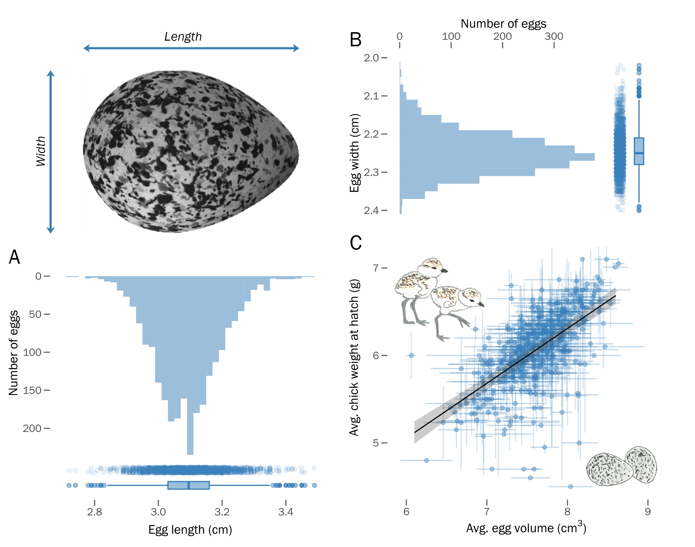

# Reproducible datasets and code for:
## Egg size variation in a long-lived polyandrous shorebird in the context of senescence and breeding phenology
#### Luke J. Eberhart-Hertel, Lourenço Falcão Rodrigues, Johannes Krietsch, Anne G. Eberhart-Hertel, Medardo Cruz López, Karina Alejandra Vázquez-Rojas, Erick González-Medina, Julia Schroeder, and Clemens Küpper
#### *In review*

In this repository you can find all the raw data and code needed to reproduce our investigation of egg size variation in snowy plovers (_Charadrius nivosus_) monitored annually since 2006 at [Bahía de Ceuta](https://www.google.com/maps/@23.9197739,-106.9668912,2358m/data=!3m1!1e3 "Google Map Satellite") – an important breeding site in western Mexico.

For a complete overview of the methods and results presented in our manuscript, please view our project vignette: [Supplementary File 1](https://raw.githack.com/leberhartphillips/snowy_plover_eggs/main/Rmd/Supplementary_File_1/Supplementary_File_1.html)

  

  

 <i>Egg size variation and its relationship to chick size in snowy plovers (Charadrius nivosus). Illustrations by Luke Eberhart-Hertel.</i>

#### Repository Contents
[**`R/`**](https://github.com/leberhartphillips/snowy_plover_eggs/tree/main/R)

  - `project_X.R` scripts contain housekeeping code (custom functions, loading libraries, plotting themes, etc.)
  - `wrangle_X.R` scripts contain code used to wrangle the [CeutaOPEN](https://www.nature.com/articles/s41597-020-0490-y "CeutaOPEN") database into the format used in the models presented in this investigation
  - `model_X.R` scripts contain code used for modeling and exporting output
  - `results_X.R` scripts contain code used to process the model output into figures and tables

[**`data/`**](https://github.com/leberhartphillips/snowy_plover_eggs/tree/main/data)

  - [`mol_sex.rds`](https://github.com/leberhartphillips/snowy_plover_eggs/blob/main/data/mol_sex.rds) is the molecular sex-type data for a subsample of the individuals in the `ceuta_egg_chick_female_data.rds`
  - [`chicks_2006_2020.rds`](https://github.com/leberhartphillips/snowy_plover_eggs/blob/main/data/chicks_2006_2020.rds)
  - [`BaSTA_checked_life_table_females_2006-2020.rds`](https://github.com/leberhartphillips/snowy_plover_eggs/blob/main/data/BaSTA_checked_life_table_females_2006-2020.rds) is the processed BaSTA file containing the encounter histories of all individually marked plovers in the population
  - [`ceuta_egg_chick_female_data.rds`](https://github.com/leberhartphillips/snowy_plover_eggs/blob/main/data/ceuta_egg_chick_female_data.rds) is the trait data used in the polyandry, egg volume, and lay date models
  - [`raw_encounter_histories_females_2006_2020.rds`](https://github.com/leberhartphillips/snowy_plover_eggs/blob/main/data/raw_encounter_histories_females_2006_2020.rds) is the raw unprocessed encounter histories of all individually marked plovers in the population with each row being an encounter.
  - [`raw_life_table_females_2006_2020.rds`](https://github.com/leberhartphillips/snowy_plover_eggs/blob/main/data/raw_life_table_females_2006_2020.rds) is the raw unprocessed encounter histories of all individually marked plovers in the population with each row being an individual and columns including annual detections (i.e., the main difference with the BaSTA life table file is that this contains the individual identities)

[**`output/`**](https://github.com/leberhartphillips/snowy_plover_eggs/tree/main/output)

  - [`multibasta_output_females_min_age_1_2006-2020.rds`](https://github.com/leberhartphillips/snowy_plover_eggs/blob/main/output/multibasta_output_females_min_age_1_2006-2020.rds) is the output from the BaSTA modl selection
  - [`stats_eggv_mod.rds`](https://github.com/leberhartphillips/snowy_plover_eggs/blob/main/output/stats_eggv_mod.rds) is the output from the egg volume model
  - [`stats_polyandry_age_mod.rds`](https://github.com/leberhartphillips/snowy_plover_eggs/blob/main/output/stats_polyandry_mod.rds) is the output from the polyandry model
  - [`stats_renesting_mod.rds`](https://github.com/leberhartphillips/snowy_plover_eggs/blob/main/output/stats_renesting_mod.rds)is the output from the re-nesting model
  - [`stats_laydate_mod.rds`](https://github.com/leberhartphillips/snowy_plover_eggs/blob/main/output/stats_laydate_mod.rds) is the output from the lay date model
  - [`stats_chick_mod.rds`](https://github.com/leberhartphillips/snowy_plover_eggs/blob/main/output/stats_chick_mod.rds) is the output from the chick weight model
  - [`age_estimate_uncertainty_bootstraps.rds`](https://github.com/leberhartphillips/snowy_plover_eggs/blob/main/output/age_estimate_uncertainty_bootstraps.rds) is the output form the BaSTA age uncertainty bootstrap

[**`products/figures/`**](https://github.com/leberhartphillips/snowy_plover_eggs/tree/main/products/figures)

  - [`Figure_1.jpg`](https://github.com/leberhartphillips/snowy_plover_eggs/blob/main/products/figures/Figure_1.jpg): BaSTA survival function
  - [`Figure_2.jpg`](https://github.com/leberhartphillips/snowy_plover_eggs/blob/main/products/figures/Figure_2.jpg): sampling distribution
  - [`Figure_3.jpg`](https://github.com/leberhartphillips/snowy_plover_eggs/blob/main/products/figures/Figure_3.jpg): egg volume and lay date models forest plots
  - [`Figure_4.png`](https://github.com/leberhartphillips/snowy_plover_eggs/blob/main/products/figures/Figure_4.png): seasonal correlates
  - [`Figure_5.jpg`](https://github.com/leberhartphillips/snowy_plover_eggs/blob/main/products/figures/Figure_5.jpg): lay date variation by age and origin
  - [`Figure_S1.jpg`](https://github.com/leberhartphillips/snowy_plover_eggs/blob/main/products/figures/Figure_S1.jpg): raw egg size variation
  - [`Figure_S2.png`](https://github.com/leberhartphillips/snowy_plover_eggs/blob/main/products/figures/Figure_S2.png): BaSTA model diagnostics
  - [`Figure_S3.jpg`](https://github.com/leberhartphillips/snowy_plover_eggs/blob/main/products/figures/Figure_S3.jpg): chick model forest plot
  - [`Figure_S4.jpg`](https://github.com/leberhartphillips/snowy_plover_eggs/blob/main/products/figures/Figure_S4.jpg): polyandry model forest plot
  - [`Figure_S5.jpg`](https://github.com/leberhartphillips/snowy_plover_eggs/blob/main/products/figures/Figure_S5.jpg): re-nesting model forest plot
  - [`Figure_S6.jpg`](https://github.com/leberhartphillips/snowy_plover_eggs/blob/main/products/figures/Figure_S6.jpg): residuals plot
  - [`Figure_S7.jpg`](https://github.com/leberhartphillips/snowy_plover_eggs/blob/main/products/figures/Figure_S7.jpg): tarsus correlates
  - [`Figure_S8.jpg`](https://github.com/leberhartphillips/snowy_plover_eggs/blob/main/products/figures/Figure_S8.jpg): BaSTA age uncertainty plots

[**`products/tables/`**](https://github.com/leberhartphillips/snowy_plover_eggs/tree/main/products/tables)

  - [`Table_S1.png`](https://github.com/leberhartphillips/snowy_plover_eggs/blob/main/products/tables/Table_S1.png): BaSTA model selection results
  - [`Table_S2.png`](https://github.com/leberhartphillips/snowy_plover_eggs/blob/main/products/tables/Table_S2.png): chick weight model results
  - [`Table_S3.png`](https://github.com/leberhartphillips/snowy_plover_eggs/blob/main/products/tables/Table_S3.png): egg volume model results
  - [`Table_S4.png`](https://github.com/leberhartphillips/snowy_plover_eggs/blob/main/products/tables/Table_S4.png): polyandry model results
  - [`Table_S5.png`](https://github.com/leberhartphillips/snowy_plover_eggs/blob/main/products/tables/Table_S5.png): re-nesting model results 
  - [`Table_S6.png`](https://github.com/leberhartphillips/snowy_plover_eggs/blob/main/products/tables/Table_S6.png): lay date model results 