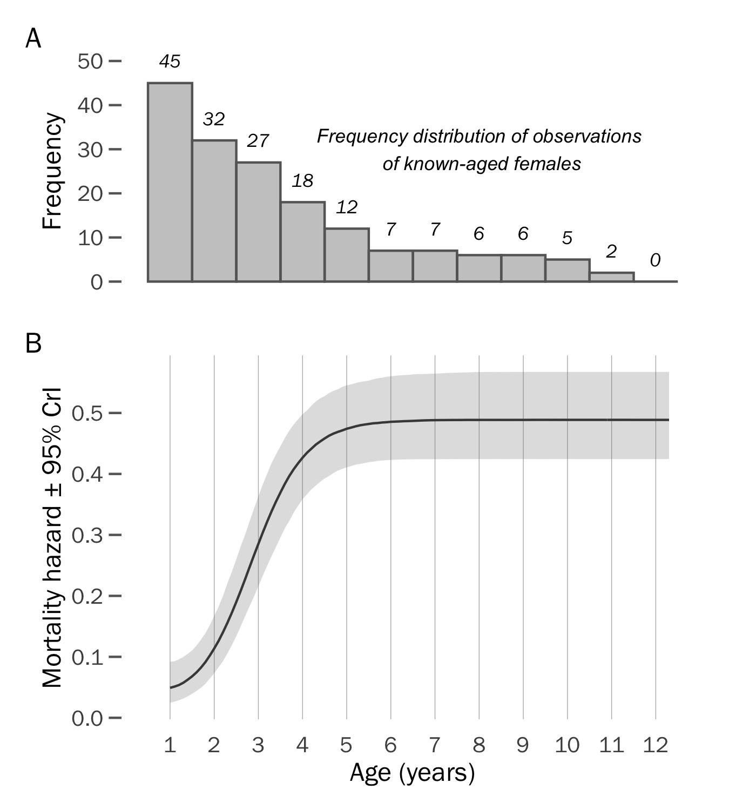

```{r setup, include=FALSE}
library(knitr)
library(rmdformats)
library(formatR)
## Global options
options(max.print="75")
opts_chunk$set(echo=TRUE,
	             cache=TRUE,
               prompt=FALSE,
               tidy=TRUE,
               comment=NA,
               message=FALSE,
               warning=FALSE,
               eval=FALSE)
opts_knit$set(width=75)
```


In this document we provide all the necessary code for reproducing the analyses presented in our paper.  To reproduce our analytical steps presented in this Rmarkdown at your own leisure, please download this [GitHub](https://github.com/leberhartphillips/snowy_plover_eggs) repository. Simply follow the link and click on *Download ZIP* on the right-hand side of the page.  An explanation of the files in the repository can be found in the Readme file.  Please don't hesitate to contact Luke Eberhart-Hertel (`luke.eberhart[at]orn.mpg.de`), Lourenço Falcão (`lourenco.falcao[at]uam.es`) or Clemens Küpper (`ckuepper[at]orn.mpg.de`) if you have any questions.

The structure of the code we present here follows the analyses presented in the *Methods* and *Results* sections of the paper.

The document is best viewed in html on an internet browser.

## Prerequisites

* The following packages are needed to employ this R Markdown document and can be easily installed from [CRAN](http://cran.r-project.org/) by uncommenting the `install.packages` function below:

```{r libraries}
# install.packages("arm", "aspace", "BaSTA", "bayestestR", "broom.mixed", 
#                  "coefplot2", "cowplot", "data.table","doParallel","effects", 
#                  "extrafont", "flexmix", "fGarch", "ggmap", "ggpubr", "ggridges",
#                  "ggthemes", "grid", "gt", "kableExtra", "leaflet", "lme4", 
#                  "magick", "mapview", "mgcv", "moveVis", "multcomp", 
#                  "multipanelfigure", "parallel", "parameters", "partR2", 
#                  "patchwork", "RColorBrewer", "rptR", "RSQLite", "scales", 
#                  "snowfall", "sp", "standardize", "tidybayes", "tidyverse")

library(arm)
library(aspace)
library(BaSTA)
library(bayestestR)
library(broom.mixed)
library(coefplot2)
library(cowplot)
library(data.table)
library(doParallel)
library(effects)
library(extrafont)
library(flexmix)
library(fGarch)
library(ggmap)
library(ggpubr)
library(ggridges)
library(ggthemes)
library(grid)
library(gt)
library(kableExtra)
library(leaflet)
library(lme4)
library(magick)
library(mapview)
library(mgcv)
library(moveVis)
library(multcomp)
library(multipanelfigure)
library(parallel)
library(parameters)
library(partR2)
library(patchwork)
library(RColorBrewer)
library(rptR)
library(RSQLite)
library(scales)
library(snowfall)
library(sp)
library(standardize)
library(tidybayes)
library(tidyverse)
```

* The following custom functions are needed to run several chunks in the analysis, please load these into your R environment:

```{r plover data convert()}
plover_date_convert <- 
  function(df, input = "mdd"){
    if(input == "mdd"){
      
      if(sum(grepl(paste(c("date", "alive", "manip"), collapse = "|"), names(df))) > 1){
        df[, which(grepl(paste(c("date", "alive", "manip"), collapse = "|"), names(df)))] <- 
          lapply(df[, which(grepl(paste(c("date", "alive", "manip"), collapse = "|"), names(df)))],
                 function(x) 
                   paste(df$year, 
                         ifelse(nchar(x) == 3, 
                                substring(x, first = 1, last = 1), 
                                substring(x, first = 1, last = 2)), 
                         ifelse(nchar(x) == 3, 
                                substring(x, first = 2, last = 3), 
                                substring(x, first = 3, last = 4)), 
                         sep = "-"))
        df[, which(grepl(paste(c("date", "alive", "manip"), collapse = "|"), names(df)))] <-
          lapply(df[, which(grepl(paste(c("date", "alive", "manip"), collapse = "|"), names(df)))],
                 function(x) as.Date(x, format = "%Y-%m-%d"))
      }
      else{
        df[, which(grepl(paste(c("date", "alive", "manip"), collapse = "|"), names(df)))] <- 
          paste(df$year, 
                ifelse(nchar(df[, which(grepl(paste(c("date", "alive", "manip"), collapse = "|"), names(df)))]) == 3, 
                       substring(df[, which(grepl(paste(c("date", "alive", "manip"), collapse = "|"), names(df)))], first = 1, last = 1), 
                       substring(df[, which(grepl(paste(c("date", "alive", "manip"), collapse = "|"), names(df)))], first = 1, last = 2)), 
                ifelse(nchar(df[, which(grepl(paste(c("date", "alive", "manip"), collapse = "|"), names(df)))]) == 3, 
                       substring(df[, which(grepl(paste(c("date", "alive", "manip"), collapse = "|"), names(df)))], first = 2, last = 3), 
                       substring(df[, which(grepl(paste(c("date", "alive", "manip"), collapse = "|"), names(df)))], first = 3, last = 4)), 
                sep = "-")
        df[, which(grepl(paste(c("date", "alive", "manip"), collapse = "|"), names(df)))] <- 
          as.Date(df[, which(grepl(paste(c("date", "alive", "manip"), collapse = "|"), names(df)))], format = "%Y-%m-%d")
      }
    }
    if(input == "Rdate"){
      if(sum(grepl(paste(c("date", "alive", "manip"), collapse = "|"), names(df))) > 1){
        df[, which(grepl(paste(c("date", "alive", "manip"), collapse = "|"), names(df)))] <- 
          lapply(df[, which(grepl(paste(c("date", "alive", "manip"), collapse = "|"), names(df)))],
                 function(x) 
                   as.Date(x, origin = "1970-01-01"))
      }
      else{
        df[, which(grepl(paste(c("date", "alive", "manip"), collapse = "|"), names(df)))] <- 
          as.Date(df[, which(grepl(paste(c("date", "alive", "manip"), collapse = "|"), names(df)))], origin = "1970-01-01")
      }
    }
    return(df)
  }
```

```{r negate()}
`%!in%` = Negate(`%in%`)
```

* The following plotting theme and objects are needed to reproduce the figures presented in our paper, please also load these into your environment:
```{r plotting objects}
# define the plotting theme to be used in subsequent ggplots
luke_theme <- 
  theme_bw() +
  theme(
    text = element_text(family = "Franklin Gothic Book"),
    legend.title = element_text(size = 16),
    legend.text = element_text(size = 12),
    axis.title.x = element_text(size = 12),
    axis.text.x  = element_text(size = 10), 
    axis.title.y = element_text(size = 12),
    axis.text.y = element_text(size = 10),
    strip.text = element_text(size = 12),
    panel.grid.major = element_blank(),
    panel.grid.minor = element_blank(),
    axis.ticks = element_line(size = 0.5, colour = "grey40"),
    axis.ticks.length = unit(0.2, "cm"),
    panel.border = element_rect(linetype = "solid", colour = "grey"),
    legend.position = c(0.1, 0.9)
  )

# Find fonts from computer that you want. Use regular expressions to do this
# For example, load all fonts that are 'candara' or 'Candara'
extrafont::font_import(pattern = "[F/f]ranklin", prompt = FALSE)

# check which fonts were loaded
extrafont::fonts()
extrafont::fonttable()
extrafont::loadfonts() # load these into R

# set plotting color palettes
plot_palette_sex <- RColorBrewer::brewer.pal(8, "Dark2")[c(2,1)]
plot_palette_polyandry <- RColorBrewer::brewer.pal(8, "Dark2")[c(6,1)]
plot_palette_renesting <- RColorBrewer::brewer.pal(8, "Dark2")[c(2,3)]
plot_palette_nest_order <- c("black", "#f03b20")

# specify the facet labels for each species
polyandry.labs <- c("Polyandrous", "Monogamous")
names(polyandry.labs) <- c("poly", "mono")

# image of a plover egg
egg_image <- image_read("media/plover_egg.png")
egg_image_grob <- rasterGrob(egg_image, interpolate = TRUE, height = 0.6)

# some nice color palettes
show_col(wsj_pal(palette = "rgby")(6))
ggthemes_data$wsj

# color of mean estimate point in forest plots
col_all <- "#2E3440"
```

# Part 1: Bayesian estimation of age for unknown aged individuals

## Data Import and Wrangle
Firstly, connect to the CeutaOPEN SQLite database (open-access between 2006 to 2016; for more details, see: Eberhart-Phillips, L.J., Cruz-López, M., Lozano-Angulo, L. et al. CeutaOPEN, individual-based field observations of breeding snowy plovers *Charadrius nivosus*. *Scientific Data* 7, 149 (2020). https://doi.org/10.1038/s41597-020-0490-y).

Our raw field data collected between 2017 to 2020 are not yet publicly available, but the data in these years that are needed to reproduce the results shown in our manuscript are provided here in the `BaSTA_checked_life_table_females_2006_2020.rds` (for Part 1 "BaSTA model selection") and the `ceuta_egg_chick_female_data.rds` (for Part 2) files found in the data folder included in the project's OSF repository.

```{r}
# connect to CeutaOPEN
CeutaOPEN <- 
  dbConnect(SQLite(), 
            dbname = "/Users/Luke/Documents/Academic_Projects/Postdoc_Seewiesen/Ceuta_Open/Ceuta_OPEN/data/Ceuta_OPEN_version_releases/Ceuta_OPEN_v1-5.sqlite")
```

```{r BaSTA data wrangle}
# Wrangle the capture data
captures <-
  # extract the capture datatable
  dbReadTable(CeutaOPEN,"Captures") %>% 
  
  # subset to only include snowy plovers
  dplyr::filter(species == "SNPL") %>% 
  
  # group by individual
  group_by(ring) %>%
  
  # determine the first year that an individual was seen
  mutate(originalsight = ifelse(age == "J", year,
                                year[which.min(as.numeric(year))])) %>% 
  
  # determine if the first encouter was as an adult or a juvenile
  mutate(chick = age[which.min(as.numeric(year))]) %>% 
  
  # specify first encounters as juveniles as recruits and adults as immigrants
  mutate(recruit = ifelse(chick == "J", "Recruit", "Immigrant")) %>% 
  
  # if a recruit then specify the year at which it was first encountered (i.e., it's birth year); 0 for immigrants
  mutate(birth = ifelse(recruit == "Recruit", originalsight, "0")) %>% 
  
  # remove 13 rows that do not have ring information (i.e., these are "observation only" captures of XX.XX|XX.XX birds)
  dplyr::filter(ring != "NA") %>%
  
  # subset to females
  dplyr::filter(sex == "F")

# Assess the sample size of the capture population
# assess how many individuals we have: Female = 860
captures %>%  
  group_by(sex) %>% 
  summarise(count = n_distinct(ring)) %>% 
  collect() %>%
  kable(col.names = c("Sex",
                      "Number of individuals")) %>%
  kable_styling() %>%
  scroll_box(width = "50%")

# assess how many immigrants and recruits we have:
# Immigrant Females = 406, Recruit Females = 454
captures %>%
  group_by(recruit, sex) %>%
  summarise(n_inds = n_distinct(ring)) %>% 
  collect() %>%
  kable(col.names = c("Status",
                      "Sex",
                      "Number of individuals")) %>%
  kable_styling() %>%
  scroll_box(width = "50%")

# Wrangle the resight data
resightings <- 
  # extract the resight datatable
  dbReadTable(CeutaOPEN,"Resights") %>% 
  
  # subset to only include snowy plovers
  dplyr::filter(species == "SNPL") %>% 
  
  # merge the ring identity to the resight codes
  left_join(., dplyr::select(captures, ring, code), by = "code") %>% 
  
  # remove duplicates
  distinct()

# extract combinations that are unique
unique_combos <- 
  resightings %>% 
  
  # remove all combos without a distinct set of rings (i.e., needs at most 4 X's)
  dplyr::filter(str_count(code, "X") < 5) %>% 
  
  # remove all combos with uncertainty (i.e., no ?'s)
  dplyr::filter(str_detect(code, "\\?", negate = TRUE)) %>%
  
  # remove all combos without the appropriate number of rings
  dplyr::filter(nchar(code) == 11) %>% 
  
  # extract the combos that have only one metal ring associate with them
  group_by(code) %>% 
  summarise(n_obs = n_distinct(ring)) %>% 
  arrange(desc(n_obs)) %>% 
  dplyr::filter(n_obs == 1)

# Tidy up capture and resight data
resightings <- 
  resightings %>% 
  
  # subset resightings to only include observations of unique combinations
  dplyr::filter(code %in% unique_combos$code) %>% 
  
  # remove all combos that don't have a ring associated with them
  dplyr::filter(!is.na(ring)) %>% 
  
  # sort by ring and year to assess the output
  arrange(ring, year)

capture_final <- 
  captures %>%
  
  # paste ring and year together to make a unique identifier for this observation
  unite(ring_year, ring, year, remove = FALSE) %>%
  
  # specify as a capture
  mutate(observation = "capture") %>%
  
  # clean up output
  dplyr::select(ring_year, sex, ring, year, recruit, birth, observation) %>% 
  arrange(ring, year)

resightings_final <- 
  resightings %>%
  
  # paste ring and year together to make a unique identifier for this observation
  unite(ring_year, ring, year, remove = FALSE) %>%
  
  # specify as a resight
  mutate(observation = "resight") %>%
  
  # clean up output
  dplyr::select(ring_year, ring, year, observation) %>% 
  
  # join with the capture data to merge recruit status, sex, and birth year
  left_join(., dplyr::select(capture_final, ring, recruit, birth, sex), by = "ring") %>% 
  
  # remove duplicates
  distinct()

# Bind capture and resight data into a complete encounter history
encounter_histories <- 
  bind_rows(capture_final, resightings_final) %>% 
  arrange(ring_year)

# Remove resight encounters that occurred prior to the first capture
# determine the year of first capture for each individual
first_cap <- 
  capture_final %>%
  group_by(ring) %>%
  dplyr::filter(as.numeric(year) == min(as.numeric(year))) %>%
  dplyr::select(ring, year) %>%
  distinct(ring,.keep_all = TRUE) %>%
  rename(first_cap = year) %>% 
  arrange(first_cap)

# determine which resights occurred before the first capture
resights_before_first_capture <- 
  encounter_histories %>% 
  left_join(., first_cap, by = "ring") %>% 
  dplyr::filter(observation == "resight" & (as.numeric(year) < as.numeric(first_cap)))

# exclude early resightings from encounter history
encounter_histories <-
  encounter_histories %>% 
  dplyr::filter(ring_year %!in% resights_before_first_capture$ring_year) %>% 
  arrange(ring, as.numeric(year))

# Make the encounter history table needed for the survival analysis
encounter_history_table <- 
  distinct(encounter_histories, ring_year, .keep_all = TRUE) %>% 
  dplyr::select(ring, year) %>%
  arrange(ring) %>% 
  mutate(year = as.integer(year)) %>%
  CensusToCaptHist(ID = .$ring,
                   d = .$year, 
                   timeInt = "Y") %>% 
  mutate(ring = rownames(.),
         ID = as.character(ID))

# Extract the known birth and death information for each individual
birth_death_mat <- 
  encounter_histories %>%
  dplyr::select(ring, birth) %>%
  mutate(death = 0) %>%
  arrange(ring) %>%
  distinct(ring, .keep_all = TRUE)

# Unite the encounter history table with the birth and death matrices
raw_life_table_females_2006_2020 <-
  left_join(birth_death_mat, encounter_history_table, by = "ring") %>%
  as.data.frame() %>% 
  distinct() %>% 
  dplyr::select(ID, birth, death,
                "2006", "2007", "2008", "2009",
                "2010", "2011", "2012", "2013", 
                "2014", "2015", "2016", "2017",
                "2018", "2019", "2020", ring) %>%
  mutate_at(vars(-ring), as.numeric) %>% 
  mutate(sum_years = rowSums(.[4:18])) %>%
  dplyr::filter(sum_years > 1 | birth == 0) %>%
  mutate(ID = as.numeric(row.names(.))) %>%
  dplyr::select(-sum_years)

# Run "DataCheck" BaSTA function to make final cleans to encounter history. The 
# only change needed is that the birth year of recruits should be '0' instead 
# of '1'; this function will solve this issue and provide a cleaned version 
# ready for analysis. In total, we have 918 encounters of 452 individually 
# marked females that were seen as adults, of which 46 are of known birth year.
BaSTA_checked_life_table_females_2006_2020 <- 
  DataCheck(object = raw_life_table_females_2006_2020[, -c(length(raw_life_table_females_2006_2020))], 
            studyStart = 2006, studyEnd = 2020,
            autofix = rep(1, 7), silent = FALSE)
```

## BaSTA model selection

Run the multibasta function to fit all possible survival trends to the data, while specifying the study start year at 2006, study end year at 2020, 800000 iterations, burn-in of 10000, thinning every 2000th iteration, 4 parallel chains, and a minimum age of 1 (i.e., our mark-recapture data only includes individuals that are either adults of unknown age (age >= 1), or individuals that were born locally but were encountered in subsequent years (ie., first-year survival = 1.0)).

```{r, echo=FALSE}
load(file = "data/BaSTA_checked_life_table_females_2006-2020.rds")
```

```{r}
multiout_females <-
  multibasta(object = BaSTA_checked_life_table_females_2006_2020$newData,
             studyStart = 2006, studyEnd = 2020, covarsStruct = "fused", 
             minAge = 1, niter = 800000, burnin = 10000, thinning = 2000,
             nsim = 4, parallel = TRUE, ncpus = 4, updateJumps = TRUE)
```

To save time, load the output file here:
```{r}
load(file = "output/multibasta_output_females_min_age_1_2006-2020.rds")
```

```{r}
# DIC model selection shows that the Logistic mortality model with bathtub 
# shape fits our data the best
BaSTA_DIC_table <- 
  multiout_females$DICs %>% 
  as.data.frame() %>% 
  mutate(model = ifelse(model == "LO", "Logistic",
                        ifelse(model == "WE", "Weibull",
                               ifelse(model == "GO", "Gompertz", "Exponential"))),
         shape = paste0(toupper(substr(shape, 1, 1)), 
                        substr(shape, 2, nchar(.)))) %>% 
  mutate(shape = ifelse(shape == "Simp", "Simple", shape)) %>% 
  dplyr::select(model, shape, k, DICdiff) %>% 
  gt() %>% 
  cols_label(model = "Mortality function",
             shape = "Shape",
             k = md("*k*"),
             # DIC = md("*DIC*"),
             DICdiff = md("\U0394*DIC*")) %>% 
  fmt_number(columns = vars(DICdiff),
             decimals = 2,
             use_seps = FALSE) %>% 
  # tab_options(column_labels.font.weight = "bold",
  #             table.width = pct(50),
  #             column_labels.font.size = 14,
  #             table.font.size = 12,
  #             data_row.padding = 5, table.align = "left") %>% 
  fmt_missing(columns = 3,
              missing_text = "") %>% 
  tab_options(row_group.font.weight = "bold",
              row_group.background.color = brewer.pal(9,"Greys")[3],
              table.font.size = 12,
              data_row.padding = 3,
              row_group.padding = 4,
              summary_row.padding = 2,
              column_labels.font.size = 14,
              row_group.font.size = 12,
              table.width = pct(60))

BaSTA_DIC_table
```

### Table 1: BaSTA model selection results

```{r Table 1, echo=FALSE, eval=TRUE, out.width = '100%'}
knitr::include_graphics("../../products/tables/BaSTA_DIC_table.png")
```

```{r, echo=FALSE}
# save as rtf for manuscript
BaSTA_DIC_table %>%
  gtsave("BaSTA_DIC_table.rtf", path = "products/tables/rtf/", expand = 1)

BaSTA_DIC_table %>%
  gtsave("BaSTA_DIC_table.png", path = "products/tables/png/", expand = 0.5)
```

```{r}
# Extract top model
plover_survival_model <- 
  multiout_females$runs[[1]]

# Check the diagnostics to assess the simulation performance
BaSTA_autocorr_plot <- 
  plover_survival_model$coefficients %>% 
  as.data.frame() %>% 
  dplyr::select(SerAutocor) %>% 
  mutate(coeffs = rownames(.)) %>% 
  ggplot() +
  geom_col(aes(x = coeffs, y = SerAutocor)) +
  scale_y_continuous(limits = c(-1, 1)) +
  ylab("Serial autocorrelation within chain") +
  luke_theme +
  theme(legend.position = "none",
        axis.title.x = element_blank(),
        axis.text.x = element_blank(),
        axis.ticks.x = element_blank())

BaSTA_chain_converg_plot <- 
  plover_survival_model$convergence %>% 
  as.data.frame() %>% 
  dplyr::select(Rhat) %>% 
  mutate(coeffs = rownames(.)) %>% 
  ggplot() +
  geom_hline(yintercept = 1, color = "red") +
  geom_point(aes(x = coeffs, y = Rhat), size = 2) +
  scale_y_continuous(limits = c(0.9, 1.1)) +
  ylab("Chain convergence (R-hat)") +
  xlab("Coefficient") +
  luke_theme +
  theme(axis.text.x = element_text(angle = 45, hjust = 1))

# Serial autcorrelation: values should hover around zero...good!
# Convergence: values should hover around one...good!
BaSTA_model_diag_plot <-
  BaSTA_autocorr_plot + BaSTA_chain_converg_plot + 
  plot_layout(heights = c(0.45, 0.55)) +
  plot_annotation(tag_levels = "A")

BaSTA_model_diag_plot
```

### Figure S2. Bayesian model diagnostics of the Logistic bathtub shaped survival model. a) Serial autocorrelation of iterations within chains, b) chain convergence (R-hat) of model, and c) trace plots of chain dynamics.
```{r Figure S2, echo=FALSE, eval=TRUE, out.width = '100%'}
knitr::include_graphics("../../products/figures/png/BaSTA_model_diag_plot.png")
```

```{r}
ggsave(plot = BaSTA_model_diag_plot,
       filename = "products/figures/jpg/BaSTA_model_diag_plot.jpg",
       width = 4.5,
       height = 7,
       units = "in")

# Trace plot: should look like a hairy catepillar instead of a snake...good!
plot(plover_survival_model)

BaSTA_trace_plot <-
  pdf("products/figures/BaSTA_trace_plot.pdf",
      width = 6,
      height = 8)
plot(plover_survival_model)
dev.off()
```

```{r}
# Plot age-specific female survival probability and mortality rate for the Logistic mortality model with bathtub shape.
female_survival_plot <-
  t(plover_survival_model$survQuant$noCov) %>% 
  as.data.frame() %>% 
  mutate(age = as.numeric(rownames(.))) %>% 
  ggplot() +
  geom_line(aes(x = age, y = `50%`), linetype = "dashed", color = "#7570B3") +
  geom_ribbon(aes(x = age, ymin = `2.5%`, ymax = `97.5%`), 
              color = "#7570B3", fill = "#7570B3", alpha = 0.4) +
  scale_y_continuous(limits = c(0, 1)) +
  ylab("Survival probability ± 95% CI") +
  xlab("Age (years)") +
  scale_x_continuous(limits = c(0.5, 12.5), breaks = c(1:12)) +
  luke_theme +
  # scale_x_continuous(limits = c(1, 12), breaks = c(1:12)) +
  theme(legend.position = "none",
        axis.title.x = element_blank(),
        axis.text.x = element_blank(),
        axis.ticks.x = element_blank())

female_mortality_plot <-
  t(plover_survival_model$mortQuant$noCov) %>% 
  as.data.frame() %>% 
  mutate(age = as.numeric(rownames(.))) %>% 
  ggplot() +
  geom_line(aes(x = age, y = `50%`), linetype = "dashed", color = "#7570B3") +
  geom_ribbon(aes(x = age, ymin = `2.5%`, ymax = `97.5%`), 
              color = "#7570B3", fill = "#7570B3", alpha = 0.4) +
  ylab("Mortality hazard ± 95% CI") +
  xlab("Age (years)") +
  luke_theme +
  # scale_x_continuous(limits = c(1, 12), breaks = c(1:12))
  scale_x_continuous(limits = c(0.5, 12.5), breaks = c(1:12))

recruit_ages_obs <-
  raw_life_table_females_2006_2020 %>% 
  dplyr::filter(birth != 0) %>%
  unite(ch, `2006`:`2020`) %>% 
  mutate(ch = str_remove_all(ch, "_")) %>% 
  mutate(ch2 = gsub("(?<![0-9])0+", "", ch, perl = TRUE))

recruit_ages_obs$ch3 <- 
  sapply(strsplit(recruit_ages_obs$ch2, split = ""), 
         function(str) {paste(rev(str), collapse = "")})

recruit_ages_obs <- 
  recruit_ages_obs %>% 
  mutate(ch4 = gsub("(?<![0-9])0+", "", ch3, perl = TRUE))

recruit_ages_obs <- 
  recruit_ages_obs %>% 
  mutate(age_obs = nchar(ch4)-1) %>% 
  dplyr::select(ring, age_obs) %>%
  arrange(desc(age_obs))

recruit_ages_freq <- 
  expand.grid(as.character(raw_life_table_females_2006_2020[which(raw_life_table_females_2006_2020$birth != 0), 
                                      "ring"]), c(0:12)) %>% 
  rename(ring = Var1,
         age = Var2) %>% 
  left_join(recruit_ages_obs, by = "ring") %>% 
  dplyr::filter(age <= age_obs) %>% 
  arrange(ring)

recruit_ages_freq_totals <- 
  recruit_ages_freq %>%
  group_by(age) %>%
  dplyr::summarize(total = n()) %>% 
  bind_rows(., data.frame(age = 12, total = 0))

recruit_ages_freq_plot <-
  recruit_ages_freq %>%
  dplyr::filter(age != 0) %>% 
  ggplot() +
  geom_histogram(aes(age), alpha = 0.3, color = "grey40", fill = "#7570B3", 
                 binwidth = 1, position = "identity") +
  geom_text(aes(x = age, y = total + 5, label = total, fill = NULL),
            data = recruit_ages_freq_totals,
            size = 3, family = "Franklin Gothic Book", fontface = "italic") +
  luke_theme +
  theme(panel.border = element_blank(),
        axis.title.x = element_blank(),
        axis.text.x = element_blank(),
        axis.ticks.x = element_blank()) +
  scale_x_continuous(limits = c(0.5, 12.5), breaks = c(1:12)) +
  ylab("Frequency") +
  annotate(geom = "text", y = 30, x = 8,
           label = "Frequency distribution of observations\n of known-aged females",
           color = "black", size = 3, fontface = 'italic')

# draw the three panels together for Fig S1
# Fig_1 <-
max_dims <- get_max_dim(recruit_ages_freq_plot, female_survival_plot, female_mortality_plot)
set_dim(recruit_ages_freq_plot, max_dims)

BaSTA_curve_plot <- 
  recruit_ages_freq_plot / female_mortality_plot +
  plot_layout(heights = c(0.4, 0.6)) +
  plot_annotation(tag_levels = "A")

BaSTA_curve_plot
```

### Figure 1. Logistic-bathtub mortality function for snowy plover females: a) frequency distribution of age-specific observations of 45 known-aged females and b) age-dependent mortality hazard.
```{r Figure 1, echo=FALSE, eval=TRUE, out.width = '75%'}

```

```{r}
ggsave(plot = BaSTA_curve_plot,
       filename = "products/figures/jpg/BaSTA_curve_plot.jpg",
       width = 4.5,
       height = 5,
       units = "in")
```

```{r}
# Wrangle the estimated birth year and age-at-death for each individual given 
# the BaSTA output
BaSTA_births <- 
  t(plover_survival_model$birthQuant) %>% 
  as.data.frame() %>% 
  mutate(ID = row.names(.)) %>% 
  rename(est_b = `50%`,
         upper_b = `97.5%`,
         lower_b = `2.5%`)

BaSTA_death_ages <- 
  t(plover_survival_model$agesQuant) %>% 
  as.data.frame() %>% 
  mutate(ID = row.names(.)) %>% 
  rename(est_d = V1,
         upper_d = `97.5%`,
         lower_d = `2.5%`)

BaSTA_ages <-
  raw_life_table_females_2006_2020 %>% 
  dplyr::select(ID, ring) %>%
  mutate(ID = as.character(ID)) %>% 
  left_join(., BaSTA_births, by = "ID") %>% 
  left_join(., BaSTA_death_ages, by = "ID") %>% 
  dplyr::select(-ID)

BaSTA_ages <- 
  BaSTA_ages %>% 
  
  # manually add the known births for CA2036 and CA1526 (first ringed as chicks 
  # during a small study in 2004)
  mutate(est_b = ifelse(ring %in% c("CA2036", "CA1526"), 2004, est_b),
         lower_b = ifelse(ring %in% c("CA2036", "CA1526"), 2004, lower_b),
         upper_b = ifelse(ring %in% c("CA2036", "CA1526"), 2004, upper_b)) %>% 
  
  # mutate(est_b = ifelse(ring %in% c("CA245", "CA241"), 2005, est_b),
  #        lower_b = ifelse(ring %in% c("CA245", "CA241"), 2005, lower_b),
  #        upper_b = ifelse(ring %in% c("CA245", "CA241"), 2005, upper_b)) %>% 
  
  # manually change the estimated birth and death of CA1579 by one year (this
  # individual was first ringed as an adult during the small study in 2004)
  mutate(est_b = ifelse(ring == "CA1579", est_b - 1, est_b),
         lower_b = ifelse(ring == "CA1579", lower_b - 1, lower_b),
         upper_b = ifelse(ring == "CA1579", upper_b - 1, upper_b),
         est_d = ifelse(ring == "CA1579", est_d + 1, est_d),
         lower_d = ifelse(ring == "CA1579", lower_d + 1, lower_d),
         upper_d = ifelse(ring == "CA1579", upper_d + 1, upper_d))

save(BaSTA_ages, file = "output/BaSTA_age_estimates_2006-2020.rds")
```

# Part 2: Individual variation in egg volume and breeding dynamics
## Data import and wrangle

Here we extract all egg morphometric data for individually banded females and merge the estimated ages of the BaSTA analysis.

```{r}
load("output/BaSTA_age_estimates_2006-2020.rds")

#### extract females and their nests ####
nest_caps_F <-
  
  # extract snowy plover captures of adult females
  dbReadTable(CeutaOPEN,"Captures") %>% 
  dplyr::filter(species == "SNPL" & sex == "F" & age == "A") %>% 
  
  # summarise body morphometric data with the earliest capture of each nest
  group_by(ID, ring, code, sex, age) %>% 
  summarise(ad_cap_date = date[which.min(date)],
            ad_cap_time = time[which.min(date)],
            ad_weight = weight[which.min(date)],
            left_tarsus = mean(left_tarsus, na.rm = TRUE),
            right_tarsus = mean(right_tarsus, na.rm = TRUE),
            ad_bill = mean(bill, na.rm = TRUE),
            ad_fat = fat[which.min(date)]) %>% 
  mutate(ad_tarsi = mean(c(left_tarsus, right_tarsus), na.rm = TRUE)) %>% 
  group_by(ring) %>% 
  mutate(avg_ad_tarsi = mean(ad_tarsi, na.rm = TRUE),
         sd_ad_tarsi = sd(ad_tarsi, na.rm = TRUE),
         n_ad_tarsi = sum(!is.na(ad_tarsi)),
         avg_ad_weight = mean(ad_weight, na.rm = TRUE),
         sd_ad_weight = sd(ad_weight, na.rm = TRUE),
         n_ad_weight = sum(!is.na(ad_weight))) %>% 

  # join the nest data
  left_join(., dplyr::filter(dbReadTable(CeutaOPEN, "Nests"), species == "SNPL"), 
            by = "ID") %>% 
  
  # remove repeated observations of nests 2020_C_4 and 2020_D_201 that were done
  # for training purposes in the field
  dplyr::filter(ID != "2020_C_4" | observer != "DVR") %>% 
  dplyr::filter(ID != "2020_D_201" | observer != "MC") %>%
  
  # remove duplicated rows
  distinct() %>% 
  
  # set dates as numeric
  mutate(nest_initiation_date = as.numeric(nest_initiation_date),
         end_date = as.numeric(end_date),
         found_date = as.numeric(found_date),
         year = as.factor(year)) %>% 
  
  # change to as.Date format
  plover_date_convert(input = "Rdate") %>%
  
  group_by(ID) %>% 
  # specify the lay date as the nest initiation date based on float score. If this is unknown, then
  # subtract 25 days from the end date if the nest hatched. If this is not the case,
  # then subtract 17 days from the found date if the float score of the first 
  # egg is "F".
  mutate(lay_date1 = 
           as.Date(
                      ifelse((!is.na(found_date) & float1 == "A"), found_date - 0,
                        ifelse((!is.na(found_date) & float1 == "AB"), found_date - 1,
                          ifelse((!is.na(found_date) & float1 == "B"), found_date - 2,
                            ifelse((!is.na(found_date) & float1 == "C"), found_date - 5,
                              ifelse((!is.na(found_date) & float1 == "D"), found_date - 8,
                                ifelse((!is.na(found_date) & float1 == "E"), found_date - 10,
                                  ifelse((!is.na(found_date) & float1 == "F"), found_date - 11,
                                    ifelse((!is.na(end_date) & fate == "Hatch"), end_date - 25, 
                                      ifelse(!is.na(found_date), found_date - 17, NA))))))))), 
             origin = "1970-01-01"),
         lay_date2 = 
           as.Date(
                 ifelse((!is.na(found_date) & float2 == "A"), found_date - 0,
                   ifelse((!is.na(found_date) & float2 == "AB"), found_date - 1,
                     ifelse((!is.na(found_date) & float2 == "B"), found_date - 2,
                       ifelse((!is.na(found_date) & float2 == "C"), found_date - 5,
                         ifelse((!is.na(found_date) & float2 == "D"), found_date - 8,
                           ifelse((!is.na(found_date) & float2 == "E"), found_date - 10,
                             ifelse((!is.na(found_date) & float2 == "F"), found_date - 11,
                                ifelse((!is.na(end_date) & fate == "Hatch"), end_date - 25, 
                                  ifelse(!is.na(found_date), found_date - 17, NA))))))))), 
             origin = "1970-01-01"),
         lay_date3 = 
           as.Date(
                 ifelse((!is.na(found_date) & float3 == "A"), found_date - 0,
                   ifelse((!is.na(found_date) & float3 == "AB"), found_date - 1,
                     ifelse((!is.na(found_date) & float3 == "B"), found_date - 2,
                       ifelse((!is.na(found_date) & float3 == "C"), found_date - 5,
                         ifelse((!is.na(found_date) & float3 == "D"), found_date - 8,
                           ifelse((!is.na(found_date) & float3 == "E"), found_date - 10,
                              ifelse((!is.na(found_date) & float3 == "F"), found_date - 11,
                                 ifelse((!is.na(end_date) & fate == "Hatch"), end_date - 25, 
                                   ifelse(!is.na(found_date), found_date - 17, NA))))))))), 
             origin = "1970-01-01"),
         min_egg_float = min(c(float1, float2, float3), na.rm = TRUE)) %>% 
  
  mutate(lay_date = as.Date(min(c(lay_date1, lay_date3, lay_date3), 
                                na.rm = TRUE), 
                            origin = "1970-01-01")) %>% 
  mutate(lay_date = as.Date(ifelse(min_egg_float == "F" & !is.na(found_date) & fate != "Hatch", 
                                   found_date - 17, 
                                   ifelse((min_egg_float == "F" | is.na(min_egg_float)) & !is.na(found_date) & fate == "Hatch", 
                                          end_date - 25, lay_date)), origin = "1970-01-01")) %>% 
  mutate(lay_date = as.Date(ifelse(is.na(lay_date) & !is.na(found_date), 
                                   found_date - 17, lay_date), 
                            origin = "1970-01-01")) %>% 

  mutate(lay_date_method =
           ifelse((min_egg_float < "F" & !is.na(min_egg_float)), "floatation",
                    ifelse((!is.na(end_date) & fate == "Hatch"), "hatch date",
                                  ifelse(!is.na(found_date), "found_date - 17", NA)))) %>%
  
  # create a julian lay date
  mutate(jul_lay_date = as.numeric(format(lay_date, "%j"))) %>% 
  
  # remove any duplicated rows resulting from joining above
  distinct() %>% 
  
  # remove any rows without lay date information
  dplyr::filter(!is.na(jul_lay_date)) %>% 
  
  # remove rows with NA egg dimensions
  dplyr::filter(!is.na(width1) & !is.na(length1))

# determine how many years of observations each female has
n_years <- 
  nest_caps_F %>% 
  group_by(ring) %>% 
  summarise(n_years_obs = n_distinct(year))

# join repeated meausres info and consolidate dataframe
nest_caps_F <-
  left_join(nest_caps_F, n_years, by = "ring") %>% 
  dplyr::select(-left_tarsus, -right_tarsus, -species, -population, 
                -site, -nest, -found_date, -found_time, -nest_initiation_date, 
                -photo, -observer, -comments)

# extract dimensions of egg 1
nest_caps_F_egg1 <- 
  nest_caps_F %>% 
  dplyr::select(-width2, -width3, 
                -length2, -length3,
                -float2, -float3) %>%
  rename(width = width1,
         length = length1,
         float = float1)

# extract dimensions of egg 2
nest_caps_F_egg2 <- 
  nest_caps_F %>% 
  dplyr::select(-width1, -width3, 
                -length1, -length3,
                -float1, -float3) %>%
  rename(width = width2,
         length = length2,
         float = float2)

# extract dimensions of egg 3
nest_caps_F_egg3 <- 
  nest_caps_F %>% 
  dplyr::select(-width2, -width1, 
                -length2, -length1,
                -float2, -float1) %>%
  rename(width = width3,
         length = length3,
         float = float3)

# bind all egg measurements and remove NA observations
nest_caps_F <- 
  bind_rows(nest_caps_F_egg1, 
            nest_caps_F_egg2, 
            nest_caps_F_egg3) %>% 
  dplyr::filter(!is.na(width) | !is.na(length)) %>% 
  
  # calculate egg volume
  mutate(volume = 0.486 * length * width^2,
         year = as.integer(as.character(year))) %>% 
  
  # transform measures to cm
  mutate(length_cm = length/10,
         width_cm = width/10,
         volume_cm = volume/1000) %>% 
  
  # sort by ring and nest ID and remove duplicated rows
  arrange(ring, ID) %>% 
  distinct() %>% 
  
  # merge with basta age estimates
  left_join(., BaSTA_ages, by = "ring") %>% 
  
  mutate(
    # calculate the estimated age at a given year
    est_age = year - est_b,
    
    # calculate upper and lower 95% CI for age at a given year
    est_age_lower = year - upper_b,
    est_age_upper = year - lower_b,
    
    est_death_age = upper_d) %>% 
  
  # remove duplicate rows and extraneous columns
  distinct()

# extract egg laying order from float scores
first_egg <- 
  nest_caps_F %>% 
  arrange(ID, desc(float)) %>% 
  group_by(ID) %>% 
  slice(1) %>% 
  mutate(egg = "egg1")

second_egg <-
  nest_caps_F %>% 
  arrange(ID, desc(float)) %>% 
  group_by(ID) %>% 
  slice(2) %>%
  mutate(egg = "egg2")

third_egg <-
  nest_caps_F %>% 
  arrange(ID, desc(float)) %>% 
  group_by(ID) %>% 
  slice(3) %>%
  mutate(egg = "egg3")

nest_caps_F <- 
  bind_rows(first_egg, 
            second_egg, 
            third_egg)

distinct_first_eggs <- 
  nest_caps_F %>% 
  dplyr::filter(!is.na(float)) %>% 
  dplyr::filter(egg %in% c("egg1", "egg2")) %>% 
  group_by(ID) %>% 
  summarise(n_float_scores = n_distinct(float),
            first_egg = nth(float, 1),
            second_egg = nth(float, 2)) %>% 
  arrange(desc(n_float_scores))

nest_caps_F <- 
  left_join(nest_caps_F, dplyr::select(distinct_first_eggs, 
                                       ID, n_float_scores), by = "ID") %>% 
  rename(old_egg1 = n_float_scores) %>% 
  mutate(old_egg1 = ifelse(old_egg1 == 2, 1, 0))

# extract the first, second, third, and fourth nests for each individual in a
# given year
first_nests <- 
  nest_caps_F %>% 
  dplyr::select(ring, year, ID, jul_lay_date) %>%
  arrange(ring, year, jul_lay_date) %>%
  distinct() %>% 
  group_by(ring, year) %>% 
  slice(1) %>% 
  mutate(nest_order = 1) %>% 
  dplyr::select(-jul_lay_date) %>% 
  mutate(ring_year = paste(ring, year, sep = "_"))

second_nests <- 
  nest_caps_F %>% 
  dplyr::select(ring, year, ID, jul_lay_date) %>%
  arrange(ring, year, jul_lay_date) %>%
  distinct() %>% 
  group_by(ring, year) %>% 
  slice(2) %>% 
  mutate(nest_order = 2) %>% 
  dplyr::select(-jul_lay_date) %>% 
  mutate(ring_year = paste(ring, year, sep = "_"))

third_nests <- 
  nest_caps_F %>% 
  dplyr::select(ring, year, ID, jul_lay_date) %>%
  arrange(ring, year, jul_lay_date) %>%
  distinct() %>% 
  group_by(ring, year) %>% 
  slice(3) %>% 
  mutate(nest_order = 3) %>% 
  dplyr::select(-jul_lay_date) %>% 
  mutate(ring_year = paste(ring, year, sep = "_"))

fourth_nests <- 
  nest_caps_F %>% 
  dplyr::select(ring, year, ID, jul_lay_date) %>%
  arrange(ring, year, jul_lay_date) %>%
  distinct() %>% 
  group_by(ring, year) %>% 
  slice(4) %>% 
  mutate(nest_order = 4) %>% 
  dplyr::select(-jul_lay_date) %>% 
  mutate(ring_year = paste(ring, year, sep = "_"))

# bind all together into a single dataframe
nest_caps_F <- 
  bind_rows(first_nests, second_nests, third_nests, fourth_nests) %>% 
  left_join(nest_caps_F, ., by = c("ring", "year", "ID"))

# determine the fate of the first nest of the season for each female
nest_caps_F <- 
  nest_caps_F %>% 
  group_by(ring_year) %>% 
  summarise(nest_1_fate = fate[which.min(jul_lay_date)]) %>% 
  left_join(nest_caps_F, ., by = "ring_year")

# Determine the age at first capture for females in the data
age_at_first_cap_info <- 
  dbReadTable(CeutaOPEN, "Captures") %>%
  dplyr::filter(ring %in% nest_caps_F$ring) %>%
  plover_date_convert(input = "Rdate") %>%
  group_by(ring) %>%
  summarise(age_first_cap = age[which.min(year)],
            year_first_cap = as.numeric(year[which.min(year)])) %>%
  collect() %>% 
  
  # manually assign J to CA2036 and CA1526 which were captured as chicks during 
  # the small study in 2004
  mutate(age_first_cap = ifelse(ring %in% c("CA2036", "CA1526"), "J", age_first_cap))

# join the age at first capture info to the data
nest_caps_F <- 
  left_join(nest_caps_F, age_at_first_cap_info, 
            by = "ring") %>% 
  mutate(year_first_cap = ifelse(age_first_cap == "J", est_b, year_first_cap)) %>% 
  mutate(conservative_age = year - year_first_cap)

# Need to check these four nests
nest_caps_F %>% 
  dplyr::filter(code != female) %>%
  dplyr::select(year, ID, male, female, ring, code) %>%  
  distinct
nest_caps_F %>% 
  dplyr::filter(code == male) %>%
  dplyr::select(year, ID, male, female, ring, code) %>%  
  distinct

# check tarsus measurements
nest_caps_F %>% 
  # dplyr::filter(sd_ad_tarsi > 1) %>% 
  dplyr::select(ring, avg_ad_tarsi, n_ad_tarsi, sd_ad_tarsi) %>% 
  distinct() %>% 
  arrange(desc(sd_ad_tarsi))

# extract polyandry and multiclutching information
nest_caps_F <-
  nest_caps_F %>% 
  dplyr::select(year, ID, male, female, ring) %>%
  arrange(female) %>%
  group_by(female, ring, year) %>%
  summarise(n_mates = n_distinct(male, na.rm = TRUE),
            n_nests = n_distinct(ID, na.rm = TRUE)) %>% 
  mutate(polyandry = ifelse(n_mates > 1, "poly", "mono"),
         multiclutch = ifelse(n_nests > 1, "multi", "single"),
         year = as.integer(year),
         n_mates = ifelse(n_mates == 0, 1, n_mates)) %>% 
  left_join(nest_caps_F, ., 
            by = c("year", "ring", "female")) %>% 
  distinct

# add average, first, and last age information to each ring
age_summary <- 
  function(df){
    
    # extract the average, first, and last age for each individual
    ring_Age <- 
      df %>%
      dplyr::select(ring, est_age, conservative_age, 
                    est_age_lower, est_age_upper) %>%
      distinct() %>% 
      group_by(ring) %>% 
      summarise(first_age_t = min(est_age) - 1,
                conservative_first_age = min(conservative_age),
                first_age_lower = min(est_age_lower),
                first_age_upper = min(est_age_upper),
                last_age_t = max(est_age) - 1,
                conservative_last_age = max(conservative_age),
                last_age_lower = max(est_age_lower),
                last_age_upper = max(est_age_upper))
    
    # merge with dataframe
    df2 <- 
      left_join(df, ring_Age, by = "ring") %>% 
      mutate(est_age_t = est_age - 1,
             conservative_age = ifelse(age_first_cap == "J", 
                                       conservative_age - 1, 
                                       conservative_age),
             conservative_first_age_t = ifelse(age_first_cap == "J", 
                                               conservative_first_age - 1, 
                                               conservative_first_age),
             conservative_last_age_t = ifelse(age_first_cap == "J", 
                                              conservative_last_age - 1, 
                                              conservative_last_age)) %>% 
      mutate(est_age_t_deviation = est_age_t - first_age_t)
    
    
    return(df2)
    
  }

# apply age summary to data
nest_caps_F <-
  nest_caps_F %>% 
  age_summary(df = .) %>% 
  mutate(year = as.factor(year),
         ID = as.factor(ID),
         ring = as.factor(ring)) %>% 
  distinct()

eggs_2006_2020 <-
  nest_caps_F %>% 
  ungroup() %>% 
  mutate(ID = as.character(ID),
         ring = as.character(ring)) %>%
  
  # remove CN0424 since sex is unclear
  dplyr::filter(ring != "CN0424") %>% 
  
  # remove outlier egg measurements below 6000 cubic mm
  dplyr::filter(volume > 6000) #%>%

eggs_2006_2020 <- 
  eggs_2006_2020 %>% 
  dplyr::select(ID, jul_lay_date, year, ring_year) %>% 
  distinct() %>% 
  mutate(
    # scale the julian lay date by year
    jul_lay_date_std = scale_by(jul_lay_date ~ year, ., scale = 0)) %>% 
  
  # make the scaled date variable numeric class
  mutate(jul_lay_date_std_num = as.numeric(jul_lay_date_std)) %>% 
  group_by(ring_year) %>% 
  arrange(ring_year, jul_lay_date) %>% 
  mutate(laydate_deviation = jul_lay_date_std_num - jul_lay_date_std_num[which.min(jul_lay_date_std_num)],
         first_laydate = jul_lay_date_std_num[which.min(jul_lay_date_std_num)],
         last_laydate = jul_lay_date_std_num[which.max(jul_lay_date_std_num)]) %>% 
  left_join(eggs_2006_2020, ., 
            by = c("ID", "jul_lay_date", "year", "ring_year")) %>% 
  distinct()

#### Chick data wrangle ----
# Extract chick measurements from the capture data
chicks_measurements <-
  # read the Captures table
  dbReadTable(CeutaOPEN, "Captures") %>% 
  # subset to SNPL
  dplyr::filter(species == "SNPL") %>% 
  # average the left and right tarsus length measurements in to one value
  mutate(tarsus = rowMeans(cbind(as.numeric(left_tarsus), 
                                 as.numeric(right_tarsus)), na.rm = TRUE)) %>% 
  # calculate Body Mass Index based on weight and structural size
  mutate(BMI = weight/(tarsus^2)) %>% 
  # subset to juvenile captures
  dplyr::filter(age == "J",
                # remove observations that are missing information for weight and tarsus
                !is.na(weight) & !is.na(tarsus) & !is.na(date)) %>% 
  # convert date columns to the %Y-%m-%d format
  plover_date_convert(input = "Rdate") %>% 
  # group by bird identity
  group_by(ring) %>%
  # specify the biological nest ID as the ID of the earliest capture (i.e.,
  # brood mixing can occur and create multiple nest IDs for a chick in the
  # capture data)
  dplyr::mutate(bio_ID = ID[which.min(date)]) %>% 
  # filter(bio_ID != ID) %>% 
  # convert to dataframe
  data.frame() %>% 
  # select the relevant columns
  dplyr::select(ring, year, bio_ID, age, sex, date, time, weight, tarsus, bill, BMI) %>% 
  # extract only chicks that are in the egg data
  dplyr::filter(bio_ID %in% eggs_2006_2020$ID) %>% 
  arrange(ring)

# Extract hatch dates
hatch_dates <-
  # read the Nests table
  dbReadTable(CeutaOPEN, "Nests") %>%
  # extract only the nests that contain chicks in the previous capture subset
  dplyr::filter(ID %in% chicks_measurements$bio_ID) %>%
  # subset the nests that have hatch date information
  dplyr::filter(fate == "Hatch") %>%
  # define as a dataframe
  data.frame() %>%
  # classify date columns in the appropriate format
  plover_date_convert(input = "Rdate") %>% 
  # subset the result as simply the nest ID and their respective hatch dates
  dplyr::select(ID, end_date) %>%
  # rename the columns
  rename(bio_ID = ID,
         hatch_date = end_date)

# combine chick measurements with hatch dates
chicks_2006_2020 <- 
  # join the hatch dates to the chick captures
  left_join(x = chicks_measurements, y = hatch_dates, by = "bio_ID") %>%
  # classify variables as factor or numeric and calculate age at capture
  ungroup() %>% 
  mutate(age = as.numeric(date - hatch_date),
         year = as.factor(year),
         weight = as.numeric(weight),
         tarsus = as.numeric(tarsus),
         ring = as.factor(ring),
         sex = as.factor(sex)) %>% 
  rename(chick_ring = ring,
         ID = bio_ID) %>% 
  # specify ages less than 0 as 0 (i.e., hatch dates represent the average hatch
  # date of a brood and thus the earliest chick to hatch in a nest could be up
  # 2 days earlier than the nest's hatch date)
  mutate(age = ifelse(age < 0, 0, age)) %>% 
  # scale the numeric variables in preparation for modeling
  mutate(age.z = scale(age),
         weight.z = scale(weight),
         tarsus.z = scale(tarsus),
         BMI.z = scale(BMI)) %>% 
  # remove individuals that don't have an age value (i.e., hatch date was NA)
  dplyr::filter(!is.na(age)) %>% 
  left_join(., dplyr::select(eggs_2006_2020, ID, ring)) %>% 
  rename(mother_ring = ring)

# summarize chick morphometric data by nest and filter to only include chicks
# measured at age 0 or 1
chick_size_summary <- 
  chicks_2006_2020 %>% 
  arrange(chick_ring, age) %>% 
  group_by(chick_ring) %>% 
  slice(1) %>% 
  dplyr::filter(age %in% c(0, 1)) %>% 
  group_by(ID) %>% 
  summarise(avg_chick_tarsus = mean(tarsus, na.rm = TRUE),
            sd_chick_tarsus = sd(tarsus, na.rm = TRUE),
            avg_chick_bill = mean(bill, na.rm = TRUE),
            sd_chick_bill = sd(bill, na.rm = TRUE),
            avg_chick_weight = mean(weight, na.rm = TRUE),
            sd_chick_weight = sd(weight, na.rm = TRUE),
            avg_chick_BMI = mean(BMI, na.rm = TRUE),
            sd_chick_BMI = sd(BMI, na.rm = TRUE)) %>% 
  
  # remove questionable outlier chick measurements (hatch date likely incorrect)
  dplyr::filter(ID != "2020_H_6")

# join the summarised data together by nest
ceuta_egg_chick_female_data <- 
  left_join(eggs_2006_2020, chick_size_summary, by = "ID")
```

```{r}
# extract the first and last observations of each individual
ceuta_egg_chick_female_data_3_year <-  
  ceuta_egg_chick_female_data %>% 
  dplyr::filter(n_years_obs > 2)

max_min_obs <-
  encounter_histories %>% 
  dplyr::filter(ring %in% ceuta_egg_chick_female_data_3_year$ring) %>% 
  left_join(., dplyr::select(BaSTA_ages, ring, est_b), by = "ring") %>%
  mutate(est_age = as.numeric(year) - as.numeric(est_b)) %>% 
  group_by(ring) %>% 
  summarise(min_age = min(est_age),
            max_age = max(est_age),
            obs_span = max(est_age) - min(est_age)) %>% 
  as.data.frame() %>% 
  left_join(., dplyr::select(ceuta_egg_chick_female_data_3_year, ring, age_first_cap)) %>% 
  distinct()

# manually adjust the ages of CA1526 and CA2036 to reflect their first encounter
# during the 2004 pilot study as chicks (i.e., aged 0)
max_min_obs[which(max_min_obs$ring %in% c("CA1526", "CA2036")), "min_age"] <-
  c(0, 0)

# manually adjust the min age estimate of CA1579 to relect that it was first
# encountered as an adult during the 2004 pilot study (i.e., subtract 2 years
# from BaSTA estimate of age at first encounter)
max_min_obs[which(max_min_obs$ring == "CA1579"), "min_age"] <-
  max_min_obs[which(max_min_obs$ring == "CA1579"), "min_age"] - 2
max_min_obs[which(max_min_obs$ring == "CA1579"), "obs_span"] <-
  max_min_obs[which(max_min_obs$ring == "CA1579"), "max_age"] -
  max_min_obs[which(max_min_obs$ring == "CA1579"), "min_age"]

# specify the factor levels according to the rank (for plotting)
max_min_obs$ring_ordered <- 
  factor(max_min_obs$ring, 
         levels = unique(max_min_obs$ring[order(max_min_obs$min_age, 
                                                max_min_obs$obs_span, 
                                                decreasing = TRUE)]), 
         ordered = TRUE)

# calculate the number of clutches per year for each individual and join back to 
# ranked dataframe
eggdf_clutches <- 
  ceuta_egg_chick_female_data_3_year %>% 
  dplyr::group_by(ring, year) %>%
  dplyr::summarise(n_clutches = n_distinct(ID)) %>% 
  dplyr::right_join(dplyr::select(max_min_obs, 
                                  c(ring, min_age, obs_span, age_first_cap)), 
                    by = "ring") %>% 
  dplyr::right_join(dplyr::select(ceuta_egg_chick_female_data_3_year, c(ring, year, est_age, polyandry)), 
                    by = c("ring", "year")) %>% 
  distinct() %>% 
  mutate(polyandry = ifelse(polyandry == "poly", "2", "1"))

# specify the factor levels according to the rank (for plotting)
eggdf_clutches$ring_ordered <- 
  factor(eggdf_clutches$ring, 
         levels = unique(eggdf_clutches$ring[order(eggdf_clutches$min_age, 
                                                   eggdf_clutches$obs_span, 
                                                   decreasing = TRUE)]), 
         ordered = TRUE)

# create a ranking variable and confidence interval limits of age estimate
eggdf_n_upper <-
  ceuta_egg_chick_female_data_3_year %>%
  dplyr::group_by(ring) %>%
  dplyr::summarise(CI_age = max(est_death_age))


eggdf_age_CI <-
  ceuta_egg_chick_female_data_3_year %>%
  dplyr::group_by(ring) %>%
  dplyr::summarise(CI_age = 1) %>%
  dplyr::bind_rows(eggdf_n_upper) %>%
  mutate(ring = as.factor(ring)) %>% 
  arrange(ring) %>% 
  dplyr::left_join(., dplyr::select(max_min_obs, 
                                    c(ring, min_age, obs_span, age_first_cap)))

# specify the factor levels according to the rank (for plotting)
eggdf_age_CI$ring_ordered <- 
  factor(eggdf_age_CI$ring, 
         levels = unique(eggdf_age_CI$ring[order(eggdf_age_CI$min_age, 
                                                 eggdf_age_CI$obs_span,
                                                 decreasing = TRUE)]), 
         ordered = TRUE)

# specify point size for number of clutches per year
point_size <- c(1, 2, 3, 4)
point_colors <- c("black", "#f03b20")

# create the first captured as adult plot
Imm_plot <-
  ggplot2::ggplot() +
  geom_line(data = dplyr::filter(eggdf_age_CI, age_first_cap == "A"),
            aes(x = CI_age, y = ring_ordered), color = "grey90",
            size = 2.5, lineend = "round") +
  geom_linerange(data = dplyr::filter(max_min_obs, age_first_cap == "A"),
                 orientation = "y", aes(y = ring_ordered, x = min_age,
                                        xmin = min_age, xmax = max_age),
                 size = 0.85, color = "grey60") +
  geom_point(data = dplyr::filter(eggdf_clutches, age_first_cap == "A"), 
             aes(x = est_age, y = ring_ordered, size = as.factor(n_clutches), 
                 fill = as.factor(polyandry)), shape = 21) +
  # geom_point(data = dplyr::filter(matings_without_egg_obs_plot, age_first_cap == "A"),
  #            aes(x = est_age, y = ring_ordered), size = 2, shape = 4) +
  scale_x_continuous(limits = c(0, 24),
                     breaks = seq(0, 24, by = 2)) +
  ylab("First captured as adults") +
  xlab("Age ± 95% CrI") +
  luke_theme +
  theme(legend.position = c(0.75, 0.8),
        legend.title = element_text(size = 9),
        legend.text = element_text(size = 9)) +
  scale_size_manual(values = point_size) +
  scale_fill_manual(values = point_colors) +
  labs(size = "Number of\nclutches observed",
       fill = "Number of\nmates observed") +
  annotate(geom = "text", y = 28, x = 16,
           label = "For visual purposes,\nonly individuals\nwith more than 2 years of\nobservations are shown",
           color = "black", size = 3, fontface = 'italic', hjust = 0)

# create the recruit plot
Rec_plot <- 
  ggplot2::ggplot() +
  geom_linerange(data = dplyr::filter(max_min_obs, age_first_cap == "J"), 
                 orientation = "y", aes(y = ring_ordered, x = min_age,
                                        xmin = min_age, xmax = max_age), 
                 size = 0.85, color = "grey60") +
  geom_point(data = dplyr::filter(eggdf_clutches, age_first_cap == "J"), 
             aes(x = est_age, y = ring_ordered, size = as.factor(n_clutches), 
                 fill = as.factor(polyandry)), shape = 21) +
  
  # geom_point(data = dplyr::filter(matings_without_egg_obs_plot, age_first_cap == "J"),
  #            aes(x = est_age, y = ring_ordered), size = 2, shape = 4) +
  scale_x_continuous(limits = c(0, 24),
                     breaks = seq(0, 24, by = 2)) +
  ylab("Locally recruited") +
  xlab("Age") +
  luke_theme +
  theme(legend.position = "none",
        axis.title.x = element_blank(),
        axis.text.x = element_blank(),
        axis.ticks.x = element_blank()) +
  scale_size_manual(values = point_size) +
  scale_fill_manual(values = point_colors)

# draw the two panels together for Fig 1
plot_of_sample_population <- 
  ggarrange(Rec_plot, Imm_plot, nrow = 2, align = "v",
            # heights = c(0.5, 0.5))
            heights = c(0.19, 0.81))

plot_of_sample_population2 <-
  (Rec_plot / Imm_plot) + 
  plot_annotation(tag_levels = 'A') + 
  plot_layout(heights = c(0.19, 0.81))

plot_of_sample_population

ggsave(plot = plot_of_sample_population2,
       filename = "products/figures/jpg/Figure_2.jpg",
       width = 6,
       height = 10, units = "in")
```

### Figure 2. Mating strategy and clutch number of female snowy plovers according to age. Each row shows an individual female in the population for which we have at least three years of observations (note that our analysis also includes females with one or two years of observation, but given space constraints only individuals with a minimum of three years are plotted in this graph). Panel A) shows known-aged females which were born locally, whereas B) shows females that were initially captured as adults and are therefore of unknown age. Points illustrate the age at which we collected observations of egg volume, with the size of the point corresponding to the number of clutches measured at a given age, and the colour indicating if we observed the female mating with one or two distinct males (i.e., in case of multiple clutches at a given age). The light grey buffer around unknown-age females indicates the 95% CrI of the ages for an individuals’ observed period (i.e., lower limit indicates the minimum age the individual could have entered the population and the upper limit indicates the maximum age of an individual’s last observation based on BaSTA’s birth year posterior). The dark grey lines indicate the period for which an individual was observed alive (i.e., in some cases we encountered an individual in the field and confirmed its survival, but we did not observe its nest to be able to measure the eggs. Note also that the age at first encounter of all known-aged individuals is 0).
```{r Figure 2, echo=FALSE, eval=TRUE, out.width = '75%'}

```

## Modelling individual variation in egg volume (“Egg volume model”)

```{r}
ceuta_egg_chick_female_data <- 
  readRDS("data/Ceuta_egg_chick_female_data.rds")

#### Modeling egg volume ----
# Full model predicting egg volume:
# Fixed effects
# - quadratic age effect (i.e., within-group deviation in age sensu van de Pol and Verhulst 2006)
# - selective appearance and disappearence (i.e., age at first and last observation)
# - female structural size (tarsus)
# - quadratic seasonal effect of first lay date (i.e., between individual effect)
# - linear within seasonal effect (i.e., within-group deviation in laydate)
# Random intercepts: nest, individual, year

# use van der Pol method to obtain the within-group deviation scores for age and
# lay date. The "x_deviation" effect is interpreted as the within individual
# effect, whereas the "first_x" (or "last_x") effect is interpreted as the between 
# individual effect.
mod_eggv_poly <-
  lmer(volume_cm ~ poly(est_age_t_deviation, 2) +
         first_age_t + last_age_t + avg_ad_tarsi + 
         laydate_deviation +
         poly(first_laydate, 2) +
         (1 | ID) + (1 | ring) + (1 | year),
       data = ceuta_egg_chick_female_data)

mod_eggv_I <-
  lmer(volume_cm ~ est_age_t_deviation + I(est_age_t_deviation^2) +
         first_age_t + last_age_t + avg_ad_tarsi + 
         laydate_deviation +
         first_laydate + #I(first_laydate^2) +
         (1 | ID) + (1 | ring) + (1 | year),
       data = ceuta_egg_chick_female_data)

# run tidy bootstrap to obtain model diagnostics
tidy_mod_eggv <-
  tidy(mod_eggv_I, conf.int = TRUE, conf.method = "boot", nsim = 1000)

model_parameters(mod_eggv_I)
random_parameters(mod_eggv_I)

# run rptR to obtain repeatabilities of random effects
rpt_mod_eggv <-
  rpt(volume_cm ~ poly(est_age_t_deviation, 2) + first_age_t + last_age_t + 
        avg_ad_tarsi + 
        laydate_deviation + poly(first_laydate, 2) +
        (1|ID) + (1|ring) + (1|year),
      grname = c("ID", "ring", "year", "Fixed"),
      data = ceuta_egg_chick_female_data,
      datatype = "Gaussian",
      nboot = 1000, npermut = 1000, ratio = TRUE,
      adjusted = TRUE, ncores = 4, parallel = TRUE)

# run partR2 on each model to obtain marginal R2, parameter estimates, and beta
# weights
R2m_mod_eggv <-
  partR2(mod_eggv_poly,
         partvars = c("poly(est_age_t_deviation, 2)",
                      "first_age_t",
                      "last_age_t",
                      "poly(first_laydate, 2)",
                      "laydate_deviation",
                      "avg_ad_tarsi"),
         R2_type = "marginal",
         nboot = 1000,
         CI = 0.95,
         max_level = 1)

R2c_mod_eggv <-
  partR2(mod_eggv_poly,
         partvars = c("poly(est_age_t_deviation, 2)",
                      "first_age_t",
                      "last_age_t",
                      "poly(first_laydate, 2)",
                      "laydate_deviation",
                      "avg_ad_tarsi"),
         R2_type = "conditional",
         nboot = 1000,
         CI = 0.95,
         max_level = 1)

# save model, tidy, rptR, and partR2 output as a list
stats_eggv_mod <-
  list(mod_I = mod_eggv_I,
       mod_poly = mod_eggv_poly,
       tidy = tidy_mod_eggv,
       rptR = rpt_mod_eggv,
       partR2m = R2m_mod_eggv,
       partR2c = R2c_mod_eggv)

save(stats_eggv_mod,
     file = "output/Stats_eggv_mod.rds")

load("output/stats_eggv_mod.rds")

model_parameters(stats_eggv_mod$mod_I, standardize = "refit")
random_parameters(stats_eggv_mod$mod_poly)
plot(allEffects(stats_eggv_mod$mod_I))

#### Libraries and data ----
source("R/project_libraries.R")
source("R/project_functions.R")
source("R/project_plotting.R")

#### Results and data----
load("output/stats_eggv_mod.rds")
ceuta_egg_chick_female_data <- 
  readRDS("data/Ceuta_egg_chick_female_data.rds")

#### Table of effect sizes (van de Pol method) ----
# Retrieve sample sizes
sample_sizes <-
  ceuta_egg_chick_female_data %>% 
  ungroup() %>% 
  summarise(Year = n_distinct(year),
            Individual = n_distinct(ring),
            Nests = n_distinct(ID),
            Observations = nrow(.))

sample_sizes <- 
  as.data.frame(t(as.data.frame(sample_sizes))) %>%
  rownames_to_column("term") %>% 
  rename(estimate = V1) %>% 
  mutate(stat = "n")

# clean model component names
mod_comp_names <- 
  data.frame(comp_name = c("Within ind. linear age",
                           "Within ind. quadratic age",
                           "Between ind. first breeding age",
                           "Between ind. last breeding age",
                           "Mother tarsus length",
                           "Within ind. lay date",
                           "Between ind. linear lay date",
                           "Between ind. quadratic lay date",
                           "Total Marginal \U1D479\U00B2",
                           "Senescence",
                           "Selective appearance",
                           "Selective disappearance", 
                           "Between ind. seasonality",
                           "Within ind. seasonality",
                           "Mother tarsus length",
                           "Total Conditional \U1D479\U00B2",
                           "Nest / Individual",
                           "Individual",
                           "Year",
                           "Residual",
                           "Nest / Individual",
                           "Individual",
                           "Year",
                           "Residual",
                           "Years",
                           "Individuals",
                           "Nests",
                           "Observations (i.e., Eggs)"))

# Fixed effect sizes (non-standardized)
fixefTable <- 
  stats_eggv_mod$tidy %>% 
  dplyr::filter(effect == "fixed") %>% 
  dplyr::select(term, estimate, conf.low, conf.high) %>% 
  as.data.frame() %>% 
  mutate(stat = "fixed")

# Fixed effect sizes (standardized)
fixef_bw_Table <- 
  stats_eggv_mod$partR2m$BW %>% 
  as.data.frame() %>% 
  mutate(stat = "fixed_bw") %>% 
  rename(conf.low = CI_lower,
         conf.high = CI_upper)

# Semi-partial R2 estimates
R2Table <- 
  bind_rows(stats_eggv_mod$partR2m$R2,
            stats_eggv_mod$partR2c$R2[1,]) %>% 
  dplyr::select(term, estimate, CI_lower, CI_upper) %>% 
  as.data.frame() %>% 
  mutate(stat = "partR2") %>% 
  rename(conf.low = CI_lower,
         conf.high = CI_upper)

# Random effects variances
ranefTable <- 
  stats_eggv_mod$tidy %>% 
  dplyr::filter(effect == "ran_pars") %>% 
  dplyr::select(group, estimate, conf.low, conf.high) %>% 
  as.data.frame() %>% 
  mutate(stat = "rand") %>% 
  rename(term = group) %>% 
  mutate(estimate = estimate^2,
         conf.high = conf.high^2,
         conf.low = conf.low^2)

# Adjusted repeatabilities
coefRptTable <- 
  stats_eggv_mod$rptR$R_boot %>% 
  dplyr::select(-Fixed) %>% 
  mutate(residual = 1 - rowSums(.)) %>% 
  apply(., 2, 
        function(x) c(mean (x), quantile (x, prob = c(0.025, 0.975)))) %>% 
  t() %>% 
  as.data.frame() %>% 
  rownames_to_column("term") %>% 
  rename(estimate = V1,
         conf.low = `2.5%`,
         conf.high = `97.5%`) %>% 
  mutate(stat = "RptR")

# Store all parameters into a single table and clean it up
allCoefs_mod <- 
  bind_rows(fixef_bw_Table,
            R2Table,
            ranefTable, 
            coefRptTable, 
            sample_sizes) %>% 
  bind_cols(.,
            mod_comp_names) %>%
  mutate(coefString = ifelse(!is.na(conf.low),
                             paste0("[", 
                                    round(conf.low, 2), ", ", 
                                    round(conf.high, 2), "]"),
                             NA),
         effect = c(rep("Fixed effects \U1D6FD (standardized)", nrow(fixef_bw_Table)),
                    rep("Partitioned \U1D479\U00B2", nrow(R2Table)),
                    rep("Random effects \U1D70E\U00B2", nrow(ranefTable)),
                    rep("Adjusted repeatability \U1D45F", nrow(coefRptTable)),
                    rep("Sample sizes \U1D45B", nrow(sample_sizes)))) %>%
  dplyr::select(effect, everything())

# re-organize model components for table
allCoefs_mod <-
  allCoefs_mod[c(5, 1:4, 6:9, 16, 15, 10:14, 17:28), ]

# draw gt table
eggv_mod_table <- 
  allCoefs_mod %>% 
  dplyr::select(effect, comp_name, estimate, coefString) %>% 
  gt(rowname_col = "row",
     groupname_col = "effect") %>% 
  cols_label(comp_name = html("<i>Egg volume</i>"),
             estimate = "Mean estimate",
             coefString = "95% confidence interval") %>% 
  fmt_number(columns = vars(estimate),
             rows = 1:24,
             decimals = 2,
             use_seps = FALSE) %>% 
  fmt_number(columns = vars(estimate),
             rows = 25:28,
             decimals = 0,
             use_seps = FALSE) %>% 
  fmt_missing(columns = 1:4,
              missing_text = "") %>% 
  cols_align(align = "left",
             columns = vars(comp_name)) %>% 
  tab_options(row_group.font.weight = "bold",
              row_group.background.color = brewer.pal(9,"Greys")[3],
              table.font.size = 12,
              data_row.padding = 3,
              row_group.padding = 4,
              summary_row.padding = 2,
              column_labels.font.size = 14,
              row_group.font.size = 12,
              table.width = pct(60))

eggv_mod_table
```

### Table S3. Sources of egg size variation.
```{r Table S3, echo=FALSE, eval=TRUE, out.width = '80%'}

```

```{r}
# export table to disk
eggv_mod_table %>%
  gtsave("eggv_mod_table.rtf", path = "products/tables/rtf/")

eggv_mod_table %>%
  gtsave("Table_S3.png", path = "products/tables/png/")

#### Forest plot of results ----
# Standardized fixed effects
eggv_mod_forest_plot_fixef <-
  allCoefs_mod %>%
  filter(str_detect(effect, "Fixed") & 
           term != "(Intercept)") %>%
  mutate(comp_name = fct_relevel(comp_name,
                                 "Between ind. quadratic lay date", 
                                 "Between ind. linear lay date", 
                                 "Within ind. lay date",
                                 "Between ind. last breeding age", "Between ind. first breeding age", 
                                 "Within ind. quadratic age", "Within ind. linear age",
                                 "Mother tarsus length")) %>%
  ggplot() +
  geom_vline(xintercept = 0, linetype = "dashed", color = "grey") +
  geom_errorbarh(aes(xmin = conf.low,
                     xmax = conf.high,
                     y = comp_name),
                 alpha = 1, color = col_all, 
                 size = 0.5,
                 height = 0) +
  geom_point(aes(y = comp_name, x = estimate),
             size = 3, shape = 21, 
             fill = "#ECEFF4", col = col_all, 
             alpha = 1, stroke = 0.5) +
  luke_theme +
  theme(axis.title.x = element_text(size = 10, hjust = 0),
        plot.title = element_text(face = 'italic', hjust = 0.5)) +
  ylab("Fixed effects") +
  xlab(expression(italic(paste("              Standardized effect size (", beta,")" %+-% "95% CI", sep = "")))) +
  ggtitle('Egg volume model')

# Semi-partial R2 estimates
eggv_mod_forest_plot_partR2 <-
  allCoefs_mod %>%
  filter(str_detect(effect, "Partitioned") & str_detect(comp_name, "Conditional", negate = TRUE)) %>%
  mutate(comp_name = fct_relevel(comp_name,
                                 "Between ind. seasonality",
                                 "Within ind. seasonality",
                                 "Selective disappearance",
                                 "Selective appearance",
                                 "Senescence",
                                 "Mother tarsus length",
                                 "Total Marginal \U1D479\U00B2")) %>%
  ggplot() +
  geom_vline(xintercept = 0, linetype = "dashed", color = "grey") +
  geom_errorbarh(aes(xmin = conf.low,
                     xmax = conf.high,
                     y = comp_name),
                 alpha = 1, color = col_all, 
                 size = 0.5,
                 height = 0) +
  geom_point(aes(y = comp_name, x = estimate),
             size = 3, shape = 21, 
             fill = "#ECEFF4", col = col_all, 
             alpha = 1, stroke = 0.5) +
  luke_theme +
  theme(axis.title.x = element_text(size = 10, hjust = 0)) +
  scale_y_discrete(labels = c("Between ind. seasonality" = expression("Between ind. seasonality"),
                              "Within ind. seasonality" = expression("Within ind. seasonality"),
                              "Selective disappearance" = expression("Selective disappearance"),
                              "Selective appearance" = expression("Selective appearance"),
                              "Senescence" = expression("Senescence"),
                              "Mother tarsus length" = expression("Mother tarsus length"),
                              "Total Marginal \U1D479\U00B2" = expression(paste("Total marginal ", italic("R"), ''^{2}, sep = "")))) +
  ylab(expression(paste("Semi-partial ", italic("R"),''^{2}, sep = ""))) +
  xlab(expression(italic(paste("               Variance explained (R", ''^{2}, ")" %+-% "95% CI", sep = ""))))

# Random effect variances
eggv_mod_forest_plot_randef <-
  allCoefs_mod %>%
  filter(str_detect(effect, "Random")) %>%
  mutate(comp_name = fct_relevel(comp_name,
                                 "Residual",
                                 "Year",
                                 "Individual",
                                 "Nest / Individual")) %>%
  ggplot() +
  geom_vline(xintercept = 0, linetype = "dashed", color = "grey") +
  geom_errorbarh(aes(xmin = conf.low,
                     xmax = conf.high,
                     y = comp_name),
                 alpha = 1, color = col_all, 
                 size = 0.5,
                 height = 0) +
  geom_point(aes(y = comp_name, x = estimate),
             size = 3, shape = 21, 
             fill = "#ECEFF4", col = col_all, 
             alpha = 1, stroke = 0.5) +
  luke_theme +
  theme(axis.title.x = element_text(size = 10, hjust = 0)) +
  ylab("Random\neffects") +
  xlab(expression(italic(paste("Variance (", sigma, ''^{2}, ")" %+-% "95% CI", sep = ""))))

# Adjusted repeatabilities
eggv_mod_forest_plot_rptR <-
  allCoefs_mod %>%
  filter(str_detect(effect, "repeat")) %>%
  mutate(comp_name = fct_relevel(comp_name,
                                 "Residual",
                                 "Year",
                                 "Individual",
                                 "Nest / Individual")) %>%
  ggplot() +
  geom_vline(xintercept = 0, linetype = "dashed", color = "grey") +
  geom_errorbarh(aes(xmin = conf.low,
                     xmax = conf.high,
                     y = comp_name),
                 alpha = 1, color = col_all, 
                 size = 0.5,
                 height = 0) +
  geom_point(aes(y = comp_name, x = estimate),
             size = 3, shape = 21, 
             fill = "#ECEFF4", col = col_all, 
             alpha = 1, stroke = 0.5) +
  luke_theme +
  theme(axis.title.x = element_text(size = 10, hjust = 0)) +
  ylab("Intra-class\ncorrelation") +
  xlab(expression(italic(paste("              Adjusted repeatability (r)" %+-% "95% CI", sep = ""))))

# Patchwork plot
eggv_mod_forest_plot_combo <-
  (eggv_mod_forest_plot_fixef / eggv_mod_forest_plot_partR2 / 
     # eggv_mod_forest_plot_randef / 
     eggv_mod_forest_plot_rptR) + 
  plot_annotation(tag_levels = 'A', title = 'Egg volume model', 
                  theme = theme(plot.title = element_text(face = 'italic', hjust = 0.2))) +
  plot_layout(heights = unit(c(4.5, 4, 
                               # 2.5, 
                               2.5), c('cm', 'cm', 
                                       # 'cm', 
                                       'cm')))

eggv_mod_forest_plot_combo
```

```{r, echo=FALSE}
# # export plot to disk
# ggsave(plot = eggv_mod_forest_plot_combo,
#        filename = "products/figures/jpg/eggv_mod_forest.jpg",
#        width = 5,
#        height = 9, units = "in")
# 
# ggsave(plot = eggv_mod_forest_plot_combo,
#        filename = "products/figures/svg/eggv_mod_forest.svg",
#        width = 5,
#        height = 9, units = "in")

```

## Modelling seasonal variation in polyandry potential (“Polyandry model”)

```{r}
# Model the relationship between liklihood of polyandry and lay date of first 
# breeding attempt

# Product: stats and figure of the polyandry ~ lay date model

#### Libraries and data ----
source("R/project_functions.R")
source("R/project_libraries.R")

ceuta_egg_chick_female_data <- 
  readRDS("data/Ceuta_egg_chick_female_data.rds")

#### Modeling ----
# Modeling the relationship between mating behavior and initiation date
# of first breeding attempt

# wrangle data to include only first nests
first_nests_data <-
  ceuta_egg_chick_female_data %>%
  dplyr::filter(nest_order == 1) %>% 
  dplyr::select(polyandry, year, ring, first_laydate, n_nests, ID,
                est_age_t_deviation, first_age_t, last_age_t) %>%
  distinct() %>%
  mutate(polyandry = as.factor(polyandry)) %>%
  mutate(poly = ifelse(polyandry == "poly", 1, 0),
         mono = ifelse(polyandry == "mono", 1, 0)) %>%
  mutate(poly_plot = ifelse(poly == 1, poly + 0.1, poly - 0.1))

# sample size summary
first_nests_data %>% 
  summarise(n_inds = n_distinct(ring),
            n_nests = n_distinct(ID))

first_nests_data %>% 
  mutate(multinest = ifelse(n_nests > 1, "multi", "single")) %>% 
  group_by(polyandry, multinest) %>% 
  summarise(n_cases = n()) %>% 
  group_by(polyandry) %>% 
  mutate(prop_cases = n_cases/sum(n_cases))

first_nests_data %>% 
  summarise(max_date = max(first_laydate, na.rm = TRUE),
            min_date = min(first_laydate, na.rm = TRUE))

# Procedure:
# binomial mixed effects regression of polyandry ~ lay date with mother ID and
# year as random effects
mod_polyandry <-
  glmer(cbind(poly, mono) ~ first_laydate +
          (1|ring) + (1|year),
        data = first_nests_data, family = "binomial")

# run tidy bootstrap to obtain model diagnostics
tidy_polyandry <-
  tidy(mod_polyandry, conf.int = TRUE, conf.method = "boot", nsim = 1000)

# run rptR to obtain repeatabilities of random effects
rpt_polyandry <-
  rpt(poly ~ first_laydate +
        (1|ring) + (1|year),
      grname = c("ring", "year", "Fixed"),
      data = first_nests_data,
      datatype = "Binary",
      nboot = 1000, npermut = 1000, ratio = TRUE,
      adjusted = TRUE, ncores = 4, parallel = TRUE)

# run partR2 on each model to obtain marginal R2, parameter estimates, and beta
# weights
R2m_polyandry <-
  partR2(mod_polyandry,
         partvars = c("first_laydate"),
         R2_type = "marginal",
         nboot = 1000, CI = 0.95, max_level = 1)

R2c_polyandry <-
  partR2(mod_polyandry,
         partvars = c("first_laydate"),
         R2_type = "conditional",
         nboot = 1000, CI = 0.95)

# save model, tidy, rptR, and partR2 output as a list
stats_polyandry_mod <-
  list(mod = mod_polyandry,
       tidy = tidy_polyandry,
       rptR = rpt_polyandry,
       partR2m = R2m_polyandry,
       partR2c = R2c_polyandry)

save(stats_polyandry_mod,
     file = "output/Stats_polyandry_mod.rds")

# load the saved results
load("output/stats_polyandry_mod.rds")

mod_polyandry_age <-
  glmer(cbind(poly, mono) ~ first_laydate + est_age_t_deviation +
          first_age_t +
          # last_age_t +
          (1|ring) + (1|year),
        data = first_nests_data, family = "binomial")

model_parameters(mod_polyandry_age, standardize = "refit")
random_parameters(mod_polyandry_age)

# run tidy bootstrap to obtain model diagnostics
tidy_polyandry_age <-
  tidy(mod_polyandry_age, conf.int = TRUE, conf.method = "boot", nsim = 1000)

# run rptR to obtain repeatabilities of random effects
rpt_polyandry_age <-
  rpt(poly ~ first_laydate + est_age_t_deviation +
        first_age_t + #last_age_t + 
        (1|ring) + (1|year),
      grname = c("ring", "year", "Fixed"),
      data = first_nests_data,
      datatype = "Binary",
      nboot = 1000, npermut = 1000, ratio = TRUE,
      adjusted = TRUE, ncores = 4, parallel = TRUE)

# run partR2 on each model to obtain marginal R2, parameter estimates, and beta
# weights
R2m_polyandry_age <-
  partR2(mod_polyandry_age,
         partvars = c("first_laydate", 
                      "est_age_t_deviation",
                      "first_age_t"
                      # "last_age_t"
                      ),
         R2_type = "marginal",
         nboot = 1000, CI = 0.95, max_level = 1)

R2c_polyandry_age <-
  partR2(mod_polyandry_age,
         partvars = c("first_laydate", 
                      "est_age_t_deviation",
                      "first_age_t"
                      # "last_age_t"
                      ),
         R2_type = "conditional",
         nboot = 1000, CI = 0.95, max_level = 1)

# save model, tidy, rptR, and partR2 output as a list
stats_polyandry_age_mod <-
  list(mod = mod_polyandry_age,
       tidy = tidy_polyandry_age,
       rptR = rpt_polyandry_age,
       partR2m = R2m_polyandry_age,
       partR2c = R2c_polyandry_age)

save(stats_polyandry_age_mod,
     file = "output/stats_polyandry_age_mod.rds")

# load the saved results
load("output/stats_polyandry_age_mod.rds")

model_parameters(stats_polyandry_age_mod$mod, standardize = "refit")
random_parameters(stats_polyandry_age_mod$mod)
plot(allEffects(stats_polyandry_age_mod$mod))

#### Libraries and data ----
source("R/project_libraries.R")
source("R/project_functions.R")
source("R/project_plotting.R")

# load the saved results
load("output/stats_polyandry_age_mod.rds")
ceuta_egg_chick_female_data <- 
  readRDS("data/Ceuta_egg_chick_female_data.rds")

# wrangle data to include only first nests
first_nests_data <-
  ceuta_egg_chick_female_data %>%
  dplyr::filter(nest_order == 1) %>% 
  dplyr::select(polyandry, year, ring, first_laydate, n_nests, ID) %>%
  distinct() %>%
  mutate(polyandry = as.factor(polyandry)) %>%
  mutate(poly = ifelse(polyandry == "poly", 1, 0),
         mono = ifelse(polyandry == "mono", 1, 0)) %>%
  mutate(poly_plot = ifelse(poly == 1, poly + 0.1, poly - 0.1))

#### Find peaks for bimodal laydate distribution ---- 
set.seed(42)

m1 <- FLXMRglm(family = "gaussian")
m2 <- FLXMRglm(family = "gaussian")

poly_data <- 
  ceuta_egg_chick_female_data %>% 
  dplyr::filter(polyandry == "poly") %>% 
  dplyr::select(polyandry, jul_lay_date_std_num, ID, year, ring) %>%
  distinct()

polyd <- density(poly_data$jul_lay_date_std_num)

polyd_fit <- flexmix(jul_lay_date_std_num ~ 1, data = poly_data, k = 2, model = list(m1, m2))
poly_peak1 <- modeltools::parameters(polyd_fit, component=1)[[1]]
poly_peak2 <- modeltools::parameters(polyd_fit, component=2)[[1]]

plot(polyd)
abline(v=poly_peak1[[1]], lty=2, col='blue')
abline(v=poly_peak2[[1]], lty=2, col='red')

mono_data <- 
  ceuta_egg_chick_female_data %>% 
  dplyr::filter(polyandry == "mono") %>% 
  dplyr::select(polyandry, jul_lay_date_std_num, ID, year, ring) %>%
  distinct()

monod <- density(mono_data$jul_lay_date_std_num)

monod_fit <- flexmix(jul_lay_date_std_num ~ 1, data = mono_data, k = 2, model = list(m1, m2))
mono_peak1 <- modeltools::parameters(monod_fit, component=1)[[1]]
mono_peak2 <- modeltools::parameters(monod_fit, component=2)[[1]]

plot(monod)
abline(v=mono_peak1[[1]], lty=2, col='blue')
abline(v=mono_peak2[[1]], lty=2, col='red')

poly_peak2[[1]] - mono_peak1[[1]]
poly_peak1[[1]] - mono_peak1[[1]]

#### Table of effect sizes ----
# Retrieve sample sizes
sample_sizes <-
  first_nests_data %>% 
  summarise(Year = n_distinct(year),
            Individual = n_distinct(ring),
            Nests = n_distinct(ID))

sample_sizes <- 
  as.data.frame(t(as.data.frame(sample_sizes))) %>%
  rownames_to_column("term") %>% 
  rename(estimate = V1) %>% 
  mutate(stat = "n")


# clean model component names
mod_comp_names <- 
  data.frame(comp_name = c("First nest lay date",
                           "Age since first breeding",
                           "First breeding age",
                           "Total Marginal \U1D479\U00B2",
                           "First nest lay date",
                           "Age since first breeding",
                           "First breeding age",
                           "Total Conditional \U1D479\U00B2",
                           "Individual",
                           "Year",
                           "Individual",
                           "Year",
                           "Years",
                           "Individuals",
                           "Observations (i.e., Nests)"))

# Fixed effect sizes (non-standardized)
fixefTable <- 
  stats_polyandry_age_mod$tidy %>% 
  dplyr::filter(effect == "fixed") %>% 
  dplyr::select(term, estimate, conf.low, conf.high) %>% 
  as.data.frame() %>% 
  mutate(stat = "fixed") %>% 
  mutate_at(c("estimate", "conf.low", "conf.high"), invlogit)

# Fixed effect sizes (standardized)
fixef_bw_Table <- 
  stats_polyandry_age_mod$partR2m$BW %>% 
  # dplyr::select(term, estimate, CI_lower, CI_upper) %>% 
  as.data.frame() %>% 
  mutate(stat = "fixed_bw") %>% 
  rename(conf.low = CI_lower,
         conf.high = CI_upper)

# Semi-partial R2 estimates
ranefTable <- 
  stats_polyandry_age_mod$tidy %>% 
  dplyr::filter(effect == "ran_pars") %>% 
  dplyr::select(group, estimate, conf.low, conf.high) %>% 
  as.data.frame() %>% 
  mutate(stat = "rand") %>% 
  rename(term = group) %>% 
  mutate(estimate = estimate^2,
         conf.high = conf.high^2,
         conf.low = conf.low^2)

# Random effects variances
R2Table <- 
  bind_rows(stats_polyandry_age_mod$partR2m$R2,
            stats_polyandry_age_mod$partR2c$R2[1,]) %>%   
  dplyr::select(term, estimate, CI_lower, CI_upper) %>% 
  as.data.frame() %>% 
  mutate(stat = "partR2") %>% 
  rename(conf.low = CI_lower,
         conf.high = CI_upper)

# Adjusted repeatabilities
coefRptTable <- 
  stats_polyandry_age_mod$rptR$R["R_org", ] %>% 
  dplyr::select(-Fixed) %>%
  t() %>% 
  as.data.frame() %>% 
  bind_cols(stats_polyandry_age_mod$rptR$CI_emp$CI_org[c("ring", "year"),]) %>% 
  rownames_to_column("term") %>% 
  rename(estimate = R_org,
         conf.low = `2.5%`,
         conf.high = `97.5%`) %>% 
  mutate(stat = "RptR")

# Store all parameters into a single table and clean it up
allCoefs_mod <- 
  bind_rows(fixef_bw_Table,
            R2Table,
            ranefTable, 
            coefRptTable, 
            sample_sizes) %>% 
  bind_cols(.,
            mod_comp_names) %>%
  mutate(coefString = ifelse(!is.na(conf.low),
                             paste0("[", 
                                    round(conf.low, 2), ", ", 
                                    round(conf.high, 2), "]"),
                             NA),
         effect = c(rep("Fixed effects \U1D6FD (logit standardized)", nrow(fixef_bw_Table)),
                    rep("Partitioned \U1D479\U00B2", nrow(R2Table)),
                    rep("Random effects \U1D70E\U00B2", nrow(ranefTable)),
                    rep("Adjusted repeatability \U1D45F", nrow(coefRptTable)),
                    rep("Sample sizes \U1D45B", nrow(sample_sizes)))) %>%
  dplyr::select(effect, everything())

# draw gt table
polyandry_mod_table <- 
  allCoefs_mod %>% 
  dplyr::select(effect, comp_name, estimate, coefString) %>% 
  gt(rowname_col = "row",
     groupname_col = "effect") %>% 
  cols_label(comp_name = html("<i>Polyandry probability</i>"),
             estimate = "Mean estimate",
             coefString = "95% confidence interval") %>% 
  fmt_number(columns = vars(estimate),
             rows = 1:12,
             decimals = 2,
             use_seps = FALSE) %>% 
  fmt_number(columns = vars(estimate),
             rows = 13:15,
             decimals = 0,
             use_seps = FALSE) %>% 
  fmt_missing(columns = 1:4,
              missing_text = "") %>% 
  cols_align(align = "left",
             columns = vars(comp_name)) %>% 
  tab_options(row_group.font.weight = "bold",
              row_group.background.color = brewer.pal(9,"Greys")[3],
              table.font.size = 12,
              data_row.padding = 3,
              row_group.padding = 4,
              summary_row.padding = 2,
              column_labels.font.size = 14,
              row_group.font.size = 12,
              table.width = pct(60))

polyandry_mod_table
```

### Table S4. Relationship between the lay date of an individual’s first nest and their likelihood of polyandry each year. Fixed effect size of ‘first nest lay date’ is the standardized estimate on the logit scale.
```{r Table S4, echo=FALSE, eval=TRUE, out.width = '80%'}

```

```{r}
# export table to disk
polyandry_mod_table %>% 
  gtsave("polyandry_mod_table.rtf", path = "products/tables/rtf/")

polyandry_mod_table %>% 
  gtsave("Table_S4.png", path = "products/tables/png/")

#### Forest plot of results ----
# Standardized fixed effects
poly_mod_forest_plot_fixef <-
  allCoefs_mod %>%
  filter(str_detect(effect, "Fixed") & 
           term != "(Intercept)") %>%
  ggplot() +
  geom_vline(xintercept = 0, linetype = "dashed", color = "grey") +
  geom_errorbarh(aes(xmin = conf.low,
                     xmax = conf.high,
                     y = comp_name),
                 alpha = 1, color = col_all, 
                 size = 0.5,
                 height = 0) +
  geom_point(aes(y = comp_name, x = estimate),
             size = 3, shape = 21, 
             fill = "#ECEFF4", col = col_all, 
             alpha = 1, stroke = 0.5) +
  luke_theme +
  theme(axis.title.x = element_text(size = 10)) +
  ylab("Fixed\neffects") +
  xlab(expression(italic(paste("Standardized effect size (logit", beta,")" %+-% "95% CI", sep = ""))))

# Semi-partial R2 estimates
poly_mod_forest_plot_partR2 <-
  allCoefs_mod %>%
  filter(str_detect(effect, "Partitioned") & str_detect(comp_name, "Conditional", negate = TRUE)) %>%
  mutate(comp_name = fct_relevel(comp_name,
                                 "Age since first breeding",
                                 "First breeding age",
                                 "First nest lay date",
                                 "Total Marginal \U1D479\U00B2")) %>%
  ggplot() +
  geom_vline(xintercept = 0, linetype = "dashed", color = "grey") +
  geom_errorbarh(aes(xmin = conf.low,
                     xmax = conf.high,
                     y = comp_name),
                 alpha = 1, color = col_all, 
                 size = 0.5,
                 height = 0) +
  geom_point(aes(y = comp_name, x = estimate),
             size = 3, shape = 21, 
             fill = "#ECEFF4", col = col_all, 
             alpha = 1, stroke = 0.5) +
  luke_theme +
  theme(axis.title.x = element_text(size = 10)) +
  scale_y_discrete(labels = c("Total Marginal \U1D479\U00B2" = expression(paste("Marginal ", italic("R"), ''^{2}, sep = "")))) +
  ylab(expression(paste("Semi-partial ", italic("R"),''^{2}, sep = ""))) +
  xlab(expression(italic(paste("Variance explained (R", ''^{2}, ")" %+-% "95% CI", sep = ""))))

# Random effect variances
poly_mod_forest_plot_randef <-
  allCoefs_mod %>%
  filter(str_detect(effect, "Random")) %>%
  mutate(comp_name = fct_relevel(comp_name,
                                 "Year",
                                 "Individual")) %>%
  ggplot() +
  geom_vline(xintercept = 0, linetype = "dashed", color = "grey") +
  geom_errorbarh(aes(xmin = conf.low,
                     xmax = conf.high,
                     y = comp_name),
                 alpha = 1, color = col_all, 
                 size = 0.5,
                 height = 0) +
  geom_point(aes(y = comp_name, x = estimate),
             size = 3, shape = 21, 
             fill = "#ECEFF4", col = col_all, 
             alpha = 1, stroke = 0.5) +
  luke_theme +
  theme(axis.title.x = element_text(size = 10)) +
  ylab("Random\neffects") +
  xlab(expression(italic(paste("Variance (", sigma, ''^{2}, ")" %+-% "95% CI", sep = ""))))

# Adjusted repeatabilities
poly_mod_forest_plot_rptR <-
  allCoefs_mod %>%
  filter(str_detect(effect, "repeat")) %>%
  mutate(comp_name = fct_relevel(comp_name,
                                 "Year",
                                 "Individual")) %>%
  ggplot() +
  geom_vline(xintercept = 0, linetype = "dashed", color = "grey") +
  geom_errorbarh(aes(xmin = conf.low,
                     xmax = conf.high,
                     y = comp_name),
                 alpha = 1, color = col_all, 
                 size = 0.5,
                 height = 0) +
  geom_point(aes(y = comp_name, x = estimate),
             size = 3, shape = 21, 
             fill = "#ECEFF4", col = col_all, 
             alpha = 1, stroke = 0.5) +
  luke_theme +
  theme(axis.title.x = element_text(size = 10)) +
  ylab("Intra-class\ncorrelation") +
  xlab(expression(italic(paste("Adjusted repeatability (r)" %+-% "95% CI", sep = ""))))

# Patchwork plot
poly_mod_forest_plot_combo <-
  (poly_mod_forest_plot_fixef / poly_mod_forest_plot_partR2 / 
     # poly_mod_forest_plot_randef / 
     poly_mod_forest_plot_rptR) + 
  plot_annotation(tag_levels = 'A', title = 'Polyandry model', theme = theme(plot.title = element_text(face = 'italic'))) +
  plot_layout(heights = unit(c(2.00, 2.25, 
                               # 1.5, 
                               1.5), c('cm', 'cm', 
                                       # 'cm', 
                                       'cm')))

poly_mod_forest_plot_combo
```

### Figure S4. Sources of variation in a female’s probability of being polyandrous each year.
```{r Figure S4, echo=FALSE, eval=TRUE, out.width = '80%'}

```

```{r, echo=FALSE}
# # export plot to disk
# ggsave(plot = poly_mod_forest_plot_combo,
#        filename = "products/figures/svg/poly_mod_forest_plot.svg",
#        width = 5,
#        height = 9, units = "in")
# 
# ggsave(plot = poly_mod_forest_plot_combo,
#        filename = "products/figures/jpg/Figure_S4.jpg",
#        width = 5,
#        height = 9, units = "in")
```

## Modelling seasonal variation in re-nesting potential (“Re-nesting model”)
```{r}
# Model the relationship between liklihood of renesting and lay date of first 
# breeding attempt

# Product: stats and figure of the polyandry ~ lay date model

#### Libraries and data ----
source("R/project_functions.R")
source("R/project_libraries.R")

ceuta_egg_chick_female_data <- 
  readRDS("data/Ceuta_egg_chick_female_data.rds")

#### Modeling ----
# Modeling the relationship between renesting and initiation date
# of first breeding attempt

# wrangle data
renesting_data <-
  ceuta_egg_chick_female_data %>% 
  # 1) subset to only cases in which the first nest failed
  dplyr::filter(nest_order == 1) %>% 
  select(ID, ring, year, nest_1_fate, first_laydate, n_mates, n_nests, polyandry, multiclutch) %>% 
  distinct() %>% 
  # 2) subset to nests that are confirmed failed
  filter(nest_1_fate != "Hatch" & nest_1_fate != "Unknown") %>% 
  mutate(multiclutch = as.factor(multiclutch)) %>%
  mutate(multi = ifelse(multiclutch == "multi", 1, 0),
         single = ifelse(multiclutch == "single", 1, 0)) %>%
  mutate(multi_plot = ifelse(multi == 1, multi + 0.1, multi - 0.1))

# sample sizes
renesting_data %>% 
  summarise(Years = n_distinct(year),  # N = 14 years
            Individuals = n_distinct(ring),    # N = 430 females
            Nests = n_distinct(ID),    # N = 850 nests
            Eggs = nrow(.))  # N = 2451 eggs

# number of re-nesting attempts that were polyandrous vs. monogamous
renesting_data %>% 
  group_by(polyandry) %>% 
  summarise(n = n())

renesting_data %>% 
  mutate(multinest = ifelse(n_nests > 1, "multi", "single")) %>% 
  group_by(polyandry, multinest) %>% 
  summarise(n_cases = n()) %>% 
  group_by(polyandry) %>% 
  mutate(prop_cases = n_cases/sum(n_cases))

renesting_data %>% 
  summarise(max_date = max(first_laydate, na.rm = TRUE),
            min_date = min(first_laydate, na.rm = TRUE))

# Procedure:
# binomial mixed effects regression of multiclutch ~ lay date with mother ID and
# year as random effects
mod_renesting <-
  glmer(cbind(multi, single) ~ first_laydate +
          (1|ring) + (1|year),
        data = renesting_data, family = "binomial")

model_parameters(mod_renesting, standardize = "refit")
random_parameters(mod_renesting)
plot(allEffects(mod_renesting))

# run tidy bootstrap to obtain model diagnostics
tidy_renesting <-
  tidy(mod_renesting, conf.int = TRUE, conf.method = "boot", nsim = 1000)

# run rptR to obtain repeatabilities of random effects
rpt_renesting <-
  rpt(multi ~ first_laydate +
        (1|ring) + (1|year),
      grname = c("ring", "year", "Fixed"),
      data = renesting_data,
      datatype = "Binary",
      nboot = 1000, npermut = 1000, ratio = TRUE,
      adjusted = TRUE, ncores = 4, parallel = TRUE)

# run partR2 on each model to obtain marginal R2, parameter estimates, and beta
# weights
set.seed(12345)
mod_renesting_opt <-
  glmer(cbind(multi, single) ~ first_laydate +
          (1|ring) + (1|year),
        data = renesting_data, family = "binomial",
        control = glmerControl(optimizer = "bobyqa",
                               optCtrl = list(maxfun = 2e5)))
R2m_renesting <-
  partR2(mod_renesting_opt,
         partvars = c("first_laydate"),
         R2_type = "marginal",
         nboot = 1000, CI = 0.95, max_level = 1)

R2c_renesting <-
  partR2(mod_renesting_opt,
         partvars = c("first_laydate"),
         R2_type = "conditional",
         nboot = 1000, CI = 0.95, max_level = 1)

# save model, tidy, rptR, and partR2 output as a list
stats_renesting_mod <-
  list(mod = mod_renesting,
       tidy = tidy_renesting,
       rptR = rpt_renesting,
       partR2m = R2m_renesting,
       partR2c = R2c_renesting)

save(stats_renesting_mod,
     file = "output/Stats_renesting_mod.rds")

# load the saved results
load("output/stats_renesting_mod.rds")

#### Libraries and data ----
source("R/project_libraries.R")
source("R/project_functions.R")
source("R/project_plotting.R")

# load the saved results
load("output/stats_renesting_mod.rds")
ceuta_egg_chick_female_data <- 
  readRDS("data/Ceuta_egg_chick_female_data.rds")

# wrangle data
renesting_data <-
  ceuta_egg_chick_female_data %>% 
  # 1) subset to only cases in which the first nest failed
  dplyr::filter(nest_order == 1) %>% 
  select(ID, ring, year, nest_1_fate, first_laydate, n_mates, n_nests, polyandry, multiclutch) %>% 
  distinct() %>% 
  # 2) subset to nests that are confirmed failed
  filter(nest_1_fate != "Hatch" & nest_1_fate != "Unknown") %>% 
  mutate(multiclutch = as.factor(multiclutch)) %>%
  mutate(multi = ifelse(multiclutch == "multi", 1, 0),
         single = ifelse(multiclutch == "single", 1, 0)) %>%
  mutate(multi_plot = ifelse(multi == 1, multi + 0.1, multi - 0.1))

#### Find peaks for bimodal laydate distribution ---- 
set.seed(42)

m1 <- FLXMRglm(family = "gaussian")
m2 <- FLXMRglm(family = "gaussian")

renest_data <- 
  ceuta_egg_chick_female_data %>% 
  dplyr::filter(multiclutch == "multi") %>% 
  dplyr::select(multiclutch, jul_lay_date_std_num, ID, year, ring) %>%
  distinct()

rened <- density(renest_data$jul_lay_date_std_num)

rened_fit <- flexmix(jul_lay_date_std_num ~ 1, data = renest_data, k = 2, model = list(m1, m2))
rene_peak1 <- modeltools::parameters(rened_fit, component=1)[[1]]
rene_peak2 <- modeltools::parameters(rened_fit, component=2)[[1]]

plot(rened)
abline(v=rene_peak1[[1]], lty=2, col='blue')
abline(v=rene_peak2[[1]], lty=2, col='red')

single_data <- 
  ceuta_egg_chick_female_data %>% 
  dplyr::filter(multiclutch == "single") %>% 
  dplyr::select(multiclutch, jul_lay_date_std_num, ID, year, ring) %>%
  distinct()

singd <- density(single_data$jul_lay_date_std_num)

singd_fit <- flexmix(jul_lay_date_std_num ~ 1, data = single_data, k = 2, model = list(m1, m2))
sing_peak1 <- modeltools::parameters(singd_fit, component=1)[[1]]
sing_peak2 <- modeltools::parameters(singd_fit, component=2)[[1]]

plot(singd)
abline(v=sing_peak1[[1]], lty=2, col='blue')
abline(v=sing_peak2[[1]], lty=2, col='red')

rene_peak2[[1]] - sing_peak1[[1]]
rene_peak1[[1]] - sing_peak1[[1]]

#### Table of effect sizes ----
# Retrieve sample sizes
sample_sizes <-
  renesting_data %>% 
  summarise(Year = n_distinct(year),
            Individual = n_distinct(ring),
            Nests = n_distinct(ID))

sample_sizes <- 
  as.data.frame(t(as.data.frame(sample_sizes))) %>%
  rownames_to_column("term") %>% 
  rename(estimate = V1) %>% 
  mutate(stat = "n")


# clean model component names
mod_comp_names <- 
  data.frame(comp_name = c("First nest lay date",
                           "Total Marginal \U1D479\U00B2",
                           "First nest lay date",
                           "Total Conditional \U1D479\U00B2",
                           "Individual",
                           "Year",
                           "Individual",
                           "Year",
                           "Years",
                           "Individuals",
                           "Observations (i.e., Nests)"))

# Fixed effect sizes (non-standardized)
fixefTable <- 
  stats_renesting_mod$tidy %>% 
  dplyr::filter(effect == "fixed") %>% 
  dplyr::select(term, estimate, conf.low, conf.high) %>% 
  as.data.frame() %>% 
  mutate(stat = "fixed") %>% 
  mutate_at(c("estimate", "conf.low", "conf.high"), invlogit)

# Fixed effect sizes (standardized)
fixef_bw_Table <- 
  stats_renesting_mod$partR2m$BW %>% 
  # dplyr::select(term, estimate, CI_lower, CI_upper) %>% 
  as.data.frame() %>% 
  mutate(stat = "fixed_bw") %>% 
  rename(conf.low = CI_lower,
         conf.high = CI_upper)

# Semi-partial R2 estimates
ranefTable <- 
  stats_renesting_mod$tidy %>% 
  dplyr::filter(effect == "ran_pars") %>% 
  dplyr::select(group, estimate, conf.low, conf.high) %>% 
  as.data.frame() %>% 
  mutate(stat = "rand") %>% 
  rename(term = group) %>% 
  mutate(estimate = estimate^2,
         conf.high = conf.high^2,
         conf.low = conf.low^2)

# Random effects variances
R2Table <- 
  bind_rows(stats_renesting_mod$partR2m$R2,
            stats_renesting_mod$partR2c$R2[1,]) %>%   
  dplyr::select(term, estimate, CI_lower, CI_upper) %>% 
  as.data.frame() %>% 
  mutate(stat = "partR2") %>% 
  rename(conf.low = CI_lower,
         conf.high = CI_upper)

# Adjusted repeatabilities
coefRptTable <- 
  stats_renesting_mod$rptR$R["R_org", ] %>% 
  dplyr::select(-Fixed) %>%
  t() %>% 
  as.data.frame() %>% 
  bind_cols(stats_renesting_mod$rptR$CI_emp$CI_org[c("ring", "year"),]) %>% 
  rownames_to_column("term") %>% 
  rename(estimate = R_org,
         conf.low = `2.5%`,
         conf.high = `97.5%`) %>% 
  mutate(stat = "RptR")

# Store all parameters into a single table and clean it up
allCoefs_mod <- 
  bind_rows(fixef_bw_Table,
            R2Table,
            ranefTable, 
            coefRptTable, 
            sample_sizes) %>% 
  bind_cols(.,
            mod_comp_names) %>%
  mutate(coefString = ifelse(!is.na(conf.low),
                             paste0("[", 
                                    round(conf.low, 2), ", ", 
                                    round(conf.high, 2), "]"),
                             NA),
         effect = c(rep("Fixed effects \U1D6FD (logit standardized)", nrow(fixef_bw_Table)),
                    rep("Partitioned \U1D479\U00B2", nrow(R2Table)),
                    rep("Random effects \U1D70E\U00B2", nrow(ranefTable)),
                    rep("Adjusted repeatability \U1D45F", nrow(coefRptTable)),
                    rep("Sample sizes \U1D45B", nrow(sample_sizes)))) %>%
  dplyr::select(effect, everything())

# draw gt table
renesting_mod_table <- 
  allCoefs_mod %>% 
  dplyr::select(effect, comp_name, estimate, coefString) %>% 
  gt(rowname_col = "row",
     groupname_col = "effect") %>% 
  cols_label(comp_name = html("<i>Re-nesting probability</i>"),
             estimate = "Mean estimate",
             coefString = "95% confidence interval") %>% 
  fmt_number(columns = vars(estimate),
             rows = 1:8,
             decimals = 2,
             use_seps = FALSE) %>% 
  fmt_number(columns = vars(estimate),
             rows = 9:11,
             decimals = 0,
             use_seps = FALSE) %>% 
  fmt_missing(columns = 1:4,
              missing_text = "") %>% 
  cols_align(align = "left",
             columns = vars(comp_name)) %>% 
  tab_options(row_group.font.weight = "bold",
              row_group.background.color = brewer.pal(9,"Greys")[3],
              table.font.size = 12,
              data_row.padding = 3,
              row_group.padding = 4,
              summary_row.padding = 2,
              column_labels.font.size = 14,
              row_group.font.size = 12,
              table.width = pct(60))

renesting_mod_table
```

### Table S5. Relationship between the lay date of an individual’s first nest and their likelihood of re-nesting following breeding failure in a given year. Fixed effect size of ‘first nest lay date’ is the standardized estimate on the logit scale.
```{r Table S5, echo=FALSE, eval=TRUE, out.width = '80%'}

```

```{r, echo=FALSE}
# export table to disk
renesting_mod_table %>% 
  gtsave("renesting_mod_table.rtf", path = "products/tables/rtf/")

renesting_mod_table %>% 
  gtsave("Table_S5.png", path = "products/tables/png/")
```


```{r, echo=FALSE}
#### Forest plot of results ----
# Standardized fixed effects
renesting_mod_forest_plot_fixef <-
  allCoefs_mod %>%
  filter(str_detect(effect, "Fixed") & 
           term != "(Intercept)") %>%
  ggplot() +
  geom_vline(xintercept = 0, linetype = "dashed", color = "grey") +
  geom_errorbarh(aes(xmin = conf.low,
                     xmax = conf.high,
                     y = comp_name),
                 alpha = 1, color = col_all, 
                 size = 0.5,
                 height = 0) +
  geom_point(aes(y = comp_name, x = estimate),
             size = 3, shape = 21, 
             fill = "#ECEFF4", col = col_all, 
             alpha = 1, stroke = 0.5) +
  luke_theme +
  theme(axis.title.x = element_text(size = 10)) +
  ylab("Fixed\neffects") +
  xlab(expression(italic(paste("Standardized effect size (logit", beta,")" %+-% "95% CI", sep = ""))))

# Semi-partial R2 estimates
renesting_mod_forest_plot_partR2 <-
  allCoefs_mod %>%
  filter(str_detect(effect, "Partitioned") & str_detect(comp_name, "Conditional", negate = TRUE)) %>%
  mutate(comp_name = fct_relevel(comp_name,
                                 "First nest lay date",
                                 "Total Marginal \U1D479\U00B2")) %>%
  ggplot() +
  geom_vline(xintercept = 0, linetype = "dashed", color = "grey") +
  geom_errorbarh(aes(xmin = conf.low,
                     xmax = conf.high,
                     y = comp_name),
                 alpha = 1, color = col_all, 
                 size = 0.5,
                 height = 0) +
  geom_point(aes(y = comp_name, x = estimate),
             size = 3, shape = 21, 
             fill = "#ECEFF4", col = col_all, 
             alpha = 1, stroke = 0.5) +
  luke_theme +
  theme(axis.title.x = element_text(size = 10)) +
  scale_y_discrete(labels = c("Total Marginal \U1D479\U00B2" = expression(paste("Marginal ", italic("R"), ''^{2}, sep = "")))) +
  ylab(expression(paste("Semi-partial ", italic("R"),''^{2}, sep = ""))) +
  xlab(expression(italic(paste("Variance explained (R", ''^{2}, ")" %+-% "95% CI", sep = ""))))

# Random effect variances
renesting_mod_forest_plot_randef <-
  allCoefs_mod %>%
  filter(str_detect(effect, "Random")) %>%
  mutate(comp_name = fct_relevel(comp_name,
                                 "Year",
                                 "Individual")) %>%
  ggplot() +
  geom_vline(xintercept = 0, linetype = "dashed", color = "grey") +
  geom_errorbarh(aes(xmin = conf.low,
                     xmax = conf.high,
                     y = comp_name),
                 alpha = 1, color = col_all, 
                 size = 0.5,
                 height = 0) +
  geom_point(aes(y = comp_name, x = estimate),
             size = 3, shape = 21, 
             fill = "#ECEFF4", col = col_all, 
             alpha = 1, stroke = 0.5) +
  luke_theme +
  theme(axis.title.x = element_text(size = 10)) +
  ylab("Random\neffects") +
  xlab(expression(italic(paste("Variance (", sigma, ''^{2}, ")" %+-% "95% CI", sep = ""))))

# Adjusted repeatabilities
renesting_mod_forest_plot_rptR <-
  allCoefs_mod %>%
  filter(str_detect(effect, "repeat")) %>%
  mutate(comp_name = fct_relevel(comp_name,
                                 "Year",
                                 "Individual")) %>%
  ggplot() +
  geom_vline(xintercept = 0, linetype = "dashed", color = "grey") +
  geom_errorbarh(aes(xmin = conf.low,
                     xmax = conf.high,
                     y = comp_name),
                 alpha = 1, color = col_all, 
                 size = 0.5,
                 height = 0) +
  geom_point(aes(y = comp_name, x = estimate),
             size = 3, shape = 21, 
             fill = "#ECEFF4", col = col_all, 
             alpha = 1, stroke = 0.5) +
  luke_theme +
  theme(axis.title.x = element_text(size = 10)) +
  ylab("Intra-class\ncorrelation") +
  xlab(expression(italic(paste("Adjusted repeatability (r)" %+-% "95% CI", sep = ""))))

# Patchwork plot
renesting_mod_forest_plot_combo <-
  (renesting_mod_forest_plot_fixef / renesting_mod_forest_plot_partR2 / 
     # poly_mod_forest_plot_randef / 
     renesting_mod_forest_plot_rptR) + 
  plot_annotation(tag_levels = 'A', title = 'Re-nesting model', theme = theme(plot.title = element_text(face = 'italic'))) +
  plot_layout(heights = unit(c(2.00, 2.25, 
                               # 1.5, 
                               1.5), c('cm', 'cm', 
                                       # 'cm', 
                                       'cm')))

renesting_mod_forest_plot_combo
```

### Figure S5. Sources of variation in a female’s probability of re-nesting after a failed attempt each year.
```{r Figure S5, echo=FALSE, eval=TRUE, out.width = '80%'}
knitr::include_graphics("../../products/figures/jpg/Figure_S5.jpg")
```

```{r}
# # export plot to disk
# ggsave(plot = renesting_mod_forest_plot_combo,
#        filename = "products/figures/svg/renesting_mod_forest_plot.svg",
#        width = 5,
#        height = 9, units = "in")
# 
# ggsave(plot = renesting_mod_forest_plot_combo,
#        filename = "products/figures/jpg/Figure_S5.jpg",
#        width = 5,
#        height = 9, units = "in")
```

## Modelling individual variation in lay date (“Lay date model”)
```{r}
# Model age-dependent variation in lay date

# Product: stats and figure of the lay date ~ senescence model

#### Libraries and data ----
source("R/project_libraries.R")
source("R/project_functions.R")
source("R/project_plotting.R")

ceuta_egg_chick_female_data <- 
  readRDS("data/Ceuta_egg_chick_female_data.rds")

#### Data wrangle ----
# subset to nest level and first nest attempts of the season for each female
first_nests_age_data <-
  ceuta_egg_chick_female_data %>% 
  dplyr::select(ring, ID, first_laydate, est_age_t_deviation, year,
                first_age_t, last_age_t, n_years_obs, avg_ad_tarsi,
                age_first_cap, nest_order, est_age_t) %>% 
  distinct() %>% 
  dplyr::filter(!is.na(est_age_t_deviation) & 
                  nest_order == 1 &
                  year != "2006") %>%
  mutate(age_first_cap_plot = ifelse(age_first_cap == "J", 2.2, 0.8))

first_nests_age_data %>% 
  # summarise(n_ind = n_distinct(ring),
  #           n_nests = n_distinct(ID)) %>% 
  # group_by(ring, year) %>% 
  summarise(n_nests = n_distinct(ID)) %>% 
  arrange(desc(n_nests))

#### Modeling ----
# Procedure:
# mixed effects regression of laydate ~ senescence with mother ID as random
# effects
mod_laydate_I <-
  lmer(first_laydate ~ est_age_t_deviation + I(est_age_t_deviation^2) + 
         first_age_t + last_age_t + avg_ad_tarsi + age_first_cap +
         (1|ring) + (1|year),
       data = filter(first_nests_age_data, year != "2006"))

# run tidy bootstrap to obtain model diagnostics
tidy_mod_laydate <-
  tidy(mod_laydate_I, conf.int = TRUE, conf.method = "boot", nsim = 1000)

# run rptR to obtain repeatabilities of random effects
rpt_mod_laydate <-
  rpt(first_laydate ~ est_age_t_deviation + I(est_age_t_deviation^2) + 
        first_age_t + last_age_t + avg_ad_tarsi + age_first_cap +
        (1|ring) + (1|year),
      grname = c("ring", "year", "Fixed"),
      data = filter(first_nests_age_data, year != "2006"),
      datatype = "Gaussian",
      nboot = 1000, npermut = 1000, ratio = TRUE,
      adjusted = TRUE, ncores = 4, parallel = TRUE)

# run partR2 to obtain marginal R2, parameter estimates, and beta weights
mod_laydate_poly <-
  lmer(first_laydate ~ poly(est_age_t_deviation, 2) + 
         first_age_t + last_age_t + avg_ad_tarsi + age_first_cap +
         (1|ring) + (1|year),
       data = filter(first_nests_age_data, year != "2006"))

R2m_mod_laydate <-
  partR2(mod_laydate_poly,
         partvars = c("poly(est_age_t_deviation, 2)",
                      "first_age_t",
                      "last_age_t",
                      "avg_ad_tarsi",
                      "age_first_cap"),
         R2_type = "marginal",
         nboot = 1000, CI = 0.95, max_level = 1)

R2c_mod_laydate <-
  partR2(mod_laydate_poly,
         partvars = c("poly(est_age_t_deviation, 2)",
                      "first_age_t",
                      "last_age_t",
                      "avg_ad_tarsi",
                      "age_first_cap"),
         R2_type = "conditional",
         nboot = 1000, CI = 0.95, max_level = 1)

# save model, tidy, rptR, and partR2 output as a list
stats_laydate_mod <-
  list(mod_I = mod_laydate_I,
       mod_poly = mod_laydate_poly,
       tidy = tidy_mod_laydate,
       rptR = rpt_mod_laydate,
       partR2m = R2m_mod_laydate,
       partR2c = R2c_mod_laydate)

save(stats_laydate_mod,
     file = "output/Stats_laydate_mod.rds")

load(file = "output/stats_laydate_mod.rds")


plot(allEffects(mod_laydate_p_no_outlier))
random_parameters(stats_laydate_mod$mod_poly)
model_parameters(stats_laydate_mod$mod_poly, standardize = "refit")
stats_laydate_mod$rptR

#### Libraries and data ----
source("R/project_libraries.R")
source("R/project_functions.R")
source("R/project_plotting.R")

#### Results ----
load("output/stats_laydate_mod.rds")
ceuta_egg_chick_female_data <- 
  readRDS("data/Ceuta_egg_chick_female_data.rds")

#### Data wrangle ----
# subset to nest level and first nest attempts of the season for each female
first_nests_age_data <-
  ceuta_egg_chick_female_data %>% 
  dplyr::select(ring, ID, first_laydate, est_age_t_deviation, year,
                first_age_t, last_age_t, n_years_obs, avg_ad_tarsi,
                age_first_cap, nest_order, est_age_t) %>% 
  distinct() %>% 
  dplyr::filter(!is.na(est_age_t_deviation) & 
                  nest_order == 1 &
                  year != "2006") %>%
  mutate(age_first_cap_plot = ifelse(age_first_cap == "J", 2.2, 0.8))

#### Table of effect sizes ----
# Retrieve sample sizes
sample_sizes <-
  first_nests_age_data %>% 
  summarise(Year = n_distinct(year),
            Individual = n_distinct(ring),
            Nests = n_distinct(ID))

sample_sizes <- 
  as.data.frame(t(as.data.frame(sample_sizes))) %>%
  rownames_to_column("term") %>% 
  rename(estimate = V1) %>% 
  mutate(stat = "n")

# clean model component names
mod_comp_names <- 
  data.frame(comp_name = c("Within ind. linear age",
                           "Within ind. quadratic age",
                           "Between ind. first breeding age",
                           "Between ind. last breeding age",
                           "Mother tarsus length",
                           "Local recruit",
                           "Total Marginal \U1D479\U00B2",
                           "Senescence",
                           "Selective appearance",
                           "Selective disappearance",
                           "Mother tarsus length",
                           "Local recruit",
                           "Total Conditional \U1D479\U00B2",
                           "Individual",
                           "Year",
                           "Residual",
                           "Individual",
                           "Year",
                           "Residual",
                           "Years",
                           "Individuals",
                           "Observations (i.e., Nests)"))


str(model_parameters(stats_laydate_mod$mod_poly, standardize = "refit"))
model_parameters(stats_laydate_mod$mod_poly, standardize = "refit")$Coefficient
model_parameters(stats_laydate_mod$mod_I, standardize = "refit")$Coefficient
model_parameters(stats_laydate_mod$mod_I, standardize = "refit")$CI_low
model_parameters(stats_laydate_mod$mod_I, standardize = "refit")$CI_high

# Fixed effect sizes (non-standardized)
fixefTable <- 
  stats_laydate_mod$tidy %>% 
  dplyr::filter(effect == "fixed") %>% 
  dplyr::select(term, estimate, conf.low, conf.high) %>% 
  as.data.frame() %>% 
  mutate(stat = "fixed")

# Fixed effect sizes (standardized)
fixef_bw_Table <- 
  stats_laydate_mod$partR2m$BW %>% 
  # dplyr::select(term, estimate, CI_lower, CI_upper) %>% 
  as.data.frame() %>% 
  mutate(stat = "fixed_bw") %>% 
  rename(conf.low = CI_lower,
         conf.high = CI_upper)

# Semi-partial R2 estimates
fixef_bw_Table <-
  model_parameters(stats_laydate_mod$mod_I, standardize = "refit") %>%
  select(Parameter, Coefficient, CI_low, CI_high) %>% 
  as.data.frame() %>% 
  mutate(stat = "fixed_bw") %>% 
  rename(conf.low = CI_low,
         conf.high = CI_high,
         term = Parameter,
         estimate = Coefficient) %>% 
  filter(term != "(Intercept)")

R2Table <- 
  bind_rows(stats_laydate_mod$partR2m$R2,
            stats_laydate_mod$partR2c$R2[1,]) %>% 
  dplyr::select(term, estimate, CI_lower, CI_upper) %>% 
  as.data.frame() %>% 
  mutate(stat = "partR2") %>% 
  rename(conf.low = CI_lower,
         conf.high = CI_upper)

# Random effects variances
ranefTable <- 
  stats_laydate_mod$tidy %>% 
  dplyr::filter(effect == "ran_pars") %>% 
  dplyr::select(group, estimate, conf.low, conf.high) %>% 
  as.data.frame() %>% 
  mutate(stat = "rand") %>% 
  rename(term = group) %>% 
  mutate(estimate = estimate^2,
         conf.high = conf.high^2,
         conf.low = conf.low^2)

# Adjusted repeatabilities
coefRptTable <- 
  stats_laydate_mod$rptR$R_boot %>% 
  dplyr::select(-Fixed) %>% 
  mutate(residual = 1 - rowSums(.)) %>% 
  apply(., 2, 
        function(x) c(mean (x), quantile (x, prob = c(0.025, 0.975)))) %>% 
  t() %>% 
  as.data.frame() %>% 
  rownames_to_column("term") %>% 
  rename(estimate = V1,
         conf.low = `2.5%`,
         conf.high = `97.5%`) %>% 
  mutate(stat = "RptR")

# Store all parameters into a single table and clean it up
allCoefs_mod <- 
  bind_rows(fixef_bw_Table,
            R2Table,
            ranefTable, 
            coefRptTable, 
            sample_sizes) %>% 
  bind_cols(.,
            mod_comp_names) %>%
  mutate(coefString = ifelse(!is.na(conf.low),
                             paste0("[", 
                                    round(conf.low, 2), ", ", 
                                    round(conf.high, 2), "]"),
                             NA),
         effect = c(rep("Fixed effects \U1D6FD (standardized)", nrow(fixef_bw_Table)),
                    rep("Partitioned \U1D479\U00B2", nrow(R2Table)),
                    rep("Random effects \U1D70E\U00B2", nrow(ranefTable)),
                    rep("Adjusted repeatability \U1D45F", nrow(coefRptTable)),
                    rep("Sample sizes \U1D45B", nrow(sample_sizes)))) %>%
  dplyr::select(effect, everything())

# re-organize model components for table
allCoefs_mod <-
  allCoefs_mod[c(5, 6, 1:4, 7, 13, 11, 12, 8:10, 14:22), ]

# draw gt table
laydate_mod_table <- 
  allCoefs_mod %>% 
  dplyr::select(effect, comp_name, estimate, coefString) %>% 
  gt(rowname_col = "row",
     groupname_col = "effect") %>% 
  cols_label(comp_name = html("<i>Lay date of first nest</i>"),
             estimate = "Mean estimate",
             coefString = "95% confidence interval") %>% 
  fmt_number(columns = vars(estimate),
             rows = 1:19,
             decimals = 2,
             use_seps = FALSE) %>% 
  fmt_number(columns = vars(estimate),
             rows = 20:22,
             decimals = 0,
             use_seps = FALSE) %>% 
  fmt_missing(columns = 1:4,
              missing_text = "") %>% 
  cols_align(align = "left",
             columns = vars(comp_name)) %>% 
  tab_options(row_group.font.weight = "bold",
              row_group.background.color = brewer.pal(9,"Greys")[3],
              table.font.size = 12,
              data_row.padding = 3,
              row_group.padding = 4,
              summary_row.padding = 2,
              column_labels.font.size = 14,
              row_group.font.size = 12,
              table.width = pct(60))

laydate_mod_table
```

### Table S6. Sources of lay date variation.
```{r Table S6, echo=FALSE, eval=TRUE, out.width = '80%'}
knitr::include_graphics("../../products/tables/png/Table_S6.png")
```

```{r, echo=FALSE}
# export table to disk
laydate_mod_table %>% 
  gtsave("laydate_mod_table.rtf", path = "products/tables/rtf/")

laydate_mod_table %>% 
  gtsave("Table_S6.png", path = "products/tables/png/")
```


```{r}
#### Forest plot of results ----
# Standardized fixed effects
laydate_mod_forest_plot_fixef <-
  allCoefs_mod %>%
  filter(str_detect(effect, "Fixed") & 
           term != "(Intercept)") %>%
  mutate(comp_name = fct_relevel(comp_name,
                                 "Local recruit",
                                 "Between ind. last breeding age", 
                                 "Between ind. first breeding age", 
                                 "Within ind. quadratic age", "Within ind. linear age",
                                 "Mother tarsus length")) %>%
  ggplot() +
  geom_vline(xintercept = 0, linetype = "dashed", color = "grey") +
  geom_errorbarh(aes(xmin = conf.low,
                     xmax = conf.high,
                     y = comp_name),
                 alpha = 1, color = col_all, 
                 size = 0.5,
                 height = 0) +
  geom_point(aes(y = comp_name, x = estimate),
             size = 3, shape = 21, 
             fill = "#ECEFF4", col = col_all, 
             alpha = 1, stroke = 0.5) +
  luke_theme +
  # theme(axis.title.x = element_text(size = 10)) +
  theme(axis.title.x = element_blank(),
        plot.background = element_blank(),
        plot.title = element_text(face = 'italic', hjust = 0.5)) +
  ylab("Fixed effects") +
  xlab(expression(italic(paste("Standardized effect size (", beta,")" %+-% "95% CI", sep = "")))) +
  scale_y_discrete(position = "right") +
  ggtitle('Lay date model')

# Semi-partial R2 estimates
laydate_mod_forest_plot_partR2 <-
  allCoefs_mod %>%
  filter(str_detect(effect, "Partitioned") & str_detect(comp_name, "Conditional", negate = TRUE)) %>%
  mutate(comp_name = fct_relevel(comp_name,
                                 # "Seasonality",
                                 "Local recruit",
                                 "Selective disappearance",
                                 "Selective appearance",
                                 "Senescence",
                                 "Mother tarsus length",
                                 "Total Marginal \U1D479\U00B2")) %>%
  ggplot() +
  geom_vline(xintercept = 0, linetype = "dashed", color = "grey") +
  geom_errorbarh(aes(xmin = conf.low,
                     xmax = conf.high,
                     y = comp_name),
                 alpha = 1, color = col_all, 
                 size = 0.5,
                 height = 0) +
  geom_point(aes(y = comp_name, x = estimate),
             size = 3, shape = 21, 
             fill = "#ECEFF4", col = col_all, 
             alpha = 1, stroke = 0.5) +
  luke_theme +
  # theme(axis.title.x = element_text(size = 10)) +
  theme(axis.title.x = element_blank(),
        plot.background = element_blank()) +
  scale_y_discrete(labels = c(#"Seasonality" = expression("Seasonality"),
    "Selective disappearance" = expression("Selective disappearance"),
    "Selective appearance" = expression("Selective appearance"),
    "Senescence" = expression("Senescence"),
    "Mother tarsus length" = expression("Mother tarsus length"),
    "Recruit status" = expression("Recruit status"),
    "Total Marginal \U1D479\U00B2" = expression(paste("Total marginal ", italic("R"), ''^{2}, sep = ""))),
    position = "right") +
  ylab(expression(paste("Semi-partial ", italic("R"),''^{2}, sep = ""))) +
  xlab(expression(italic(paste("Variance explained (R", ''^{2}, ")" %+-% "95% CI", sep = ""))))

# Random effect variances
laydate_mod_forest_plot_randef <-
  allCoefs_mod %>%
  filter(str_detect(effect, "Random")) %>%
  mutate(comp_name = fct_relevel(comp_name,
                                 "Residual",
                                 "Year",
                                 "Individual")) %>%
  ggplot() +
  geom_vline(xintercept = 0, linetype = "dashed", color = "grey") +
  geom_errorbarh(aes(xmin = conf.low,
                     xmax = conf.high,
                     y = comp_name),
                 alpha = 1, color = col_all, 
                 size = 0.5,
                 height = 0) +
  geom_point(aes(y = comp_name, x = estimate),
             size = 3, shape = 21, 
             fill = "#ECEFF4", col = col_all, 
             alpha = 1, stroke = 0.5) +
  luke_theme +
  # theme(axis.title.x = element_text(size = 10)) +
  theme(axis.title.x = element_blank(),
        plot.background = element_blank()) +
  ylab("Random\neffects") +
  xlab(expression(italic(paste("Variance (", sigma, ''^{2}, ")" %+-% "95% CI", sep = "")))) +
  scale_y_discrete(position = "right")

# Adjusted repeatabilities
laydate_mod_forest_plot_rptR <-
  allCoefs_mod %>%
  filter(str_detect(effect, "repeat")) %>%
  mutate(comp_name = fct_relevel(comp_name,
                                 "Residual",
                                 "Year",
                                 "Individual")) %>%
  ggplot() +
  geom_vline(xintercept = 0, linetype = "dashed", color = "grey") +
  geom_errorbarh(aes(xmin = conf.low,
                     xmax = conf.high,
                     y = comp_name),
                 alpha = 1, color = col_all, 
                 size = 0.5,
                 height = 0) +
  geom_point(aes(y = comp_name, x = estimate),
             size = 3, shape = 21, 
             fill = "#ECEFF4", col = col_all, 
             alpha = 1, stroke = 0.5) +
  luke_theme +
  # theme(axis.title.x = element_text(size = 10)) +
  theme(axis.title.x = element_blank(),
        plot.background = element_blank()) +
  
  ylab("Intra-class\ncorrelation") +
  xlab(expression(italic(paste("Adjusted repeatability (r)" %+-% "95% CI", sep = "")))) +
  scale_y_discrete(position = "right")

# Patchwork plot
laydate_mod_forest_plot_combo <-
  (laydate_mod_forest_plot_fixef / laydate_mod_forest_plot_partR2 / 
     # laydate_mod_forest_plot_randef / 
     laydate_mod_forest_plot_rptR) + 
  plot_annotation(tag_levels = 'A', title = 'Lay date model', 
                  theme = theme(plot.title = element_text(face = 'italic', hjust = 0.2))) +
  plot_layout(heights = unit(c(4, 4, 
                               # 2.5, 
                               2.5), c('cm', 'cm', 
                                       # 'cm',
                                       'cm')))

laydate_mod_forest_plot_combo

forest_plot_combo <-
  ((eggv_mod_forest_plot_fixef + laydate_mod_forest_plot_fixef) / 
     (eggv_mod_forest_plot_partR2 + laydate_mod_forest_plot_partR2) / 
     # eggv_mod_forest_plot_randef / 
     (eggv_mod_forest_plot_rptR + laydate_mod_forest_plot_rptR)) + 
  # plot_annotation(tag_levels = 'A', title = 'Egg volume model', 
  #                 theme = theme(plot.title = element_text(face = 'italic', hjust = 0.2))) +
  plot_layout(heights = unit(c(4.5, 4, 
                               # 2.5, 
                               2.5), c('cm', 'cm', 
                                       # 'cm', 
                                       'cm')))
forest_plot_combo
```

### Figure 3. Sources of egg volume (left) and lay date (right) variation. Top row: standardized effect sizes (± 95% CI) of fixed effects. Middle row: variance explained by fixed effects (note: the term ‘Senescence’ describes the collective variation explained by the linear and quadratic within-individual age effects in the top row; the term ‘Selective appearance’ and ‘Selective disappearance’ describe the variation explained by the between individual first- and last-breeding age fixed effects of the top row, respectively; the term ‘Within ind. seasonality’ describes the variation explained by the within individual lay date effect in the top row, and the term ‘Between ind. seasonality’ describes the collective variation explained by the linear and quadratic lay date effects in the top row).
```{r Figure 3, echo=FALSE, eval=TRUE, out.width = '100%'}

```

```{r, echo=FALSE}
# ggsave(plot = forest_plot_combo,
#        filename = "products/figures/jpg/Figure_3.jpg",
#        width = 8,
#        height = 6.5, units = "in")
# 
# # export plot to disk
# ggsave(plot = laydate_mod_forest_plot_combo,
#        filename = "products/figures/svg/laydate_mod_forest_plot.svg",
#        width = 5,
#        height = 9, units = "in")
# 
# ggsave(plot = laydate_mod_forest_plot_combo,
#        filename = "products/figures/jpg/laydate_mod_forest_plot.jpg",
#        width = 5,
#        height = 9, units = "in")
# 
# ggsave(plot = forest_plot_combo,
#        filename = "products/figures/jpg/Figure_5.jpg",
#        width = 8,
#        height = 9, units = "in")
```

### Plots in manuscript
```{r}
#### Libraries and data ----
source("R/project_libraries.R")
source("R/project_functions.R")
source("R/project_plotting.R")

#### Results ----
load("output/stats_eggv_mod.rds")
load("output/stats_laydate_mod.rds")
load("output/stats_polyandry_age_mod.rds")
load("output/stats_renesting_mod.rds")


#### Data ----
ceuta_egg_chick_female_data <- 
  readRDS("data/Ceuta_egg_chick_female_data.rds")

# wrangle data to include only first nests
first_nests_data <-
  ceuta_egg_chick_female_data %>%
  dplyr::filter(nest_order == 1) %>% 
  dplyr::select(polyandry, year, ring, first_laydate, n_nests, ID) %>%
  distinct() %>%
  mutate(polyandry = as.factor(polyandry)) %>%
  mutate(poly = ifelse(polyandry == "poly", 1, 0),
         mono = ifelse(polyandry == "mono", 1, 0)) %>%
  mutate(poly_plot = ifelse(poly == 1, poly + 0.1, poly - 0.1))

# subset to nest level and first nest attempts of the season for each female
first_nests_age_data <-
  ceuta_egg_chick_female_data %>% 
  dplyr::select(ring, ID, first_laydate, est_age_t_deviation, year,
                first_age_t, last_age_t, n_years_obs, avg_ad_tarsi,
                age_first_cap, nest_order) %>% 
  distinct() %>% 
  dplyr::filter(!is.na(est_age_t_deviation) & nest_order == 1) %>% 
  mutate(age_first_cap_dummy = ifelse(age_first_cap == "J", 1, 0)) %>%
  mutate(age_first_cap_plot = ifelse(age_first_cap == "J", 2.2, 0.8))

# wrangle data for renesting plot
renesting_data <-
  ceuta_egg_chick_female_data %>% 
  # 1) subset to only cases in which the first nest failed
  dplyr::filter(nest_order == 1) %>% 
  select(ID, ring, year, nest_1_fate, first_laydate, n_mates, n_nests, polyandry, multiclutch) %>% 
  distinct() %>% 
  # 2) subset to nests that are confirmed failed
  filter(nest_1_fate != "Hatch" & nest_1_fate != "Unknown") %>% 
  mutate(multiclutch = as.factor(multiclutch)) %>%
  mutate(multi = ifelse(multiclutch == "multi", 1, 0),
         single = ifelse(multiclutch == "single", 1, 0)) %>%
  mutate(multi_plot = ifelse(multi == 1, multi + 0.1, multi - 0.1))

#### Plotting of polyandry potential Figure ----
# extract fitted values
polyandry_mod_fits <- function(offs) {
  model <- lme4::glmer(cbind(poly, mono) ~ 
                         I(first_laydate - offs) +
                       (1| ring) + (1 | year), 
                       data = first_nests_data, family = binomial)
  
  ests <- summary(model)$coefficients[1,1:2]
  
  # backlink the coefficients to the probability scale
  return(c(offs, ests, invlogit(ests[1] + c(-1, 0, 1) * 1.96 * ests[2])))
}

# specify the offs (i.e., vector of numbers from min to max dates stepped by 1)
offs_first_laydate <- 
  seq(min(first_nests_data$first_laydate, na.rm = TRUE), 
      max(first_nests_data$first_laydate, na.rm = TRUE), 1)

# apply the offs vector to the function (retuning a matrix)
polyandry_fits <- sapply(offs_first_laydate, polyandry_mod_fits)

# transpose the matrix
polyandry_fits <- t(polyandry_fits)

# convert the matrix to a data.frame
polyandry_fits <- data.frame(polyandry_fits)

# define the column names
colnames(polyandry_fits) <- 
  c("first_laydate", "Estimate", "Std. Error", "Upper", "Mean", "Lower")

polyandry_date_mod_plot <- 
  ggplot2::ggplot() + 
  geom_boxplot(data = first_nests_data, 
               aes(x = first_laydate, y = poly_plot, 
                   group = polyandry, fill = polyandry), 
               color = "grey50",
               width = 0.05, alpha = 0.5,
               position = position_dodge(width = 0)) +
  geom_jitter(data = first_nests_data, 
              aes(x = first_laydate, y = poly, 
                  group = polyandry, 
                  fill = polyandry, color = polyandry), 
              height = 0.02, alpha = 0.4, shape = 19) +
  geom_ribbon(data = polyandry_fits, 
              aes(x = first_laydate, y = Mean, ymin = Lower, ymax = Upper), 
              fill = "grey50", alpha = 0.25) +
  geom_line(data = polyandry_fits, 
            aes(x = first_laydate, y = Mean), lwd = 0.5, colour = "grey20") +
  luke_theme +
  theme(legend.position = c(0.5, -0.08),
        legend.title = element_blank(),
        legend.text = element_text(size = 10),
        panel.border = element_blank(),
        axis.text.x = element_blank(),
        axis.title.x = element_blank(),
        panel.grid.major.x = element_line(colour = "grey70", size=0.25),
        axis.ticks.x = element_blank(),
        axis.title.y = element_text(size = 11),
        legend.background = element_blank()) +
  scale_y_continuous(limits = c(-0.15, 1.2),
                     breaks = c(0, 0.25, 0.5, 0.75, 1)) +
  scale_x_continuous(limits = c(-65, 65), breaks = c(-60, -30, 0, 30, 60)) +
  # ylab("Probabilty of polyandry ± 95% CI") +
  ylab("P(polyandry) ± 95% CI") +
  scale_color_manual(values = rev(plot_palette_polyandry),
                     guide = guide_legend(title.position = "top", nrow = 1, ncol = 2),
                     labels = c("Monogamous", "Polyandrous")) +
  scale_fill_manual(values = rev(plot_palette_polyandry),
                    guide = guide_legend(title.position = "top", nrow = 1, ncol = 2),
                    labels = c("Monogamous", "Polyandrous")) +
  annotate(geom = "text", y = 0.5, x = 5,
           label = "Lay dates for first\nnests of the season",
           color = "black", size = 3, fontface = 'italic', hjust = 0)

# plot the posterior age at peak distribution
polyandry_date_dist_plot <-
  ceuta_egg_chick_female_data %>% 
  dplyr::select(polyandry, jul_lay_date_std_num, ID, year, ring) %>%
  distinct() %>%
  mutate(polyandry = as.factor(polyandry)) %>%
  dplyr::filter(jul_lay_date_std_num > -50) %>%
  mutate(jul_lay_date_std_num = as.numeric(jul_lay_date_std_num)) %>% 
  ggplot(data = ., aes(x = jul_lay_date_std_num, y = 1, group = polyandry)) + 
  geom_violin(data = . %>% dplyr::filter(polyandry == "mono"), 
              alpha = 0.5, fill = plot_palette_polyandry[2], color = "grey50",
              trim = FALSE) +
  geom_violin(data = . %>% dplyr::filter(polyandry == "poly"), 
              alpha = 0.5, fill = plot_palette_polyandry[1], color = "grey50",
              trim = FALSE) +
  theme_void() +
  theme(legend.position = c(0.85, 0.2),
        legend.title = element_blank(),
        legend.direction = "horizontal",
        legend.key.size = unit(0.5,"cm"),
        panel.grid.major.x = element_line(colour = "grey70", size = 0.25)) +
  scale_x_continuous(limits = c(-65, 65), breaks = c(-60, -30, 0, 30, 60)) +
  scale_y_continuous(limits = c(0.4, 1.8)) +
  annotate(geom = "text", y = 1.7, x = -58,
           label = "Lay date distributions for all nests",
           color = "black", size = 3, fontface = 'italic', hjust = 0) +
  scale_fill_manual(values = plot_palette_polyandry,
                    guide = guide_legend(title.position = "top", nrow = 2),
                    labels = c("Monogamous", "Polyandrous"))

# plot the posterior age at peak distribution
renesting_date_dist_plot <-
  ceuta_egg_chick_female_data %>% 
  dplyr::select(multiclutch, jul_lay_date_std_num, ID, year, ring) %>%
  distinct() %>%
  mutate(multiclutch = as.factor(multiclutch)) %>%
  dplyr::filter(jul_lay_date_std_num > -50) %>%
  mutate(jul_lay_date_std_num = as.numeric(jul_lay_date_std_num)) %>% 
  ggplot(data = ., aes(x = jul_lay_date_std_num, y = 1, group = multiclutch)) + 
  geom_violin(data = . %>% dplyr::filter(multiclutch == "single"), 
              alpha = 0.5, fill = plot_palette_renesting[2], color = "grey50",
              trim = FALSE) +
  geom_violin(data = . %>% dplyr::filter(multiclutch == "multi"), 
              alpha = 0.5, fill = plot_palette_renesting[1], color = "grey50",
              trim = FALSE) +
  theme_void() +
  theme(legend.position = c(0.85, 0.2),
        legend.title = element_blank(),
        legend.direction = "horizontal",
        legend.key.size = unit(0.5,"cm"),
        panel.grid.major.x = element_line(colour = "grey70", size = 0.25)) +
  scale_x_continuous(limits = c(-65, 65), breaks = c(-60, -30, 0, 30, 60)) +
  scale_y_continuous(limits = c(0.4, 1.8)) +
  annotate(geom = "text", y = 1.7, x = -58,
           label = "Lay date distributions for all nests",
           color = "black", size = 3, fontface = 'italic', hjust = 0) +
  scale_fill_manual(values = plot_palette_renesting,
                    guide = guide_legend(title.position = "top", nrow = 2),
                    labels = c("Single", "Re-nester"))

#### Plotting of re-nesting potential Figure ----
# extract fitted values
renesting_mod_fits <- function(offs) {
  model <- lme4::glmer(cbind(multi, single) ~ 
                         I(first_laydate - offs) +
                         (1| ring) + (1 | year), 
                       data = renesting_data, family = binomial)
  
  ests <- summary(model)$coefficients[1,1:2]
  
  # backlink the coefficients to the probability scale
  return(c(offs, ests, invlogit(ests[1] + c(-1, 0, 1) * 1.96 * ests[2])))
}

# specify the offs (i.e., vector of numbers from min to max dates stepped by 1)
offs_first_laydate <- 
  seq(min(renesting_data$first_laydate, na.rm = TRUE), 
      max(renesting_data$first_laydate, na.rm = TRUE), 1)

# apply the offs vector to the function (retuning a matrix)
renesting_fits <- sapply(offs_first_laydate, renesting_mod_fits)

# transpose the matrix
renesting_fits <- t(renesting_fits)

# convert the matrix to a data.frame
renesting_fits <- data.frame(renesting_fits)

# define the column names
colnames(renesting_fits) <- 
  c("first_laydate", "Estimate", "Std. Error", "Upper", "Mean", "Lower")

renesting_date_mod_plot <- 
  ggplot2::ggplot() + 
  geom_boxplot(data = renesting_data, 
               aes(x = first_laydate, y = multi_plot, 
                   group = multiclutch, fill = multiclutch), 
               color = "grey50",
               width = 0.05, alpha = 0.5,
               position = position_dodge(width = 0)) +
  geom_jitter(data = renesting_data, 
              aes(x = first_laydate, y = multi, 
                  group = multiclutch, 
                  fill = multiclutch, color = multiclutch), 
              height = 0.02, alpha = 0.4, shape = 19) +
  geom_ribbon(data = renesting_fits, 
              aes(x = first_laydate, y = Mean, ymin = Lower, ymax = Upper), 
              fill = "grey50", alpha = 0.25) +
  geom_line(data = renesting_fits, 
            aes(x = first_laydate, y = Mean), lwd = 0.5, colour = "grey20") +
  luke_theme +
  theme(legend.position = c(0.5, 1.1),
    #legend.position = c(0.5, -0.04),
        legend.title = element_blank(),
        legend.text = element_text(size = 10),
        panel.border = element_blank(),
        # axis.text.x = element_blank(),
        # axis.title.x = element_blank(),
        axis.title.y = element_text(size = 11),
        axis.ticks.x = element_blank(),
        panel.grid.major.x = element_line(colour = "grey70", size=0.25),
        legend.background = element_blank()) +
  scale_y_continuous(limits = c(-0.15, 1.2),
                     breaks = c(0, 0.25, 0.5, 0.75, 1)) +
  scale_x_continuous(limits = c(-65, 65), breaks = c(-60, -30, 0, 30, 60)) +
  # ylab("Probabilty of renesting after failure ± 95% CI") +
  ylab("P(re-nesting) ± 95% CI") +
  xlab("Standardized lay date") +
  scale_color_manual(values = plot_palette_renesting,
                     guide = guide_legend(title.position = "top", nrow = 1, ncol = 2),
                     labels = c("Re-nest", "Single")) +
  scale_fill_manual(values = plot_palette_renesting,
                    guide = guide_legend(title.position = "top", nrow = 1, ncol = 2),
                    labels = c("Re-nest", "Single")) +
  annotate(#geom = "text", y = 1.2, x = -58,
           geom = "text", y = 0.5, x = 5,
           label = "Lay dates for first\nnests of the season\nthat failed",
           color = "black", size = 3, fontface = 'italic', hjust = 0)

renesting_date_mod_plot


#### Trend plot of egg volume over season ----
# extract the fitted values of the polynomial season effect
eggv_mod_within_fits <- 
  as.data.frame(effect("laydate_deviation", stats_eggv_mod$mod_poly, 
                       xlevels = list(laydate_deviation = seq(min(ceuta_egg_chick_female_data$laydate_deviation), 
                                                          max(ceuta_egg_chick_female_data$laydate_deviation), 1))))

# summary of fitted trend
eggv_mod_within_fits %>% 
  summarise(min_eggv_fit = min(fit),
            max_eggv_fit = max(fit),
            min_eggv_dev = laydate_deviation[which.min(fit)],
            max_eggv_dev = laydate_deviation[which.max(fit)],
            min_eggv_lower = lower[which.min(fit)],
            min_eggv_upper = upper[which.min(fit)],
            max_eggv_lower = lower[which.max(fit)],
            max_eggv_upper = upper[which.max(fit)])

7.788539 - 7.575227
7.683123 - 7.509994
7.893956 - 7.64046

# extract the fitted values of the polynomial season effect
eggv_mod_date_fits <- 
  as.data.frame(effect("poly(first_laydate, 2)", stats_eggv_mod$mod_poly, 
                       xlevels = list(first_laydate = seq(min(ceuta_egg_chick_female_data$jul_lay_date_std_num), 
                                                          max(ceuta_egg_chick_female_data$jul_lay_date_std_num), 1))))

# summary of fitted trend
eggv_mod_date_fits %>% 
  summarise(min_eggv_fit = min(fit),
            max_eggv_fit = max(fit),
            min_eggv_date = first_laydate[which.min(fit)],
            max_eggv_date = first_laydate[which.max(fit)],
            min_eggv_lower = lower[which.min(fit)],
            min_eggv_upper = upper[which.min(fit)],
            max_eggv_lower = lower[which.max(fit)],
            max_eggv_upper = upper[which.max(fit)])

# plot the quadratic trend, pre- and post-peak trend, and raw data
eggv_date_mod_plot <-
  ggplot() +
  geom_point(data = ceuta_egg_chick_female_data, alpha = 0.4,
             aes(x = jul_lay_date_std_num, y = volume_cm),
             shape = 19, color = brewer.pal(8, "Set1")[c(2)]) +
  geom_line(data = eggv_mod_date_fits, aes(x = first_laydate, y = fit),
            lwd = 0.5, colour = "grey20") +
  geom_ribbon(data = eggv_mod_date_fits, aes(x = first_laydate, 
                                             ymax = upper, ymin = lower),
              lwd = 1, fill = "grey20", alpha = 0.25) +
  luke_theme +
  theme(panel.border = element_blank(),
        panel.grid.major.x = element_line(colour = "grey70", size=0.25),
        axis.ticks.x = element_blank(),
        axis.text.x = element_blank(),
        axis.title.x = element_blank(),
        plot.margin = unit(c(0,0,0,0), "cm")) +
  ylab(expression(paste("Egg volume (cm", ''^{3}, ")" %+-% "95% CI", sep = ""))) +
  xlab("Standardized lay date") +
  scale_x_continuous(limits = c(-65, 65), breaks = c(-60, -30, 0, 30, 60)) +
  theme(legend.position = "none") +
  annotate(geom = "text", y = 9, x = -58,
           label = "Lay dates for all eggs",
           color = "black", size = 3, fontface = 'italic', hjust = 0)

Season_plot <-
  (polyandry_date_mod_plot / polyandry_date_dist_plot / eggv_date_mod_plot / renesting_date_dist_plot / renesting_date_mod_plot) + 
  plot_annotation(tag_levels = 'A') + 
  plot_layout(heights = unit(c(3.5, 1.5, 7, 1.5, 3.5), c('cm', 'cm', 'cm')),
              widths = unit(c(7, 7, 7, 7, 7), c('cm', 'cm', 'cm')))

Season_plot
```

### Figure 4. Phenology of mating system, re-nesting, egg laying, and egg size in 425 female snowy plovers breeding at Bahía de Ceuta. A) Relationship between polyandry potential and lay date of a female’s first nest of the season. Each datum is the lay date of an individual’s first nest and their observed local mating behaviour of each year. B) Lay date distributions of all nests for females that were polyandrous (yellow) or monogamous (green). C) Seasonal variation in egg volume – trend shows the between-individual polynomial function of the model prediction. Each datum is an egg’s volume (cm3) and lay date. D) Lay date distributions of all nests for females that laid replacement clutches (orange) or did not re-nest (purple) following failure of their first nest. E) Relationship between re-nesting potential and lay date of a female’s first nest of the season. As with panel (A), each datum is the lay date of an individual’s first nest and their observed local re-nesting activity of each year. Late date is standardized for each year across all panels.
```{r Figure 4, echo=FALSE, eval=TRUE, out.width = '80%'}

```

```{r, echo=FALSE}
# write plot to disk
ggsave(plot = Season_plot2,
       filename = "products/figures/Figure_3.png",
       width = 7 * 1.3,
       height = sum(c(3.5, 1.5, 7, 1.5, 3.5)) * 1.3, units = "cm", dpi = 600)
```


```{r}
#### Trend plot of egg volume over age ----
# extract fitted values
eggv_mod_age_fits <- 
  as.data.frame(effect(term = "poly(est_age_t_deviation, 2)", mod = mod_eggv_poly, #stats_eggv_mod$mod_poly, 
                       xlevels = list(est_age_t_deviation = seq(min(ceuta_egg_chick_female_data$est_age_t_deviation, na.rm = TRUE), 
                                                                max(ceuta_egg_chick_female_data$est_age_t_deviation, na.rm = TRUE), 1))))

# summary of fitted trend
eggv_mod_age_fits %>% 
  summarise(min_eggv_fit = min(fit),
            max_eggv_fit = max(fit),
            min_eggv_date = est_age_t_deviation[which.min(fit)],
            max_eggv_date = est_age_t_deviation[which.max(fit)],
            min_eggv_lower = lower[which.min(fit)],
            min_eggv_upper = upper[which.min(fit)],
            max_eggv_lower = lower[which.max(fit)],
            max_eggv_upper = upper[which.max(fit)])

# plot fitted values and raw data
eggv_age_trend_plot <- 
  ggplot() +
  luke_theme +
  theme(panel.border = element_blank()) +
  geom_jitter(data = ceuta_egg_chick_female_data, 
              alpha = 0.4, width = 0.3,
              aes(x = est_age_t_deviation + 1, y = volume_cm),
              shape = 19, color = brewer.pal(8, "Set1")[c(2)]) +
  geom_line(data = eggv_mod_age_fits, aes(x = est_age_t_deviation + 1, y = fit),
            lwd = 0.5) +
  geom_ribbon(data = eggv_mod_age_fits,
              aes(x = est_age_t_deviation + 1, ymax = upper, ymin = lower),
              lwd = 1, alpha = 0.25, fill = "grey20") +
  ylab(expression(paste("Egg volume (cm", ''^{3}, ")" %+-% "95% CI", sep = ""))) +
  xlab("Years since first breeding") +
  scale_x_continuous(limits = c(0.5, 13.5), breaks = c(1:13)) +
  annotate(geom = "text", y = 9, x = 1,
           label = "All eggs",
           color = "black", size = 3, fontface = 'italic', hjust = 0)

#### Plot of trend ----
# extract fitted values
laydate_mod_age_fits <- 
  as.data.frame(effect(term = "poly(est_age_t_deviation, 2)", mod = mod_laydate_poly, #stats_laydate_mod$mod_poly, 
                       xlevels = list(est_age_t_deviation = seq(min(ceuta_egg_chick_female_data$est_age_t_deviation, na.rm = TRUE), 
                                                                max(ceuta_egg_chick_female_data$est_age_t_deviation, na.rm = TRUE), 1))))

# summary of fitted trend
laydate_mod_age_fits %>% 
  summarise(min_laydate_fit = min(fit),
            max_laydate_fit = max(fit),
            min_laydate_age = est_age_t_deviation[which.min(fit)],
            max_laydate_age = est_age_t_deviation[which.max(fit)],
            min_laydate_lower = lower[which.min(fit)],
            min_laydate_upper = upper[which.min(fit)],
            max_laydate_lower = lower[which.max(fit)],
            max_laydate_upper = upper[which.max(fit)])

(laydate_mod_age_fits[1, 2] - laydate_mod_age_fits[6, 2])/5
(laydate_mod_age_fits[1, 4] - laydate_mod_age_fits[6, 4])/5
(laydate_mod_age_fits[1, 5] - laydate_mod_age_fits[6, 5])/5

# plot predicted trend and raw data
date_age_trend_plot <- 
  ggplot() +
  luke_theme +
  theme(panel.border = element_blank(),
        panel.grid.major.y = element_line(colour = "grey70", size = 0.25),
        panel.grid.minor.y = element_line(colour = "grey70", size = 0.1),
        axis.title.y = element_text(size = 11),
        axis.title.x = element_text(size = 11),
        axis.ticks.y = element_blank()) +#,
        # axis.text.x = element_blank(),
        # axis.title.x = element_blank()) +
  geom_jitter(data = first_nests_age_data, 
              alpha = 0.4, width = 0.3,
              aes(x = est_age_t_deviation, y = first_laydate),
              shape = 19, color = brewer.pal(8, "Set1")[c(2)]) +
  geom_line(data = laydate_mod_age_fits, aes(x = est_age_t_deviation, y = fit),
            lwd = 0.5) +
  geom_ribbon(data = laydate_mod_age_fits, 
              aes(x = est_age_t_deviation, ymax = upper, ymin = lower),
              lwd = 1, alpha = 0.25, fill = "grey20") +
  ylab(expression(paste("Standardized lay date" %+-%  "95% CI", sep = ""))) +
  xlab("Years since first local breeding attempt") +
  scale_x_continuous(limits = c(-0.5, 12.5), breaks = seq(0, 12, by = 2)) +
  scale_y_continuous(limits = c(-65, 65), breaks = c(-60, -30, 0, 30, 60)) +
  annotate(geom = "text", y = 55, x = 0,
           label = "First nests of the season",
           color = "black", size = 3, fontface = 'italic', hjust = 0)

# extract fitted values
laydate_mod_rec_fits <- 
  as.data.frame(effect(term = "age_first_cap", mod = mod_laydate_poly, #stats_laydate_mod$mod_poly, 
                       xlevels = list(age_first_cap = c("A", "J")))) %>%
  mutate(age_first_cap_plot = ifelse(age_first_cap == "J", 1.8, 1.2))

plot_palette_recruit <- brewer.pal(6, "Dark2")[c(2,3)]

laydate_mod_rec_fits[1, 2] - laydate_mod_rec_fits[2, 2] 
laydate_mod_rec_fits[1, 4] - laydate_mod_rec_fits[2, 4] 
laydate_mod_rec_fits[1, 5] - laydate_mod_rec_fits[2, 5] 

date_recruit_plot <- 
  ggplot2::ggplot() + 
  geom_boxplot(data = first_nests_age_data,
               aes(x = age_first_cap_plot, y = first_laydate,
                   group = age_first_cap, fill = age_first_cap),
               color = "grey50",
               width = 0.05, alpha = 0.5,
               position = position_dodge(width = 0)) +
  geom_errorbar(data = laydate_mod_rec_fits, 
                aes(x = age_first_cap_plot, ymax = upper, ymin = lower),
                alpha = 1, color = "black", width = 0.05, lwd = 0.5) + 
  geom_point(data = laydate_mod_rec_fits, 
             aes(x = age_first_cap_plot, y = fit, fill = age_first_cap),
             lwd = 1, shape = 21, color= "black") +
  geom_jitter(data = first_nests_age_data, 
                aes(x = age_first_cap, y = first_laydate, 
                    group = age_first_cap, 
                    fill = age_first_cap, color = age_first_cap), 
                width = 0.02, alpha = 0.2, shape = 19) +
  luke_theme +
  theme(legend.position = "none",
        panel.border = element_blank(),
        # axis.title.x = element_blank(),
        axis.title.y = element_blank(),
        axis.text.y = element_blank(),
        # axis.ticks.x = element_blank(),
        axis.ticks.y = element_blank(),
        legend.background = element_blank(),
        panel.grid.major.y = element_line(colour = "grey70", size = 0.25),
        panel.grid.minor.y = element_line(colour = "grey70", size = 0.1),
        axis.title.x = element_text(size = 11)) +
  scale_y_continuous(limits = c(-65, 65), breaks = c(-60, -30, 0, 30, 60)) +
  scale_x_discrete(labels = c("A" = "Immigrant",
                              "J" = "Local\nrecruit")) +
  ylab(expression(paste("Standardized lay date" %+-%  "95% CI", sep = ""))) +
  xlab("Origin") +
  scale_color_manual(values = rev(plot_palette_recruit)) +
  scale_fill_manual(values = rev(plot_palette_recruit))# +
  # annotate(geom = "text", x = 0.5, y = 58,
  #          label = "First nests of the season",
  #          color = "black", size = 3, fontface = 'italic', hjust = 0)

date_recruit_plot

#### Combo plot of age dynamics ----
Age_plot <-
  (date_age_trend_plot | date_recruit_plot) + 
  plot_annotation(tag_levels = 'A') + 
  plot_layout(heights = unit(c(7, 7), c('cm', 'cm')),
              widths = unit(c(7, 4), c('cm', 'cm')))
Age_plot
```

### Figure 5. Phenology of mating system, re-nesting, egg laying, and egg size in 425 female snowy plovers breeding at Bahía de Ceuta. A) Relationship between polyandry potential and lay date of a female’s first nest of the season. Each datum is the lay date of an individual’s first nest and their observed local mating behaviour of each year. B) Lay date distributions of all nests for females that were polyandrous (yellow) or monogamous (green). C) Seasonal variation in egg volume – trend shows the between-individual polynomial function of the model prediction. Each datum is an egg’s volume (cm3) and lay date. D) Lay date distributions of all nests for females that laid replacement clutches (orange) or did not re-nest (purple) following failure of their first nest. E) Relationship between re-nesting potential and lay date of a female’s first nest of the season. As with panel (A), each datum is the lay date of an individual’s first nest and their observed local re-nesting activity of each year. Late date is standardized for each year across all panels.
```{r Figure 5, echo=FALSE, eval=TRUE, out.width = '75%'}
knitr::include_graphics("../../products/figures/Figure_5.png")
```

```{r, echo=FALSE}
# write plot to disk
ggsave(plot = Age_plot,
       filename = "products/figures/svg/Age_plot.svg",
       width = 6,
       height = 4, units = "in")

ggsave(plot = Age_plot,
       filename = "products/figures/jpg/Figure_4.jpg",
       width = 6,
       height = 3.5, units = "in")
```


```{r}
#### Trend plot of egg volume over tarsus ----
# extract fitted values
eggv_mod_tarsus_fits <- 
  as.data.frame(effect(term = "avg_ad_tarsi", mod = stats_eggv_mod$mod_poly, 
                       xlevels = list(avg_ad_tarsi = seq(min(ceuta_egg_chick_female_data$avg_ad_tarsi, na.rm = TRUE), 
                                                         max(ceuta_egg_chick_female_data$avg_ad_tarsi, na.rm = TRUE), 0.5))))

# summary of fitted trend
eggv_mod_tarsus_fits %>% 
  summarise(min_eggv_fit = min(fit),
            max_eggv_fit = max(fit),
            min_eggv_tarsus = avg_ad_tarsi[which.min(fit)],
            max_eggv_tarsus = avg_ad_tarsi[which.max(fit)],
            min_eggv_lower = lower[which.min(fit)],
            min_eggv_upper = upper[which.min(fit)],
            max_eggv_lower = lower[which.max(fit)],
            max_eggv_upper = upper[which.max(fit)])

# plot fitted values and raw data
eggv_tarsus_trend_plot <- 
  ggplot() +
  luke_theme +
  theme(panel.border = element_blank()) +
  geom_jitter(data = ceuta_egg_chick_female_data, 
              alpha = 0.4, width = 0.3,
              aes(x = avg_ad_tarsi, y = volume_cm),
              shape = 19, color = brewer.pal(8, "Set1")[c(2)]) +
  geom_line(data = eggv_mod_tarsus_fits, aes(x = avg_ad_tarsi, y = fit),
            lwd = 0.5) +
  geom_ribbon(data = eggv_mod_tarsus_fits,
              aes(x = avg_ad_tarsi, ymax = upper, ymin = lower),
              lwd = 1, alpha = 0.25, fill = "grey20") +
  ylab(expression(paste("Egg volume (cm", ''^{3}, ")" %+-% "95% CI", sep = ""))) +
  xlab("Mother tarsus length (mm)") +
  scale_x_continuous(limits = c(22, 27))

#### Plot of trend ----
# extract fitted values
date_tarsus_mod_fits <- 
  as.data.frame(effect(term = "avg_ad_tarsi", mod = stats_laydate_mod$mod_poly, 
                       xlevels = list(avg_ad_tarsi = seq(min(first_nests_age_data$avg_ad_tarsi, na.rm = TRUE), 
                                                         max(first_nests_age_data$avg_ad_tarsi, na.rm = TRUE), 0.5))))

# plot predicted trend and raw data
date_tarsus_trend_plot <- 
  ggplot() +
  luke_theme +
  theme(panel.border = element_blank(),
        axis.text.x = element_blank(),
        axis.title.x = element_blank()) +
  geom_jitter(data = first_nests_age_data, 
              alpha = 0.4, width = 0.3,
              aes(x = avg_ad_tarsi, y = first_laydate),
              shape = 19, color = brewer.pal(8, "Set1")[c(2)]) +
  geom_line(data = date_tarsus_mod_fits, aes(x = avg_ad_tarsi, y = fit),
            lwd = 0.5) +
  geom_ribbon(data = date_tarsus_mod_fits,
              aes(x = avg_ad_tarsi, ymax = upper, ymin = lower),
              lwd = 1, alpha = 0.25, fill = "grey20") +
  ylab(expression(paste("Standardized lay date" %+-%  "95% CI", sep = ""))) +
  xlab("Estimated age (years)") +
  scale_x_continuous(limits = c(22, 27)) +
  scale_y_continuous(limits = c(-65, 65), breaks = c(-60, -30, 0, 30, 60))
  

#### Combo plot of Tarsus dynamics ----
Tarsus_plot <-
  (date_tarsus_trend_plot / eggv_tarsus_trend_plot) + 
  plot_annotation(tag_levels = 'A') + 
  plot_layout(heights = unit(c(7, 7), c('cm', 'cm')))

Tarsus_plot
```

### Figure S7. Relationship between a female’s structural size (i.e., her tarsus length) and A) the lay date of her first nest of the season, and B) the volume of her eggs.
```{r Figure S7, echo=FALSE, eval=TRUE, out.width = '70%'}
knitr::include_graphics("../../products/figures/jpg/Figure_S7.jpg")
```


```{r, echo=FALSE}
# write plot to disk
ggsave(plot = Tarsus_plot,
       filename = "products/figures/svg/Tarsus_plot.svg",
       width = 4.5,
       height = 6.75, units = "in")

ggsave(plot = Tarsus_plot,
       filename = "products/figures/jpg/Figure_S7.jpg",
       width = 4.5,
       height = 6.75, units = "in")
```


```{r}
#### Plot of trend ----
# extract fitted values
date_firstage_mod_fits <- 
  as.data.frame(effect(term = "first_age_t", mod = stats_laydate_mod$mod_poly, 
                       xlevels = list(first_age_t = seq(min(first_nests_age_data$first_age_t, na.rm = TRUE), 
                                                          max(first_nests_age_data$first_age_t, na.rm = TRUE), 1))))

# plot predicted trend and raw data
date_firstage_trend_plot <- 
  ggplot() +
  luke_theme +
  theme(panel.border = element_blank()) +#,
        #axis.text.x = element_blank(),
        #axis.title.x = element_blank()
        # ) +
  geom_jitter(data = first_nests_age_data, 
              alpha = 0.4, width = 0.3,
              aes(x = first_age_t + 1, y = first_laydate),
              shape = 19, color = brewer.pal(8, "Set1")[c(2)]) +
  geom_line(data = date_firstage_mod_fits, aes(x = first_age_t + 1, y = fit),
            lwd = 0.5) +
  geom_ribbon(data = date_firstage_mod_fits, 
              aes(x = first_age_t + 1, ymax = upper, ymin = lower),
              lwd = 1, alpha = 0.25, fill = "grey20") +
  ylab(expression(paste("Standardized lay date" %+-%  "95% CI", sep = ""))) +
  xlab("Age at first local breeding attempt") +
  scale_x_continuous(limits = c(0.5, 7.5), breaks = c(1:7)) +
  annotate(geom = "text", y = 50, x = 1,
           label = "First nests of the season",
           color = "black", size = 3, fontface = 'italic', hjust = 0)

coefplot2(stats_date_van_de_Pol$mod_I)
plot(allEffects(stats_date_van_de_Pol$mod_I))

#### Residuals plot ----
load("output/stats_eggv_mod.rds")
load("output/stats_laydate_mod.rds")
load("output/stats_polyandry_age_mod.rds")

eggv_residuals_plot <- 
  ggplot(augment(stats_eggv_mod$mod_poly), aes(x = .fitted, y = .resid)) + 
  geom_point(alpha = 0.4, shape = 19, color = brewer.pal(8, "Set1")[c(2)]) +
  geom_hline(yintercept = 0, 
             linetype = "dashed", color = "grey") +
  ylab("Residual") +
  xlab("Fitted value") +
  luke_theme

qqnorm(resid(stats_eggv_mod$mod_poly))
qqmath(stats_eggv_mod$mod_poly, id=0.025)

laydate_residuals_plot <- 
  ggplot(augment(stats_laydate_mod$mod_poly), aes(x = .fitted, y = .resid)) + 
  geom_point(alpha = 0.4, shape = 19, color = brewer.pal(8, "Set1")[c(2)]) +
  geom_hline(yintercept = 0, 
             linetype = "dashed", color = "grey") +
  ylab("Residual") +
  xlab("Fitted value") +
  luke_theme

qqnorm(resid(stats_laydate_mod$mod_poly))
qqmath(stats_laydate_mod$mod_poly, id=0.025)

residuals_combo_plot <- 
  (eggv_residuals_plot / laydate_residuals_plot) +
  plot_annotation(tag_levels = 'A')

residuals_combo_plot
```

### Figure S6. Homoscedastic spread of residuals from the A) ‘egg volume’ and B) ‘lay date’ models.
```{r Figure S6, echo=FALSE, eval=TRUE, out.width = '70%'}

```

```{r, echo=FALSE}
ggsave(plot = residuals_combo_plot,
       filename = "products/figures/jpg/Figure_S6.jpg",
       width = 4.5,
       height = 9, units = "in")
```

## Appendix 2: relationship between egg size and chick size 
```{r}
# Model the relationship between chick hatch weight and egg volume to confirm 
# that egg volume is a relevant fitness measure

#### Libraries and data ----
source("R/project_functions.R")
source("R/project_libraries.R")

ceuta_egg_chick_female_data <- 
  readRDS("data/Ceuta_egg_chick_female_data.rds")

#### Data wrangle of nest summary ----
# summarize egg morphometric data by nest
eggs_and_chicks_nest_summary <- 
  ceuta_egg_chick_female_data %>% 
  group_by(ID, ring, year, jul_lay_date_std_num, 
           avg_chick_tarsus, sd_chick_tarsus, avg_chick_bill, 
           sd_chick_bill, avg_chick_weight, sd_chick_weight, avg_chick_BMI, 
           sd_chick_BMI) %>% 
  summarise(avg_egg_length = mean(length_cm, na.rm = TRUE),
            sd_egg_length = sd(length_cm, na.rm = TRUE),
            avg_egg_width = mean(width_cm, na.rm = TRUE),
            sd_egg_width = sd(width_cm, na.rm = TRUE),
            avg_egg_volume = mean(volume_cm, na.rm = TRUE),
            sd_egg_volume = sd(volume_cm, na.rm = TRUE),
  ) %>% 
  rename(mother_ring = ring)

#### Model relationship between egg volume and chick weight ----
# Procedure:
# linear mixed effects regression of chick weight ~ egg volume with mother ID and
# year as random effects 
mod_chickw <-
  lmer(avg_chick_weight ~ avg_egg_volume +
         (1|mother_ring) + (1|year),
       data = dplyr::filter(eggs_and_chicks_nest_summary,
                            !is.na(avg_chick_weight)))

summary(mod_chickw)

# run tidy bootstrap to obtain model diagnostics
tidy_mod_chickw <-
  tidy(mod_chickw, conf.int = TRUE, conf.method = "boot", nsim = 1000)

# run rptR to obtain repeatabilities of random effects
rpt_mod_chickw <-
  rpt(avg_chick_weight ~ avg_egg_volume +
        (1|mother_ring) + (1|year),
      grname = c("mother_ring", "year", "Fixed"),
      data = dplyr::filter(eggs_and_chicks_nest_summary, !is.na(avg_chick_weight)),
      datatype = "Gaussian",
      nboot = 1000, npermut = 1000, ratio = TRUE,
      adjusted = FALSE, ncores = 4, parallel = TRUE)

# run partR2 on each model to obtain marginal R2, parameter estimates, and beta
# weights
R2m_mod_chickw <-
  partR2(mod_chickw,
         partvars = c("avg_egg_volume"),
         R2_type = "marginal", nboot = 1000, CI = 0.95, max_level = 1)

R2c_mod_chickw <-
  partR2(mod_chickw,
         partvars = c("avg_egg_volume"),
         R2_type = "conditional", nboot = 1000, CI = 0.95, max_level = 1)

# save model, tidy, rptR, and partR2 output as a list
stats_chick_mod <-
  list(mod = mod_chickw,
       tidy = tidy_mod_chickw,
       rptR = rpt_mod_chickw,
       partR2m = R2m_mod_chickw,
       partR2c = R2c_mod_chickw)

# save(stats_chick_mod,
#      file = "output/stats_chick_mod.rds")

load("output/stats_chick_mod.rds")

model_parameters(stats_chick_mod$mod, standardize = "refit")
random_parameters(stats_chick_mod$mod)
plot(allEffects(stats_chick_mod$mod))

#### Libraries and data ----
source("R/project_libraries.R")
source("R/project_functions.R")
source("R/project_plotting.R")

#### Results and data----
load("output/stats_chick_mod.rds")
load("data/ceuta_egg_chick_female_data.rds")

# extract fitted values of chick weight v egg volume model
mod_chickw_eggv_fits <- 
  as.data.frame(effect(term = "avg_egg_volume", mod = stats_chick_mod$mod, 
                       xlevels = list(avg_chick_weight = seq(min(eggs_and_chicks_nest_summary[, "avg_chick_weight"], na.rm = TRUE),
                                                             max(eggs_and_chicks_nest_summary[, "avg_chick_weight"], na.rm = TRUE), 0.01))))
# model summary a diagnostics
summary(mod_chickw_eggv)
plot(allEffects(mod_chickw_eggv))
coefplot2(mod_chickw_eggv)
summary(glht(mod_chickw_eggv))

#### Manuscript plot: chick weight v egg volume ----
chickw_eggv_plot <-
  ggplot() +
  geom_errorbarh(data = eggs_and_chicks_nest_summary,
                 aes(y = avg_chick_weight, x = avg_egg_volume, 
                     xmin = avg_egg_volume - sd_egg_volume, 
                     xmax = avg_egg_volume + sd_egg_volume), 
                 alpha = 0.3, size = 0.5, linetype = "solid",
                 color = brewer.pal(8, "Set1")[c(2)]) +
  geom_errorbar(data = eggs_and_chicks_nest_summary,
                aes(y = avg_chick_weight, x = avg_egg_volume, 
                    ymin = avg_chick_weight - sd_chick_weight, 
                    ymax = avg_chick_weight + sd_chick_weight), 
                alpha = 0.2, size = 0.5, linetype = "solid",
                color = brewer.pal(8, "Set1")[c(2)]) +
  geom_point(data = eggs_and_chicks_nest_summary,
             aes(x = avg_egg_volume, y = avg_chick_weight),
             alpha = 0.4,
             shape = 19, #21, 
             color = brewer.pal(8, "Set1")[c(2)]) +
  geom_line(data = mod_chickw_eggv_fits, aes(x = avg_egg_volume, y = fit),
            lwd = 0.5) +
  geom_ribbon(data = mod_chickw_eggv_fits, aes(x = avg_egg_volume, 
                                               ymax = upper, ymin = lower),
              lwd = 1, alpha = 0.25) +
  luke_theme +
  theme(panel.border = element_blank(),
        plot.margin = margin(0, 0, 0, 0.5, "cm"),
        axis.title.y = element_text(vjust = 5)) +
  scale_y_continuous(limits = c(min(eggs_and_chicks_nest_summary$avg_chick_weight, na.rm = TRUE), 
                                max(eggs_and_chicks_nest_summary$avg_chick_weight, na.rm = TRUE) * 1.05)) +
  ylab("Avg. chick weight at hatch (g)") +
  xlab(expression(paste("Avg. egg volume (cm", ''^{3}, ")", sep = "")))
```

### Figure S1c. Average egg volume of a clutch was highly correlated with the clutch’s average chick weight at hatch (β [95% CIs]: 0.628 [0.552–0.704]; R2marginal = 0.370 [0.310–0.436]). Ribbon shows the 95% CI of the model prediction, vertical and horizontal error bars visualize within clutch variation in egg volume and chick hatch weight (1 SD); see Appendix S2 for modelling methods.
```{r Figure S1c, echo=FALSE, eval=TRUE, out.width = '70%'}
knitr::include_graphics("../../products/figures/png/chickw_eggv_plot.png")
```

```{r, echo=FALSE}
ggsave(plot = chickw_eggv_plot,
       filename = "products/figures/chickw_eggv_plot.svg",
       width = 5.29*2,
       height = 5.29*2, units = "cm")
```

```{r}
#### Table of effect sizes ----
# Retrieve sample sizes
sample_sizes <-
  eggs_and_chicks_nest_summary %>% 
  ungroup() %>% 
  summarise(Year = n_distinct(year),
            Individual = n_distinct(mother_ring),
            Nests = n_distinct(ID))

sample_sizes <- 
  as.data.frame(t(as.data.frame(sample_sizes))) %>%
  rownames_to_column("term") %>% 
  rename(estimate = V1) %>% 
  mutate(stat = "n")


# clean model component names
mod_comp_names <- 
  data.frame(comp_name = c("Average egg volume of clutch",
                           "Total Marginal \U1D479\U00B2",
                           "Total Conditional \U1D479\U00B2",
                           "Mother identity",
                           "Year",
                           "Residual",
                           "Mother identity",
                           "Year",
                           "Residual",
                           "Year",
                           "Individuals",
                           "Observations (i.e., Nests)"))

# Fixed effect sizes (non-standardized)
fixefTable <- 
  stats_chick_mod$tidy %>% 
  dplyr::filter(effect == "fixed") %>% 
  dplyr::select(term, estimate, conf.low, conf.high) %>% 
  as.data.frame() %>% 
  mutate(stat = "fixed") %>% 
  mutate_at(c("estimate", "conf.low", "conf.high"), invlogit)

# Fixed effect sizes (standardized)
fixef_bw_Table <- 
  stats_chick_mod$partR2m$BW %>% 
  # dplyr::select(term, estimate, CI_lower, CI_upper) %>% 
  as.data.frame() %>% 
  mutate(stat = "fixed_bw") %>% 
  rename(conf.low = CI_lower,
         conf.high = CI_upper)

# Semi-partial R2 estimates
ranefTable <- 
  stats_chick_mod$tidy %>% 
  dplyr::filter(effect == "ran_pars") %>% 
  dplyr::select(group, estimate, conf.low, conf.high) %>% 
  as.data.frame() %>% 
  mutate(stat = "rand") %>% 
  rename(term = group) %>% 
  mutate(estimate = estimate^2,
         conf.high = conf.high^2,
         conf.low = conf.low^2)

# Random effects variances
R2Table <- 
  bind_rows(stats_chick_mod$partR2m$R2[1,],
            stats_chick_mod$partR2c$R2[1,]) %>%   
  dplyr::select(term, estimate, CI_lower, CI_upper) %>% 
  as.data.frame() %>% 
  mutate(stat = "partR2") %>% 
  rename(conf.low = CI_lower,
         conf.high = CI_upper)

# Adjusted repeatabilities
coefRptTable <- 
  stats_chick_mod$rptR$R_boot %>% 
  dplyr::select(-Fixed) %>% 
  mutate(residual = 1 - rowSums(.)) %>% 
  apply(., 2, 
        function(x) c(mean (x), quantile (x, prob = c(0.025, 0.975)))) %>% 
  t() %>% 
  as.data.frame() %>% 
  rownames_to_column("term") %>% 
  rename(estimate = V1,
         conf.low = `2.5%`,
         conf.high = `97.5%`) %>% 
  mutate(stat = "RptR")

# Store all parameters into a single table and clean it up
allCoefs_mod <- 
  bind_rows(fixef_bw_Table,
            R2Table,
            ranefTable, 
            coefRptTable, 
            sample_sizes) %>% 
  bind_cols(.,
            mod_comp_names) %>%
  mutate(coefString = ifelse(!is.na(conf.low),
                             paste0("[", 
                                    round(conf.low, 2), ", ", 
                                    round(conf.high, 2), "]"),
                             NA),
         effect = c(rep("Fixed effects \U1D6FD (standardized)", nrow(fixef_bw_Table)),
                    rep("Partitioned \U1D479\U00B2", nrow(R2Table)),
                    rep("Random effects \U1D70E\U00B2", nrow(ranefTable)),
                    rep("Adjusted repeatability \U1D45F", nrow(coefRptTable)),
                    rep("Sample sizes \U1D45B", nrow(sample_sizes)))) %>%
  dplyr::select(effect, everything())

# draw gt table
chick_mod_table <- 
  allCoefs_mod %>% 
  dplyr::select(effect, comp_name, estimate, coefString) %>% 
  gt(rowname_col = "row",
     groupname_col = "effect") %>% 
  cols_label(comp_name = html("<i>Chick hatch weight</i>"),
             estimate = "Mean estimate",
             coefString = "95% confidence interval") %>% 
  fmt_number(columns = vars(estimate),
             rows = 1:9,
             decimals = 2,
             use_seps = FALSE) %>% 
  fmt_number(columns = vars(estimate),
             rows = 10:12,
             decimals = 0,
             use_seps = FALSE) %>% 
  fmt_missing(columns = 1:4,
              missing_text = "") %>% 
  cols_align(align = "left",
             columns = vars(comp_name)) %>% 
  tab_options(row_group.font.weight = "bold",
              row_group.background.color = brewer.pal(9,"Greys")[3],
              table.font.size = 12,
              data_row.padding = 3,
              row_group.padding = 4,
              summary_row.padding = 2,
              column_labels.font.size = 14,
              row_group.font.size = 12,
              table.width = pct(60))

chick_mod_table
```

### Table S2. Relationship between the average egg volume of a clutch and the average chick weight at hatching. See Appendix S2 for methods.
```{r Table S2, echo=FALSE, eval=TRUE, out.width = '80%'}

```

```{r, echo=FALSE}
# # export table to disk
# chick_mod_table %>% 
#   gtsave("chick_mod_table.rtf", path = "products/tables/rtf/")
# 
# chick_mod_table %>% 
#   gtsave("chick_mod_table.png", path = "products/tables/png/")
```


```{r, echo=FALSE}
#### Forest plot of results ----
# Standardized fixed effects
chick_mod_forest_plot_fixef <-
  allCoefs_mod %>%
  filter(str_detect(effect, "Fixed") & 
           term != "(Intercept)") %>%
  ggplot() +
  geom_vline(xintercept = 0, linetype = "dashed", color = "grey") +
  geom_errorbarh(aes(xmin = conf.low,
                     xmax = conf.high,
                     y = comp_name),
                 alpha = 1, color = col_all, 
                 size = 0.5,
                 height = 0) +
  geom_point(aes(y = comp_name, x = estimate),
             size = 3, shape = 21, 
             fill = "#ECEFF4", col = col_all, 
             alpha = 1, stroke = 0.5) +
  luke_theme +
  theme(axis.title.x = element_text(size = 10)) +
  ylab("Fixed\neffects") +
  xlab(expression(italic(paste("Standardized effect size (", beta,")" %+-% "95% CI", sep = ""))))

# Semi-partial R2 estimates
chick_mod_forest_plot_partR2 <-
  allCoefs_mod %>%
  filter(str_detect(effect, "Partitioned") & str_detect(comp_name, "Conditional", negate = TRUE)) %>%
  mutate(comp_name = fct_relevel(comp_name,
                                 "Total Marginal \U1D479\U00B2")) %>%
  ggplot() +
  geom_vline(xintercept = 0, linetype = "dashed", color = "grey") +
  geom_errorbarh(aes(xmin = conf.low,
                     xmax = conf.high,
                     y = comp_name),
                 alpha = 1, color = col_all, 
                 size = 0.5,
                 height = 0) +
  geom_point(aes(y = comp_name, x = estimate),
             size = 3, shape = 21, 
             fill = "#ECEFF4", col = col_all, 
             alpha = 1, stroke = 0.5) +
  luke_theme +
  theme(axis.title.x = element_text(size = 10)) +
  scale_y_discrete(labels = c("Total Marginal \U1D479\U00B2" = expression(paste("Marginal ", italic("R"), ''^{2}, sep = "")))) +
  ylab(expression(paste("Semi-partial ", italic("R"),''^{2}, sep = ""))) +
  xlab(expression(italic(paste("Variance explained (R", ''^{2}, ")" %+-% "95% CI", sep = ""))))

# Random effect variances
chick_mod_forest_plot_randef <-
  allCoefs_mod %>%
  filter(str_detect(effect, "Random") & str_detect(comp_name, "Residual", negate = TRUE)) %>%
  mutate(comp_name = fct_relevel(comp_name,
                                 "Year",
                                 "Mother identity")) %>%
  ggplot() +
  geom_vline(xintercept = 0, linetype = "dashed", color = "grey") +
  geom_errorbarh(aes(xmin = conf.low,
                     xmax = conf.high,
                     y = comp_name),
                 alpha = 1, color = col_all, 
                 size = 0.5,
                 height = 0) +
  geom_point(aes(y = comp_name, x = estimate),
             size = 3, shape = 21, 
             fill = "#ECEFF4", col = col_all, 
             alpha = 1, stroke = 0.5) +
  luke_theme +
  theme(axis.title.x = element_text(size = 10)) +
  ylab("Random\neffects") +
  xlab(expression(italic(paste("Variance (", sigma, ''^{2}, ")" %+-% "95% CI", sep = ""))))

# Adjusted repeatabilities
chick_mod_forest_plot_rptR <-
  allCoefs_mod %>%
  filter(str_detect(effect, "repeat") & str_detect(comp_name, "Residual", negate = TRUE)) %>%
  mutate(comp_name = fct_relevel(comp_name,
                                 "Year",
                                 "Mother identity")) %>%
  ggplot() +
  geom_vline(xintercept = 0, linetype = "dashed", color = "grey") +
  geom_errorbarh(aes(xmin = conf.low,
                     xmax = conf.high,
                     y = comp_name),
                 alpha = 1, color = col_all, 
                 size = 0.5,
                 height = 0) +
  geom_point(aes(y = comp_name, x = estimate),
             size = 3, shape = 21, 
             fill = "#ECEFF4", col = col_all, 
             alpha = 1, stroke = 0.5) +
  luke_theme +
  theme(axis.title.x = element_text(size = 10)) +
  ylab("Intra-class\ncorrelation") +
  xlab(expression(italic(paste("Adjusted repeatability (r)" %+-% "95% CI", sep = ""))))

# Patchwork plot
chick_mod_forest_plot_combo <-
  (chick_mod_forest_plot_fixef / chick_mod_forest_plot_partR2 / 
     # chick_mod_forest_plot_randef / 
     chick_mod_forest_plot_rptR) + 
  plot_annotation(tag_levels = 'A', title = 'chick model', theme = theme(plot.title = element_text(face = 'italic'))) +
  plot_layout(heights = unit(c(0.75, 0.75, 
                               # 1.5, 
                               1.5), c('cm', 'cm', 
                                       # 'cm', 
                                       'cm')))

chick_mod_forest_plot_combo
```

### Figure S3. Sources of variation in the average hatch weight of chicks.
```{r Figure S3, echo=FALSE, eval=TRUE, out.width = '80%'}

```

```{r, echo=FALSE}
# # export plot to disk
# ggsave(plot = chick_mod_forest_plot_combo,
#        filename = "products/figures/svg/chick_mod_forest_plot.svg",
#        width = 5,
#        height = 9, units = "in")
# 
# ggsave(plot = chick_mod_forest_plot_combo,
#        filename = "products/figures/jpg/chick_mod_forest_plot.jpg",
#        width = 5,
#        height = 9, units = "in")
```

## Uncertainty in BaSTA age estimates

```{r}
# Model the effect of uncertainty in the BaSTA age estimates

#### Libraries and data ----
source("R/project_libraries.R")
source("R/project_functions.R")
source("R/project_plotting.R")

ceuta_egg_chick_female_data <- 
  readRDS("data/Ceuta_egg_chick_female_data.rds")

load("output/Stats_laydate_mod.rds")
load("output/Stats_eggv_mod.rds")

#### Bootstrap function ----
# Function to randomly draw an age estimate from the BaSTA posteriors, run the
# age-dependent mixed models, and store the results
BaSTA_est_age_boot <- 
  function(nreps = 1000, df = ceuta_egg_chick_female_data){
  
  ceuta_egg_chick_female_data_skew <- 
    ceuta_egg_chick_female_data %>% 
    mutate(est_age_lower = round(est_age_lower),
           est_age_upper = round(est_age_upper),
           est_age = round(est_age)) %>% 
    dplyr::select(ring, est_age_t, est_age, est_age_lower, est_age_upper, age_first_cap) %>% 
    distinct() %>% 
    arrange(ring, est_age) %>% 
    group_by(ring) %>% 
    slice(1) %>% 
    mutate(upper_skew = est_age - round(est_age_upper),
           lower_skew = est_age - round(est_age_lower))
  
  # storage matrices for the predicted values and model statistics
  mod_eggv_boot_age_dev_fits_storage_matrix <- matrix(numeric(13*nreps), nreps)
  mod_eggv_boot_first_age_fits_storage_matrix <- matrix(numeric(8*nreps), nreps)
  mod_eggv_boot_last_age_fits_storage_matrix <- matrix(numeric(13*nreps), nreps)
  mod_eggv_boot_coef_storage_matrix <- matrix(numeric(9*nreps), nreps)
  
  mod_laydate_boot_age_dev_fits_storage_matrix <- matrix(numeric(13*nreps), nreps)
  mod_laydate_boot_first_age_fits_storage_matrix <- matrix(numeric(8*nreps), nreps)
  mod_laydate_boot_last_age_fits_storage_matrix <- matrix(numeric(13*nreps), nreps)
  mod_laydate_boot_coef_storage_matrix <- matrix(numeric(7*nreps), nreps)

  # the bootstrap for-loop
  for (i in 1:nreps) {
    
    # sample a random age for each individual based on their BaSTA posterior
    # distribution (i.e., draw an age value from a skewed normal distribution 
    # estimated from the mean and 95% confidence limits provided by BaSTA)
    ceuta_egg_chick_female_data_boot <- 
      ceuta_egg_chick_female_data_skew %>% 
      mutate(skew = -(upper_skew - lower_skew)) %>% 
      mutate(rand_age = ceiling(rsnorm(n = 1, 
                                       mean = est_age, 
                                       sd = 2, 
                                       xi = skew))) %>% 
      mutate(rand_age = ifelse(age_first_cap == "J", est_age, 
                               ifelse(rand_age > est_age_upper, est_age_upper,
                                      ifelse(rand_age < 1, est_age_lower, rand_age)))) %>% 
      mutate(rand_diff = rand_age - est_age) %>% 
      dplyr::select(ring, rand_diff) %>% 
      left_join(dplyr::select(ceuta_egg_chick_female_data,
                              ring, ID, year, volume_cm, est_age_t, first_age_t,
                              last_age_t, age_first_cap, first_laydate, 
                              n_years_obs, nest_order, avg_ad_tarsi,
                              laydate_deviation), ., 
                by = "ring") %>% 
      mutate(boot_est_age_t = est_age_t + rand_diff,
             boot_firstage_t = first_age_t + rand_diff,
             boot_lastage_t = last_age_t + rand_diff) %>% 
      arrange(age_first_cap, ring, ID) %>% 
      mutate(boot_est_age_t_deviation = boot_est_age_t - boot_firstage_t)
    
    first_nests_age_data_boot <-
      ceuta_egg_chick_female_data_boot %>% 
      dplyr::select(ring, ID, first_laydate, boot_est_age_t_deviation, year,
                    boot_firstage_t, boot_lastage_t, n_years_obs, avg_ad_tarsi,
                    age_first_cap, nest_order, est_age_t) %>% 
      distinct() %>% 
      dplyr::filter(!is.na(boot_est_age_t_deviation) & 
                      nest_order == 1 &
                      year != "2006")
    
    mod_eggv_poly_age_boot <-
      lmer(volume_cm ~ poly(boot_est_age_t_deviation,2) +
             boot_firstage_t + boot_lastage_t + avg_ad_tarsi + 
             laydate_deviation +
             poly(first_laydate, 2) +
             (1 | ID) + (1 | ring) + (1 | year),
           data = ceuta_egg_chick_female_data_boot)
    
    mod_laydate_poly_age_boot <-
      lmer(first_laydate ~ poly(boot_est_age_t_deviation, 2) + 
             boot_firstage_t + boot_lastage_t + avg_ad_tarsi + age_first_cap +
             (1|ring) + (1|year),
           data = first_nests_age_data_boot)
    
    # extract fitted values
    mod_eggv_boot_age_dev_fits <- 
      as.data.frame(effect("poly(boot_est_age_t_deviation,2)", mod_eggv_poly_age_boot, 
                           xlevels = list(boot_est_age_t_deviation = 0:max(ceuta_egg_chick_female_data$est_age_t_deviation))))
    
    mod_eggv_boot_first_age_fits <- 
      as.data.frame(effect("boot_firstage_t", mod_eggv_poly_age_boot, 
                           xlevels = list(boot_firstage_t = c(min(ceuta_egg_chick_female_data$first_age_t):max(ceuta_egg_chick_female_data$first_age_t)))))
    
    mod_eggv_boot_last_age_fits <- 
      as.data.frame(effect("boot_lastage_t", mod_eggv_poly_age_boot, 
                           xlevels = list(boot_lastage_t = c(min(ceuta_egg_chick_female_data$last_age_t):max(ceuta_egg_chick_female_data$last_age_t)))))
    
    
    mod_laydate_boot_age_dev_fits <- 
      as.data.frame(effect("poly(boot_est_age_t_deviation,2)", mod_laydate_poly_age_boot, 
                           xlevels = list(boot_est_age_t_deviation = 0:max(ceuta_egg_chick_female_data$est_age_t_deviation))))
    
    mod_laydate_boot_first_age_fits <- 
      as.data.frame(effect("boot_firstage_t", mod_laydate_poly_age_boot, 
                           xlevels = list(boot_firstage_t = c(min(ceuta_egg_chick_female_data$first_age_t):max(ceuta_egg_chick_female_data$first_age_t)))))
    
    mod_laydate_boot_last_age_fits <- 
      as.data.frame(effect("boot_lastage_t", mod_laydate_poly_age_boot, 
                           xlevels = list(boot_lastage_t = c(min(ceuta_egg_chick_female_data$last_age_t):max(ceuta_egg_chick_female_data$last_age_t)))))
    
    # store results
    mod_eggv_boot_age_dev_fits_storage_matrix[i, ] <- mod_eggv_boot_age_dev_fits$fit
    mod_eggv_boot_first_age_fits_storage_matrix[i, ] <- mod_eggv_boot_first_age_fits$fit
    mod_eggv_boot_last_age_fits_storage_matrix[i, ] <- mod_eggv_boot_last_age_fits$fit
    
    mod_eggv_boot_coef_storage_matrix[i,1] <- summary(mod_eggv_poly_age_boot)$coefficients[1,1]
    mod_eggv_boot_coef_storage_matrix[i,2] <- summary(mod_eggv_poly_age_boot)$coefficients[2,1]
    mod_eggv_boot_coef_storage_matrix[i,3] <- summary(mod_eggv_poly_age_boot)$coefficients[3,1]
    mod_eggv_boot_coef_storage_matrix[i,4] <- summary(mod_eggv_poly_age_boot)$coefficients[4,1]
    mod_eggv_boot_coef_storage_matrix[i,5] <- summary(mod_eggv_poly_age_boot)$coefficients[5,1]
    mod_eggv_boot_coef_storage_matrix[i,6] <- summary(mod_eggv_poly_age_boot)$coefficients[6,1]
    mod_eggv_boot_coef_storage_matrix[i,7] <- summary(mod_eggv_poly_age_boot)$coefficients[7,1]
    mod_eggv_boot_coef_storage_matrix[i,8] <- summary(mod_eggv_poly_age_boot)$coefficients[8,1]
    mod_eggv_boot_coef_storage_matrix[i,9] <- summary(mod_eggv_poly_age_boot)$coefficients[9,1]
    
    mod_laydate_boot_age_dev_fits_storage_matrix[i, ] <- mod_laydate_boot_age_dev_fits$fit
    mod_laydate_boot_first_age_fits_storage_matrix[i, ] <- mod_laydate_boot_first_age_fits$fit
    mod_laydate_boot_last_age_fits_storage_matrix[i, ] <- mod_laydate_boot_last_age_fits$fit
    
    mod_laydate_boot_coef_storage_matrix[i,1] <- summary(mod_laydate_poly_age_boot)$coefficients[1,1]
    mod_laydate_boot_coef_storage_matrix[i,2] <- summary(mod_laydate_poly_age_boot)$coefficients[2,1]
    mod_laydate_boot_coef_storage_matrix[i,3] <- summary(mod_laydate_poly_age_boot)$coefficients[3,1]
    mod_laydate_boot_coef_storage_matrix[i,4] <- summary(mod_laydate_poly_age_boot)$coefficients[4,1]
    mod_laydate_boot_coef_storage_matrix[i,5] <- summary(mod_laydate_poly_age_boot)$coefficients[5,1]
    mod_laydate_boot_coef_storage_matrix[i,6] <- summary(mod_laydate_poly_age_boot)$coefficients[6,1]
    mod_laydate_boot_coef_storage_matrix[i,7] <- summary(mod_laydate_poly_age_boot)$coefficients[7,1]
    
  }
  
  # save as a list
  results_list <-
    list(mod_eggv_boot_age_dev_fits = mod_eggv_boot_age_dev_fits_storage_matrix,
         mod_eggv_boot_first_age_fits = mod_eggv_boot_first_age_fits_storage_matrix,
         mod_eggv_boot_last_age_fits = mod_eggv_boot_last_age_fits_storage_matrix,
         mod_eggv_boot_coefs = mod_eggv_boot_coef_storage_matrix,
           
         mod_laydate_boot_age_dev_fits = mod_laydate_boot_age_dev_fits_storage_matrix,
         mod_laydate_boot_first_age_fits = mod_laydate_boot_first_age_fits_storage_matrix,
         mod_laydate_boot_last_age_fits = mod_laydate_boot_last_age_fits_storage_matrix,
         mod_laydate_boot_coefs = mod_laydate_boot_coef_storage_matrix)
  
}

set.seed(14)

# run the bootstrap
# est_age_boot_out <-
#   BaSTA_est_age_boot(nreps = 1000, df = ceuta_egg_chick_female_data)

save(est_age_boot_out, file = "output/Age_Estimate_Uncertainty_Bootstraps.rds")

# load("output/age_estimate_uncertainty_bootstraps.rds")

#### Egg volume ----
mod_eggv_poly <-
  lmer(volume_cm ~ poly(est_age_t_deviation, 2) +
         first_age_t + last_age_t + avg_ad_tarsi + 
         laydate_deviation +
         poly(first_laydate, 2) +
         (1 | ID) + (1 | ring) + (1 | year),
       data = ceuta_egg_chick_female_data)

# Uncertainty in estimate of first age at breeding on between individual variation in egg volume
eggv_first_age_boot_out_melt <- melt(t(est_age_boot_out[["mod_eggv_boot_first_age_fits"]]))
colnames(eggv_first_age_boot_out_melt) <- c("first_age", "iteration", "volume_cm")

eggv_mod_first_age_fits <- 
  as.data.frame(effect(term = "first_age_t", mod = mod_eggv_poly, 
                       xlevels = list(first_age_t = seq(min(ceuta_egg_chick_female_data$first_age_t, na.rm = TRUE), 
                                                        max(ceuta_egg_chick_female_data$first_age_t, na.rm = TRUE), 1))))

boot_eggv_first_age_plot <- 
  ggplot() +
  geom_jitter(data = ceuta_egg_chick_female_data, 
              alpha = 0.4, width = 0.3,
              aes(x = first_age_t + 1, y = volume_cm),
              shape = 19, color = brewer.pal(8, "Set1")[c(2)]) +
  geom_ribbon(data = eggv_mod_first_age_fits, 
              aes(x = first_age_t + 1, ymax = upper, ymin = lower),
              lwd = 1, alpha = 0.25, fill = "grey20") +
  geom_line(data = eggv_first_age_boot_out_melt,
            aes(x = as.numeric(first_age), y = volume_cm, group = iteration),
            lwd = 1, alpha = 0.01, color = "black") +
  geom_line(data = eggv_mod_first_age_fits, aes(x = first_age_t + 1, y = fit),
            lwd = 0.5, color = brewer.pal(8, "Set2")[c(6)]) +
  luke_theme +
  theme(panel.border = element_blank(),
        panel.grid.major.y = element_line(colour = "grey70", size = 0.25),
        panel.grid.minor.y = element_line(colour = "grey70", size = 0.1),
        axis.title.x = element_blank(),
        axis.text.x = element_blank(),
        axis.title.y = element_blank(),
        axis.text.y = element_blank(),
        axis.ticks.y = element_blank()) +
  ylab(expression(paste("Egg volume (cm", ''^{3}, ")", sep = ""))) +
  xlab("Estimated age at first\nlocal breeding attempt") +
  scale_x_continuous(limits = c(0.5, max(ceuta_egg_chick_female_data$first_age_t) + 1.5), 
                     breaks = c(1:(max(ceuta_egg_chick_female_data$first_age_t) + 1)))
                     
# Uncertainty in estimate of last age at breeding on between individual variation in egg volume
eggv_last_age_boot_out_melt <- melt(t(est_age_boot_out[["mod_eggv_boot_last_age_fits"]]))
colnames(eggv_last_age_boot_out_melt) <- c("last_age", "iteration", "volume_cm")

eggv_mod_last_age_fits <- 
  as.data.frame(effect(term = "last_age_t", mod = mod_eggv_poly, 
                       xlevels = list(last_age_t = seq(min(ceuta_egg_chick_female_data$last_age_t, na.rm = TRUE), 
                                                        max(ceuta_egg_chick_female_data$last_age_t, na.rm = TRUE), 1))))

boot_eggv_last_age_plot <- 
  ggplot() +
  geom_jitter(data = ceuta_egg_chick_female_data, 
              alpha = 0.4, width = 0.3,
              aes(x = last_age_t + 1, y = volume_cm),
              shape = 19, color = brewer.pal(8, "Set1")[c(2)]) +
  geom_ribbon(data = eggv_mod_last_age_fits, 
              aes(x = last_age_t + 1, ymax = upper, ymin = lower),
              lwd = 1, alpha = 0.25, fill = "grey20") +
  geom_line(data = eggv_last_age_boot_out_melt,
            aes(x = as.numeric(last_age), y = volume_cm, group = iteration),
            lwd = 1, alpha = 0.01, color = "black") +
  geom_line(data = eggv_mod_last_age_fits, aes(x = last_age_t + 1, y = fit),
            lwd = 0.5, color = brewer.pal(8, "Set2")[c(6)]) +
  luke_theme +
  theme(panel.border = element_blank(),
        panel.grid.major.y = element_line(colour = "grey70", size = 0.25),
        panel.grid.minor.y = element_line(colour = "grey70", size = 0.1),
        axis.title.x = element_blank(),
        axis.text.x = element_blank(),
        axis.title.y = element_blank(),
        axis.text.y = element_blank(),
        axis.ticks.y = element_blank()) +
  ylab(expression(paste("Egg volume (cm", ''^{3}, ")", sep = ""))) +
  xlab("Estimated age at last\nlocal breeding attempt") +
  scale_x_continuous(limits = c(0.5, max(ceuta_egg_chick_female_data$last_age_t) + 1.5), 
                     breaks = seq(1, (max(ceuta_egg_chick_female_data$last_age_t) + 1), 2))

# Uncertainty in estimate of age on within individual variation in egg volume
eggv_age_dev_boot_out_melt <- melt(t(est_age_boot_out[["mod_eggv_boot_age_dev_fits"]]))
colnames(eggv_age_dev_boot_out_melt) <- c("est_age_t_deviation", "iteration", "volume_cm")

eggv_mod_age_dev_fits <- 
  as.data.frame(effect(term = "poly(est_age_t_deviation, 2)", mod = mod_eggv_poly, 
                       xlevels = list(est_age_t_deviation = seq(min(ceuta_egg_chick_female_data$est_age_t_deviation, na.rm = TRUE), 
                                                                max(ceuta_egg_chick_female_data$est_age_t_deviation, na.rm = TRUE), 1))))

boot_eggv_age_dev_plot <- 
  ggplot() +
  geom_jitter(data = ceuta_egg_chick_female_data, 
              alpha = 0.4, width = 0.3,
              aes(x = est_age_t_deviation, y = volume_cm),
              shape = 19, color = brewer.pal(8, "Set1")[c(2)]) +
  geom_ribbon(data = eggv_mod_age_dev_fits, 
              aes(x = est_age_t_deviation, ymax = upper, ymin = lower),
              lwd = 1, alpha = 0.25, fill = "grey20") +
  geom_line(data = eggv_age_dev_boot_out_melt,
            aes(x = as.numeric(est_age_t_deviation) - 1, y = volume_cm, group = iteration),
            lwd = 1, alpha = 0.01, color = "black") +
  geom_line(data = eggv_mod_age_dev_fits, aes(x = est_age_t_deviation, y = fit),
            lwd = 0.5, color = brewer.pal(8, "Set2")[c(6)]) +
  luke_theme +
  theme(panel.border = element_blank(),
        panel.grid.major.y = element_line(colour = "grey70", size = 0.25),
        panel.grid.minor.y = element_line(colour = "grey70", size = 0.1),
        axis.title.x = element_blank(),
        axis.text.x = element_blank(),
        axis.ticks.y = element_blank()) +
  ylab(expression(paste("Egg volume (cm", ''^{3}, ")", sep = ""))) +
  xlab("Years since first local\nbreeding attempt") +
  scale_x_continuous(limits = c(-0.5, max(ceuta_egg_chick_female_data$est_age_t_deviation) + 0.5), 
                     breaks = seq(0, (max(ceuta_egg_chick_female_data$est_age_t_deviation)), by = 2))

#### Laydate ----
first_nests_age_data <-
  ceuta_egg_chick_female_data %>% 
  dplyr::select(ring, ID, first_laydate, est_age_t_deviation, year,
                first_age_t, last_age_t, n_years_obs, avg_ad_tarsi,
                age_first_cap, nest_order, est_age_t) %>% 
  distinct() %>% 
  dplyr::filter(!is.na(est_age_t_deviation) & 
                  nest_order == 1 &
                  year != "2006") %>%
  mutate(age_first_cap_plot = ifelse(age_first_cap == "J", 2.2, 0.8))

mod_laydate_poly <-
  lmer(first_laydate ~ poly(est_age_t_deviation, 2) + 
         first_age_t + last_age_t + avg_ad_tarsi + age_first_cap +
         (1|ring) + (1|year),
       data = first_nests_age_data)

# Uncertainty in estimate of first age at breeding on between individual variation in laydate
laydate_first_age_boot_out_melt <- melt(t(est_age_boot_out[["mod_laydate_boot_first_age_fits"]]))
colnames(laydate_first_age_boot_out_melt) <- c("first_age", "iteration", "first_laydate")

laydate_mod_first_age_fits <- 
  as.data.frame(effect(term = "first_age_t", mod = mod_laydate_poly, 
                       xlevels = list(first_age_t = seq(min(ceuta_egg_chick_female_data$first_age_t, na.rm = TRUE), 
                                                        max(ceuta_egg_chick_female_data$first_age_t, na.rm = TRUE), 1))))

boot_laydate_first_age_plot <-
  ggplot() +
  geom_jitter(data = ceuta_egg_chick_female_data, 
              alpha = 0.4, width = 0.3,
              aes(x = first_age_t + 1, y = first_laydate),
              shape = 19, color = brewer.pal(8, "Set1")[c(2)]) +
  geom_ribbon(data = laydate_mod_first_age_fits, 
              aes(x = first_age_t + 1, ymax = upper, ymin = lower),
              lwd = 1, alpha = 0.25, fill = "grey20") +
  geom_line(data = laydate_first_age_boot_out_melt,
            aes(x = as.numeric(first_age), y = first_laydate, group = iteration),
            lwd = 1, alpha = 0.01, color = "black") +
  geom_line(data = laydate_mod_first_age_fits, aes(x = first_age_t + 1, y = fit),
            lwd = 0.5, color = brewer.pal(8, "Set2")[c(6)]) +
  luke_theme +
  theme(panel.border = element_blank(),
        panel.grid.major.y = element_line(colour = "grey70", size = 0.25),
        panel.grid.minor.y = element_line(colour = "grey70", size = 0.1),
        axis.title.y = element_blank(),
        axis.text.y = element_blank(),
        axis.ticks.y = element_blank()) +
  ylab("Standardized lay date of first nest") +
  xlab("Estimated age at first\nlocal breeding attempt") +
  scale_y_continuous(limits = c(-65, 65), breaks = c(-60, -30, 0, 30, 60)) +
  scale_x_continuous(limits = c(0.5, max(ceuta_egg_chick_female_data$first_age_t) + 1.5), 
                     breaks = c(1:(max(ceuta_egg_chick_female_data$first_age_t) + 1)))

# Uncertainty in estimate of last age at breeding on between individual variation in laydate
laydate_last_age_boot_out_melt <- melt(t(est_age_boot_out[["mod_laydate_boot_last_age_fits"]]))
colnames(laydate_last_age_boot_out_melt) <- c("last_age", "iteration", "first_laydate")

laydate_mod_last_age_fits <- 
  as.data.frame(effect(term = "last_age_t", mod = mod_laydate_poly, 
                       xlevels = list(last_age_t = seq(min(ceuta_egg_chick_female_data$last_age_t, na.rm = TRUE), 
                                                       max(ceuta_egg_chick_female_data$last_age_t, na.rm = TRUE), 1))))

boot_laydate_last_age_plot <- 
  ggplot() +
  geom_jitter(data = ceuta_egg_chick_female_data, 
              alpha = 0.4, width = 0.3,
              aes(x = last_age_t + 1, y = first_laydate),
              shape = 19, color = brewer.pal(8, "Set1")[c(2)]) +
  geom_ribbon(data = laydate_mod_last_age_fits, 
              aes(x = last_age_t + 1, ymax = upper, ymin = lower),
              lwd = 1, alpha = 0.25, fill = "grey20") +
  geom_line(data = laydate_last_age_boot_out_melt,
            aes(x = as.numeric(last_age), y = first_laydate, group = iteration),
            lwd = 1, alpha = 0.01, color = "black") +
  geom_line(data = laydate_mod_last_age_fits, aes(x = last_age_t + 1, y = fit),
            lwd = 0.5, color = brewer.pal(8, "Set2")[c(6)]) +
  luke_theme +
  theme(panel.border = element_blank(),
        panel.grid.major.y = element_line(colour = "grey70", size = 0.25),
        panel.grid.minor.y = element_line(colour = "grey70", size = 0.1),
        axis.title.y = element_blank(),
        axis.text.y = element_blank(),
        axis.ticks.y = element_blank()) +
  ylab("Standardized lay date of first nest") +
  xlab("Estimated age at last\nlocal breeding attempt") +
  scale_y_continuous(limits = c(-65, 65), breaks = c(-60, -30, 0, 30, 60)) +
  scale_x_continuous(limits = c(0.5, max(ceuta_egg_chick_female_data$last_age_t) + 1.5), 
                     breaks = seq(1, (max(ceuta_egg_chick_female_data$last_age_t) + 1), 2))

# Uncertainty in estimate of age on within individual variation in laydate
laydate_age_dev_boot_out_melt <- melt(t(est_age_boot_out[["mod_laydate_boot_age_dev_fits"]]))
colnames(laydate_age_dev_boot_out_melt) <- c("est_age_t_deviation", "iteration", "first_laydate")

laydate_mod_age_dev_fits <- 
  as.data.frame(effect(term = "poly(est_age_t_deviation, 2)", mod = mod_laydate_poly, 
                       xlevels = list(est_age_t_deviation = seq(min(ceuta_egg_chick_female_data$est_age_t_deviation, na.rm = TRUE), 
                                                                max(ceuta_egg_chick_female_data$est_age_t_deviation, na.rm = TRUE), 1))))

boot_laydate_age_dev_plot <- 
  ggplot() +
  geom_jitter(data = ceuta_egg_chick_female_data, 
              alpha = 0.4, width = 0.3,
              aes(x = est_age_t_deviation, y = first_laydate),
              shape = 19, color = brewer.pal(8, "Set1")[c(2)]) +
  geom_ribbon(data = laydate_mod_age_dev_fits, 
              aes(x = est_age_t_deviation, ymax = upper, ymin = lower),
              lwd = 1, alpha = 0.25, fill = "grey20") +
  geom_line(data = laydate_age_dev_boot_out_melt,
            aes(x = as.numeric(est_age_t_deviation) - 1, y = first_laydate, group = iteration),
            lwd = 1, alpha = 0.01, color = "black") +
  geom_line(data = laydate_mod_age_dev_fits, aes(x = est_age_t_deviation, y = fit),
            lwd = 0.5, color = brewer.pal(8, "Set2")[c(6)]) +
  luke_theme +
  theme(panel.border = element_blank(),
        panel.grid.major.y = element_line(colour = "grey70", size = 0.25),
        panel.grid.minor.y = element_line(colour = "grey70", size = 0.1),
        axis.ticks.y = element_blank()) +
  ylab("Standardized lay date of first nest") +
  xlab("Years since first local\nbreeding attempt") +
  scale_y_continuous(limits = c(-65, 65), breaks = c(-60, -30, 0, 30, 60)) +
  scale_x_continuous(limits = c(-0.5, max(ceuta_egg_chick_female_data$est_age_t_deviation) + 0.5), 
                     breaks = seq(0, (max(ceuta_egg_chick_female_data$est_age_t_deviation)), by = 2))

#### Combo plot of uncertainty ----
Est_age_boot_plot <- 
  (boot_eggv_age_dev_plot | boot_eggv_first_age_plot | boot_eggv_last_age_plot) / 
  (boot_laydate_age_dev_plot | boot_laydate_first_age_plot | boot_laydate_last_age_plot) + 
  plot_annotation(tag_levels = 'A')

Est_age_boot_plot
```

### Figure S8. Visualization of the effect of uncertainty in the age estimate provided by BaSTA on age-dependent trends in egg volume (top row) and lay date (bottom row) dynamics. Black trends show the model predictions for the 1000 bootstraps of the BaSTA age estimate posteriors (see Methods). Panels A and D show the within-individual trends of the ‘age-deviation’ score – as expected, these measures are not impacted by uncertainty in the BaSTA age estimate because they are centered for each individual (i.e., the absolute age is irrelevant). Panels B and E show the between-individual trend of the ‘age at first breeding’ (i.e., selective appearance), and panels C and F show the between-individual trend of the ‘age at last breeding’ (i.e., selective disappearance). Yellow trends and grey ribbons visualize the 95% CI of the model predictions when using the mean age estimate provided by BaSTA (i.e., the effect sizes of the ‘egg volume’ and ‘lay date’ models shown in Fig. 3).
```{r Figure S8, echo=FALSE, eval=TRUE, out.width = '80%'}

```

```{r, echo=FALSE}
# write plot to disk
# ggsave(plot = Est_age_boot_plot,
#        filename = "products/figures/svg/Est_age_boot_plot.svg",
#        width = 8,
#        height = 8, units = "in")
# 
# ggsave(plot = Est_age_boot_plot,
#        filename = "products/figures/jpg/Figure_S8.jpg",
#        width = 8,
#        height = 8, units = "in")
```

### Sample size summaries
```{r}
#### Libraries and data ----
source("R/project_functions.R")
source("R/project_libraries.R")
source("R/project_plotting.R")

ceuta_egg_chick_female_data <- 
  readRDS("data/Ceuta_egg_chick_female_data.rds")
load("data/raw_encounter_histories_females_2006_2020.rds")
load("output/BaSTA_age_estimates_2006-2020.rds")
load("data/BaSTA_checked_life_table_females_2006-2020.rds")

#### Sample size summaries ----
# reports values listed in the first paragraph of discussion

# number of observations in egg model
ceuta_egg_chick_female_data %>% 
  summarise(Years = n_distinct(year),  # N = 14 years
            Individuals = n_distinct(ring),    # N = 430 females
            Nests = n_distinct(ID),    # N = 850 nests
            Eggs = nrow(.)) %>%  # N = 2451 eggs
  t(.) %>% 
  as.data.frame() %>% 
  rename(n = V1) %>% 
  collect() %>%
  kable(col.names = c("Sample size")) %>%
  kable_styling() %>%
  scroll_box(width = "50%")

# number of 3, 2, or 1 egg nests
ceuta_egg_chick_female_data %>% 
  mutate(ID = as.factor(ID)) %>% 
  group_by(ID) %>% 
  summarise(n_eggs = n()) %>% 
  mutate(n_eggs = as.factor(n_eggs)) %>% 
  group_by(n_eggs) %>% 
  tally() %>% 
  mutate(prop = as.numeric(as.character(n))/sum(n)) %>% 
  collect() %>%
  kable(col.names = c("Clutch size",
                      "Frequency of nests",
                      "Proportion of nests")) %>%
  kable_styling() %>%
  scroll_box(width = "80%")

# summarize egg morphometric data
ceuta_egg_chick_female_data %>% 
  summarise(avg_egg_length = mean(length_cm, na.rm = TRUE),
            sd_egg_length = sd(length_cm, na.rm = TRUE),
            avg_egg_width = mean(width_cm, na.rm = TRUE),
            sd_egg_width = sd(width_cm, na.rm = TRUE),
            avg_egg_volume = mean(volume_cm, na.rm = TRUE),
            sd_egg_volume = sd(volume_cm, na.rm = TRUE)) %>% 
  as.data.frame(.) %>%
  t() %>% 
  as.data.frame(.) %>%
  rownames_to_column("Statistic / Trait") %>% 
  rename(estimate = V1) %>% 
  collect() %>%
  kable() %>%
  kable_styling() %>%
  scroll_box(width = "80%")

# effect size of chick weight ~ egg volume model
load("output/stats_chickw_eggv.rds")
stats_chickw_eggv$tidy
stats_chickw_eggv$partR2

# tally first age distribution of unknown and known-aged individuals
ceuta_egg_chick_female_data %>% 
  group_by(age_first_cap, first_age_t) %>% 
  summarise(n_ind = n_distinct(ring)) %>% 
  group_by(age_first_cap) %>% 
  mutate(prop = n_ind/sum(n_ind),
         first_age_t = first_age_t + 1) %>% 
  collect() %>%
  kable(col.names = c("Age first encountered",
                      "First breeding age",
                      "Frequency of individuals",
                      "Proportion of age group")) %>%
  kable_styling() %>%
  scroll_box(width = "100%")

ceuta_egg_chick_female_data %>% 
  group_by(age_first_cap) %>% 
  summarise(n = n_distinct(ring))

# summarize age obs per individaul
ceuta_egg_chick_female_data %>% 
  group_by(ring) %>% 
  summarise(n_ages = n_distinct(est_age)) %>% 
  ungroup() %>% 
  summarise(mean_age_obs = mean(n_ages, na.rm = TRUE),
            sd_age_obs = sd(n_ages, na.rm = TRUE),
            median_age_obs = median(n_ages, na.rm = TRUE),
            min_age_obs = min(n_ages, na.rm = TRUE),
            max_age_obs = max(n_ages, na.rm = TRUE))

# summarize tenure and age span
encounter_histories %>% 
  dplyr::filter(ring %in% ceuta_egg_chick_female_data$ring) %>% 
  left_join(., dplyr::select(BaSTA_ages, ring, est_b), by = "ring") %>%
  mutate(est_age = as.numeric(year) - as.numeric(est_b)) %>% 
  group_by(ring) %>% 
  summarise(min_age = min(est_age),
            max_age = max(est_age),
            obs_span = max(est_age) - min(est_age)) %>% 
  as.data.frame() %>% 
  left_join(., dplyr::select(ceuta_egg_chick_female_data, ring, age_first_cap)) %>% 
  distinct() %>% 
  ungroup() %>% 
  summarise(mean_tenure = mean(obs_span, na.rm = TRUE),
            sd_tenure = sd(obs_span, na.rm = TRUE),
            mean_age_span = mean(max_age, na.rm = TRUE),
            sd_age_span = sd(max_age, na.rm = TRUE),
            median_age_span = median(max_age, na.rm = TRUE),
            min_age_span = min(max_age, na.rm = TRUE),
            max_age_span = max(max_age, na.rm = TRUE))

# yearly nesting interval
ceuta_egg_chick_female_data %>% 
  group_by(ring) %>% 
  summarise(obs_period = max(est_age) - min(est_age) + 1,
            n_years = n_distinct(year)) %>% 
  mutate(obs_interval = obs_period/n_years) %>% 
  ungroup() %>% 
  summarise(avg_interval = mean(obs_interval),
            sd_interval = sd(obs_interval),
            med_interval = median(obs_interval)) %>% 
  collect() %>%
  kable(col.names = c("Average interval",
                      "SD interval",
                      "Median interval")) %>%
  kable_styling() %>%
  scroll_box(width = "80%")

# capture-mark-recapture summary
BaSTA_checked_life_table_females_2006_2020$newData %>% 
  mutate(first_age = ifelse(birth == 0, "A", "J")) %>% 
  group_by(first_age) %>% 
  summarise(n_ind = n_distinct(idnames))

# detection summary
BaSTA_checked_life_table_females_2006_2020$newData %>% 
  rowwise(idnames) %>% 
  mutate(total_detections = sum(c_across(X2006:X2020))) %>% 
  ungroup() %>% 
  summarise(sum(total_detections))

BaSTA_checked_life_table_females_2006_2020$newData %>% 
  rowwise(idnames) %>% 
  mutate(total_detections = sum(c_across(X2006:X2020))) %>% 
  ungroup() %>% 
  summarise(mean_detections = mean(total_detections),
            sd_detections = sd(total_detections),
            median_detections = median(total_detections))

# tally number of individuals with 3, 4, etc. years of observations (should have minimum of 3)
ceuta_egg_chick_female_data %>% 
  group_by(ring) %>% 
  summarise(n_years = n_distinct(year)) %>% 
  mutate(n_years = as.factor(n_years)) %>% 
  group_by(n_years) %>% 
  tally() %>% 
  collect() %>%
  kable(col.names = c("Number of years",
                      "Frequency of individuals")) %>%
  kable_styling() %>%
  scroll_box(width = "50%")

(34+9+7+4+1+1)/(34+9+7+4+1+1+83+286)

83/(34+9+7+4+1+1+83+286)

286/(34+9+7+4+1+1+83+286)

ceuta_egg_chick_female_data %>% 
  group_by(age_first_cap) %>% 
  summarise(n_inds = n_distinct(ring)) %>% 
  mutate(prop = n_inds/sum(n_inds))
  mutate(n_years = as.factor(n_years)) %>% 
  group_by(n_years) %>% 
  tally() %>% 
  collect() %>%
  kable(col.names = c("Number of years",
                      "Frequency of individuals")) %>%
  kable_styling() %>%
  scroll_box(width = "50%")
  
# sample size summary of chick ~ egg model
eggs_and_chicks_nest_summary <- 
  ceuta_egg_chick_female_data %>% 
  group_by(ID, ring, year, jul_lay_date_std_num, 
           avg_chick_tarsus, sd_chick_tarsus, avg_chick_bill, 
           sd_chick_bill, avg_chick_weight, sd_chick_weight, avg_chick_BMI, 
           sd_chick_BMI) %>% 
  summarise(avg_egg_length = mean(length_cm, na.rm = TRUE),
            sd_egg_length = sd(length_cm, na.rm = TRUE),
            avg_egg_width = mean(width_cm, na.rm = TRUE),
            sd_egg_width = sd(width_cm, na.rm = TRUE),
            avg_egg_volume = mean(volume_cm, na.rm = TRUE),
            sd_egg_volume = sd(volume_cm, na.rm = TRUE),
  ) %>% 
  rename(mother_ring = ring)

eggs_and_chicks_nest_summary %>% 
  dplyr::filter(!is.na(avg_chick_weight)) %>% 
  ungroup() %>% 
  summarise(n_nests = n_distinct(ID),
            n_females = n_distinct(mother_ring))

ceuta_egg_chick_female_data %>% 
  summarise(mean_avg_ad_tarsi = mean(avg_ad_tarsi, na.rm = TRUE),
            sd_avg_ad_tarsi = sd(avg_ad_tarsi, na.rm = TRUE),
            mean_sd_ad_tarsi = mean(sd_ad_tarsi, na.rm = TRUE),
            sd_sd_ad_tarsi = sd(sd_ad_tarsi, na.rm = TRUE))

# summary of seasonal nesting trends
ceuta_egg_chick_female_data %>% 
  summarise(mean_n_nests = mean(n_nests, na.rm = TRUE),
            sd_n_nests = sd(n_nests, na.rm = TRUE),
            median_n_nests = median(n_nests, na.rm = TRUE),
            max_n_nests = max(n_nests, na.rm = TRUE),
            min_n_nests = min(n_nests, na.rm = TRUE))

ceuta_egg_chick_female_data %>% 
  group_by(polyandry) %>% 
  summarise(mean_n_nests = mean(n_nests, na.rm = TRUE),
            sd_n_nests = sd(n_nests, na.rm = TRUE),
            median_n_nests = median(n_nests, na.rm = TRUE),
            max_n_nests = max(n_nests, na.rm = TRUE),
            min_n_nests = min(n_nests, na.rm = TRUE))

 
# number of nests: polyandrous v monogamous
mating_behaviour_nest_n_plot <- 
  ceuta_egg_chick_female_data %>% 
  dplyr::select(ring, year, n_nests, polyandry) %>% 
  distinct() %>% 
  Rmisc::summarySEwithin(.,
                         measurevar = "n_nests",
                         withinvars = "polyandry",
                         idvar = "year",
                         conf.interval = 0.95) %>% 
  mutate(lcl = n_nests - ci,
         ucl = n_nests + ci) %>% 
  ggplot(.) +
  geom_bar(aes(x = polyandry, y = n_nests, fill = polyandry),
           colour = "grey40", stat = "identity", alpha = 0.4,
           width = 0.5) +
  geom_errorbar(width = 0.1, aes(x = polyandry, y = n_nests, 
                                 ymin = lcl, ymax = ucl)) +
  ylab("Number of nests per female per year (mean ± 95% CI)") +
  xlab("Observed mating behaviour\nof a given female in a given year") +
  scale_x_discrete(labels = c("mono" = "Monogamous",
                              "poly" = "Polyandrous")) +
  scale_fill_manual(values = rev(plot_palette_polyandry)) +
  luke_theme +
  theme(legend.position = "none")

ggsave(plot = mating_behaviour_nest_n_plot,
       filename = "products/figures/jpg/mating_behaviour_nest_n_plot.jpg",
       width = 4.5,
       height = 4.5, units = "in")

# number of polyandrous females
ceuta_egg_chick_female_data %>% 
  dplyr::select(ring, year, n_nests, polyandry) %>% 
  distinct() %>% 
  group_by(ring, polyandry) %>% 
  summarise(n_poly = n_distinct(year)) %>% 
  ungroup() %>% 
  group_by(polyandry) %>% 
  tally()

# number of polyandrous females per year
ceuta_egg_chick_female_data %>% 
  dplyr::select(ring, year, polyandry) %>% 
  distinct() %>% 
  group_by(year, polyandry) %>% 
  summarise(n_poly = n_distinct(ring)) %>% 
  pivot_wider(names_from = polyandry, values_from = n_poly) %>% 
  mutate(poly = ifelse(is.na(poly), 0, poly),
         mono = ifelse(is.na(mono), 0, mono)) %>% 
  mutate(poly_incidence = poly/(mono + poly)) %>% 
  ungroup() %>% 
  summarise(max_poly_incidence = max(poly_incidence),
            min_poly_incidence = min(poly_incidence),
            avg_poly_incidence = mean(poly_incidence))

ceuta_egg_chick_female_data %>% 
  summarise(n_distinct(ring))

76/425

# number of multinest females
ceuta_egg_chick_female_data %>% 
  dplyr::select(ring, year, n_nests, polyandry) %>% 
  distinct() %>% 
  mutate(multinest = ifelse(n_nests > 1, "multi", "single")) %>% 
  group_by(ring, multinest) %>% 
  summarise(n_multinest = n_distinct(year)) %>% 
  arrange(desc(ring)) %>% 
  ungroup() %>% 
  group_by(multinest) %>% 
  tally()

127/425

ceuta_egg_chick_female_data %>% 
  summarise(n_distinct(ring))

76/425

# number of multinest females
ceuta_egg_chick_female_data %>% 
  # dplyr::filter(nest_order == 1) %>% 
  select(ID, ring, year, nest_1_fate, first_laydate, n_mates, n_nests, polyandry, multiclutch) %>% 
  distinct() %>% 
  filter(nest_1_fate != "Hatch" & nest_1_fate != "Unknown") %>% 
  group_by(ring, multiclutch) %>% 
  summarise(n_multinest = n_distinct(year)) %>% 
  arrange(desc(ring)) %>% 
  ungroup() %>% 
  group_by(multiclutch) %>% 
  tally()

55/(55+134)

# number of renesting females per year
ceuta_egg_chick_female_data %>% 
  select(ID, ring, year, nest_1_fate, first_laydate, n_mates, n_nests, polyandry, multiclutch) %>% 
  distinct() %>% 
  filter(nest_1_fate != "Hatch" & nest_1_fate != "Unknown") %>% 
  group_by(year, multiclutch) %>% 
  summarise(n_multi = n_distinct(ring)) %>% 
  pivot_wider(names_from = multiclutch, values_from = n_multi) %>% 
  mutate(multi = ifelse(is.na(multi), 0, multi),
         single = ifelse(is.na(single), 0, single)) %>% 
  mutate(renest_incidence = multi/(single + multi)) %>% 
  ungroup() %>% 
  summarise(max_renest_incidence = max(renest_incidence),
            min_renest_incidence = min(renest_incidence),
            avg_renest_incidence = mean(renest_incidence))

# tally number of individuals with a total of x nests in the sample (should have minimum of 3)
ceuta_egg_chick_female_data %>% 
  group_by(ring) %>% 
  summarise(n_measures = n_distinct(ID)) %>% 
  mutate(n_measures = as.factor(n_measures)) %>% 
  group_by(n_measures) %>% 
  tally() %>% 
  collect() %>%
  kable(col.names = c("Number of nests",
                      "Frequency of individuals")) %>%
  kable_styling() %>%
  scroll_box(width = "50%")

# tally egg observations over age groups
ceuta_egg_chick_female_data %>% 
  group_by(est_age) %>% 
  summarise(n_eggs = n(),
            n_nests = n_distinct(ID),
            n_individuals = n_distinct(ring)) %>% 
  as.data.frame() %>% 
  ungroup() %>% 
  mutate(est_age = as.numeric(est_age) + 1) %>% 
  collect() %>%
  kable(col.names = c("Age",
                      "Observations (i.e., Eggs)",
                      "Nests",
                      "Individuals")) %>%
  kable_styling() %>%
  scroll_box(width = "70%")

# age distribution
ceuta_egg_chick_female_data %>% 
  group_by(ring) %>% 
  summarise(max_age = max(est_age) + 1,
            min_age = min(est_age) + 1,
            avg_age = mean(est_age + 1)) %>% 
  mutate(age_span = max_age - min_age) %>% 
  ungroup() %>% 
  summarise(max_age = round(max(max_age)),
            min_age = min(min_age),
            grand_avg_max_age = mean(max_age),
            grand_avg_min_age = mean(min_age),
            grand_avg_avg_age = mean(avg_age),
            grand_median_age_span = median(age_span + 1),
            grand_avg_age_span = mean(age_span + 1),
            max_age_span = max(age_span) + 1,
            min_age_span = min(age_span) + 1,
            sd_age_span = sd(age_span)) %>% 
  t() %>% 
  as.data.frame() %>% 
  ungroup() %>% 
  rename(value = V1) %>%
  collect() %>%
  kable() %>% 
  kable_styling() %>%
  scroll_box(width = "70%")

# tally egg observations over age groups
ceuta_egg_chick_female_data %>% 
  group_by(ring) %>% 
  summarise(n_years = n_distinct(year)) %>% 
  ungroup() %>% 
  summarise(avg_years_per_individual = mean(n_years),
            median_years_per_individual = median(n_years),
            max_years_per_individual = max(n_years),
            min_years_per_individual = min(n_years),
            sd_years_per_individual = sd(n_years)) %>% 
  t() %>% 
  as.data.frame() %>% 
  ungroup() %>% 
  collect() %>%
  rename(value = V1) %>%
  kable() %>% 
  kable_styling() %>%
  scroll_box(width = "70%")

# tally number of nests with various lay date methods
ceuta_egg_chick_female_data %>%
  select(ID, lay_date_method) %>% 
  distinct() %>% 
  group_by(lay_date_method) %>% 
  summarise(n_nests = n_distinct(ID)) %>% 
  mutate(prop_nests = as.numeric(as.character(n_nests))/sum(n_nests))

ceuta_egg_chick_female_data %>% 
  filter(lay_date_method == "found_date - 17") %>% 
  select(year, ID, egg, end_date, last_observation_alive, fate, float, lay_date, 
         lay_date_method, jul_lay_date, jul_lay_date_std, jul_lay_date_std_num,
         laydate_deviation, first_laydate, last_laydate) %>% 
  # filter(fate == "Hatch") %>% 
  distinct() %>% 
  filter(float != "F") %>% 
  select(year, ID, end_date, fate) %>% 
  distinct() %>% 
  # group_by(float) %>% 
  # summarise(n = n())
  pull(ID)

# number of females molecularly sex-typed
dbReadTable(CeutaOPEN,"Captures") %>% 
  dplyr::filter(ring %in% ceuta_egg_chick_female_data$ring) %>% 
  dplyr::select(ring, mol_sex, sex) %>%
  distinct %>% 
  group_by(ring) %>% 
  arrange(mol_sex) %>% 
  slice(1) %>% 
  group_by(mol_sex) %>% 
  summarise(n = n()) %>% 
  mutate(prop_sexed = as.numeric(as.character(n))/sum(n))

# chick measuring age
chicks_2006_2020 %>% 
  arrange(chick_ring, age) %>% 
  group_by(chick_ring) %>% 
  slice(1) %>% 
  dplyr::filter(age %in% c(0, 1)) %>% 
  group_by(age) %>% 
  summarise(n = n()) %>% 
  mutate(prop_age = as.numeric(as.character(n))/sum(n))

```